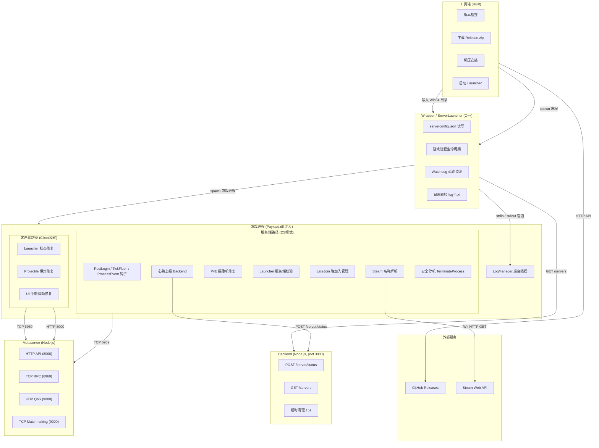
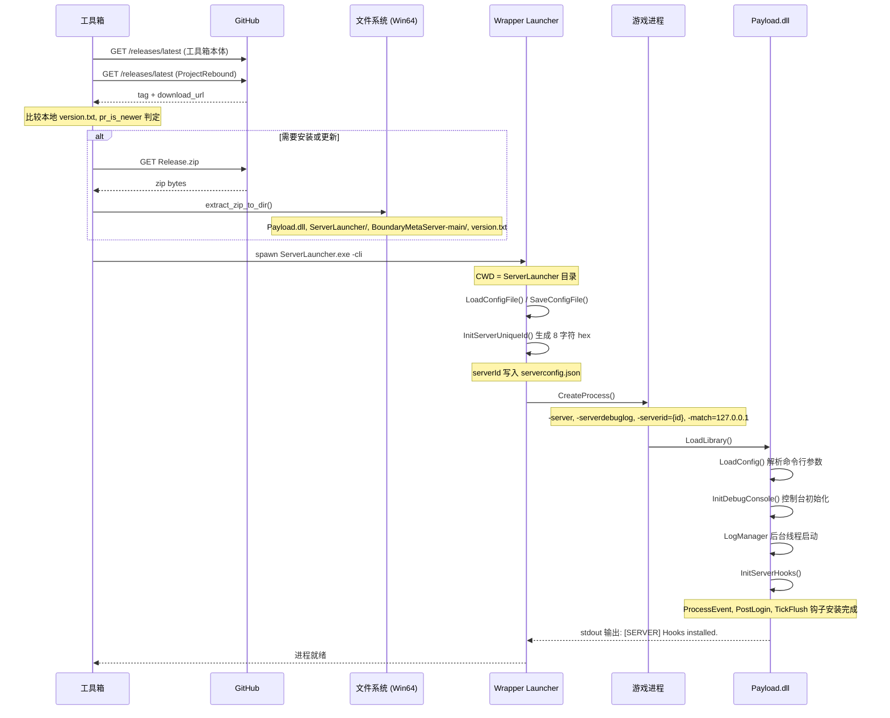
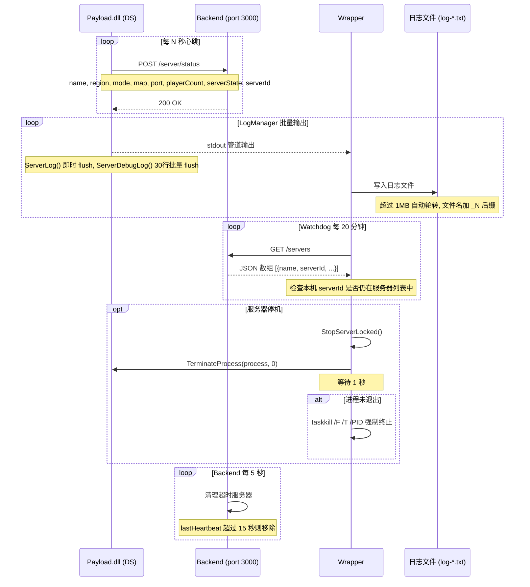
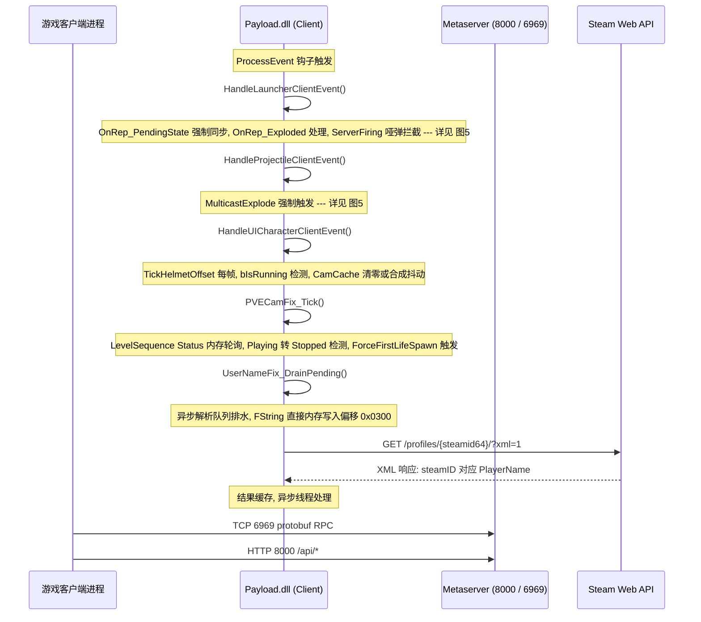
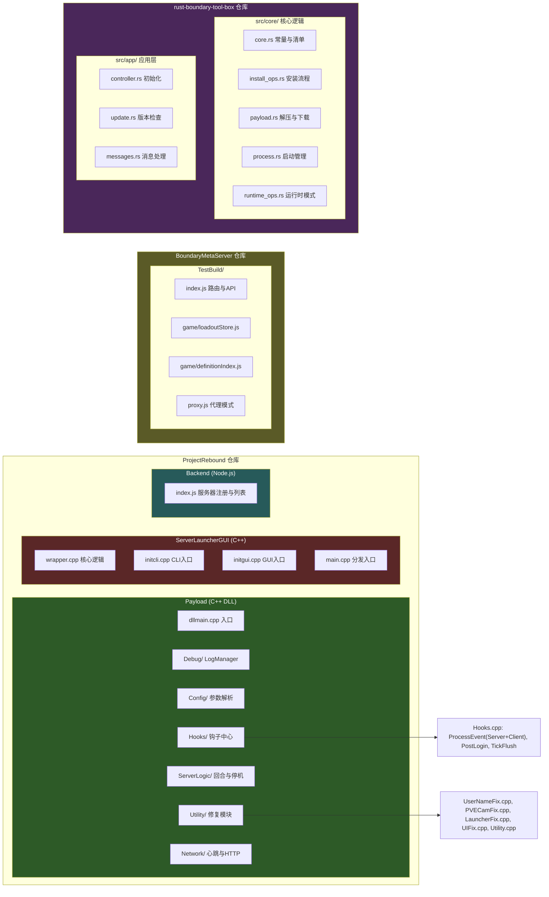
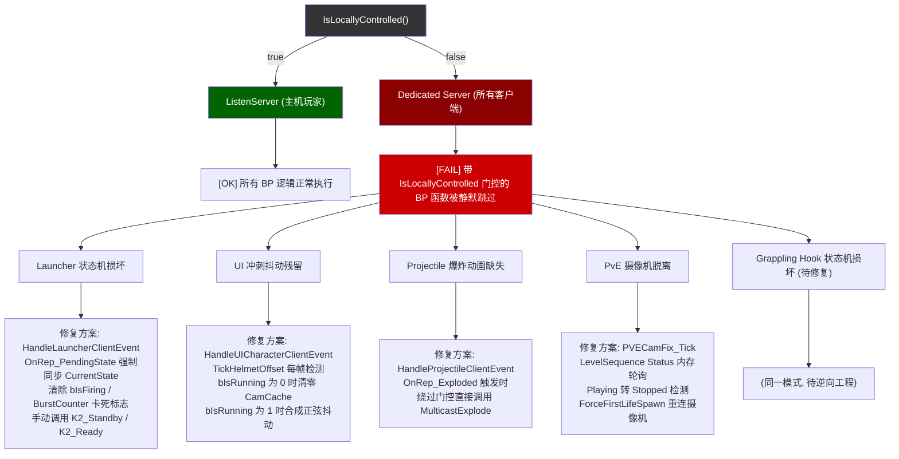

# ProjectRebound 系统架构 Mermaid 图表集

用于组会逐文件讲解。6 张图 + 端口速查附录。

---

## 图 0: 系统全景大图

---

## 图 1: 安装与启动链路

---

## 图 2: 服务器运行时数据交换

---

## 图 3: 客户端运行时数据交换

---

## 图 4: 文件级模块组织

---

## 图 5: IsLocallyControlled 问题概念图谱

---

## 附录: 端口与协议速查

| 组件 | 端口 | 协议 | 用途 |
|------|------|------|------|
| Backend | 3000 | HTTP | 服务器注册、心跳、列表查询 |
| Metaserver | 8000 | HTTP | 登录、Loadout、ConnectServer |
| Metaserver | 6969 | TCP | Protobuf RPC 游戏客户端通信 |
| Metaserver | 9000 | UDP | Matchmaking QoS Ping / Pong |
| Metaserver | 9000 | TCP | Matchmaking |
| Steam API | 443 | HTTPS | 玩家名称解析 (xml=1) |
| GitHub API | 443 | HTTPS | 版本检查、Release 下载 |
