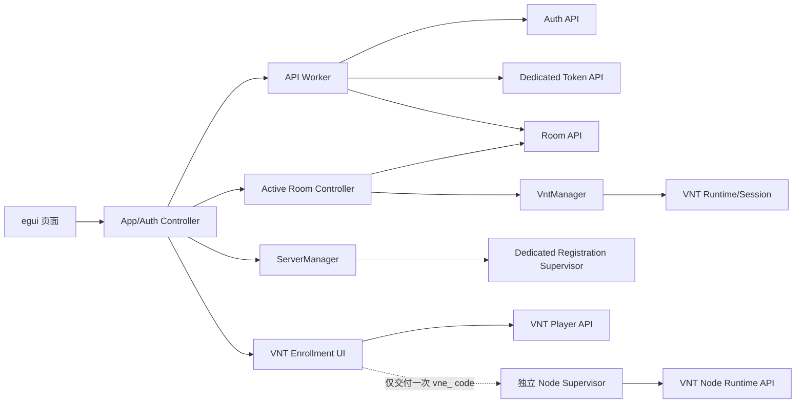
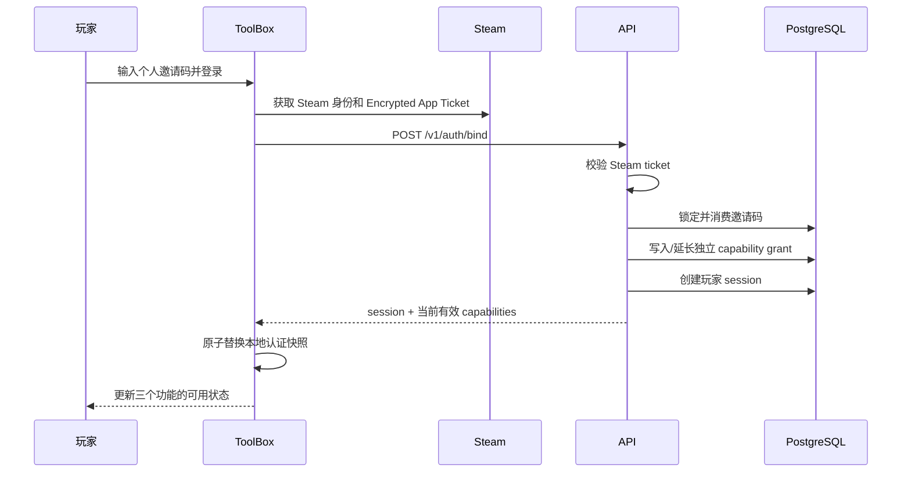
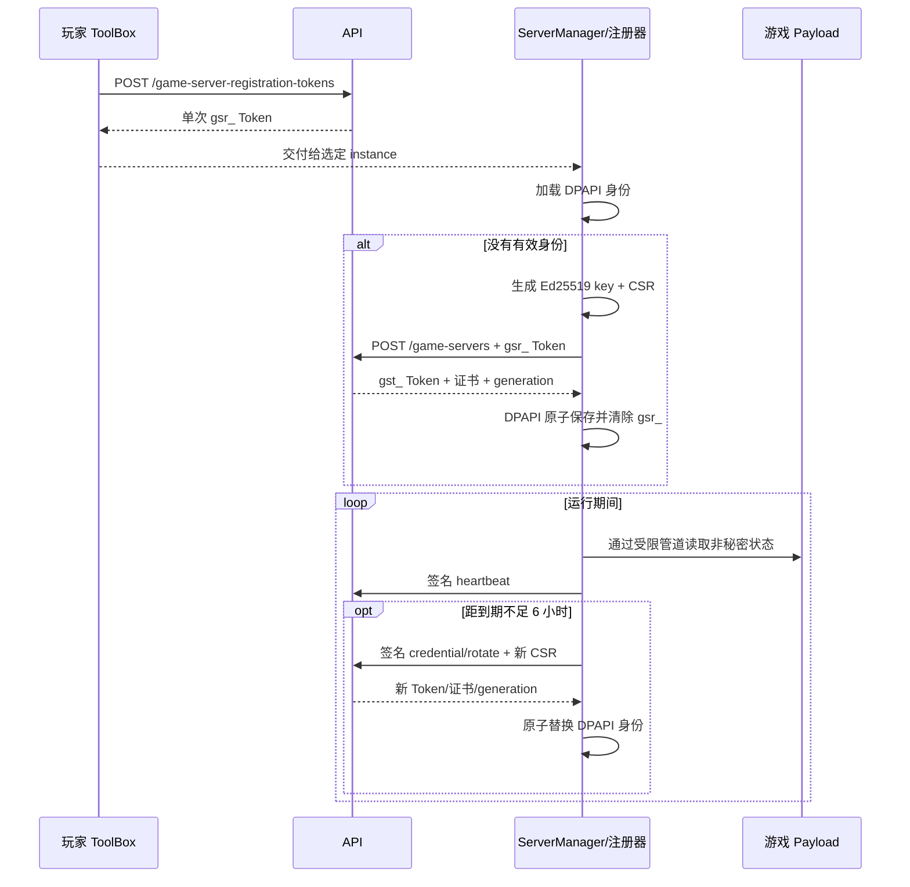
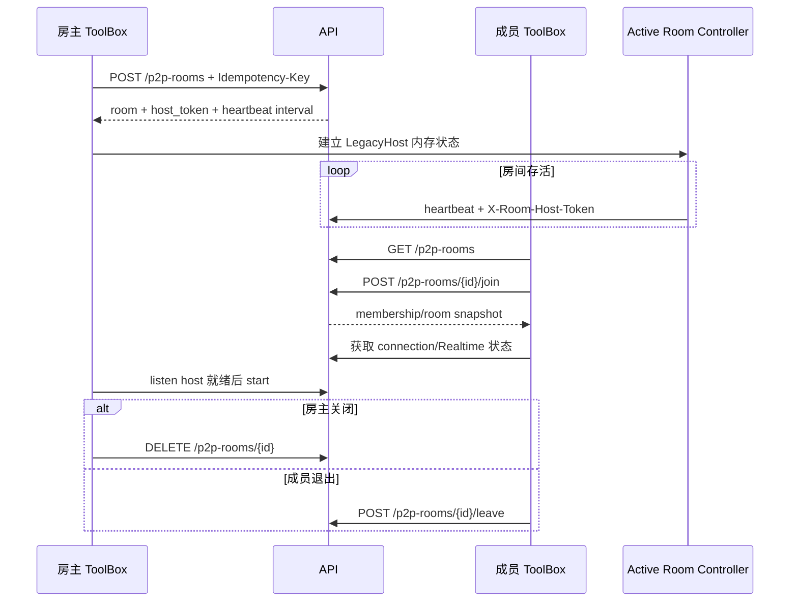
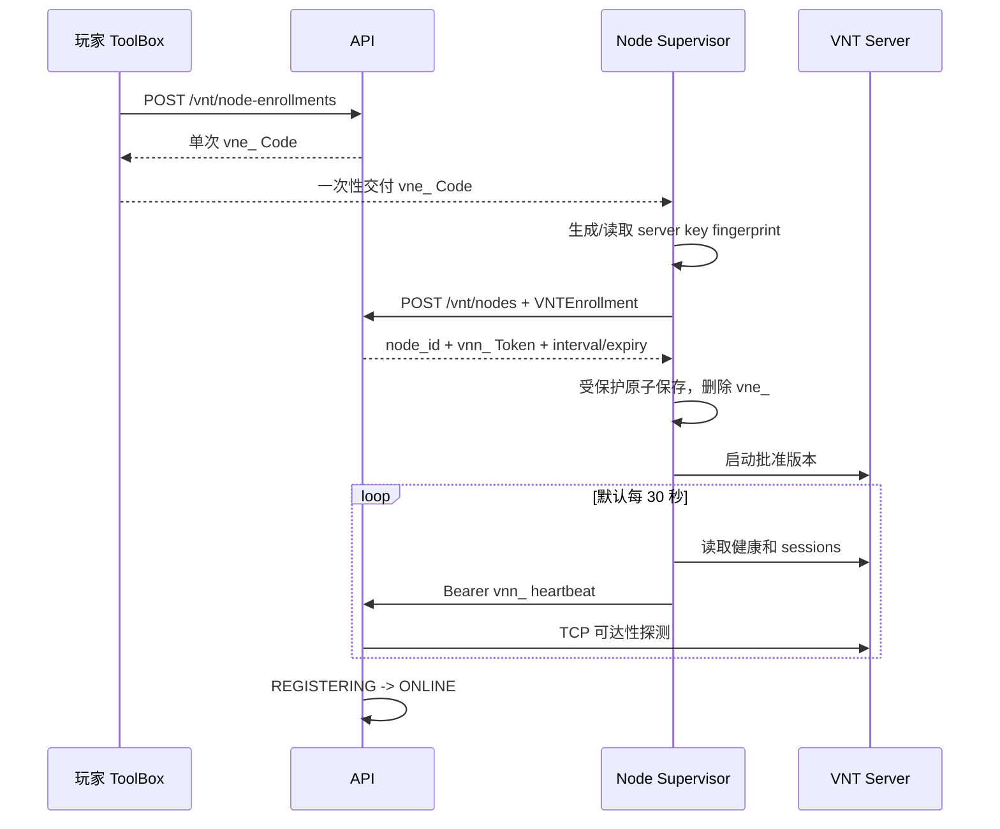

# ToolBox 模块代码更改与四类接入注册流程指导书

<!-- bilingual-doc: chinese-only -->

本文是一份面向 ToolBox 开发、联调和交付人员的独立实施指导书。它详细说明当前玩家、专用服务器、P2P 房间和社区 VNT 节点的注册/接入流程，并把需要修改的 ToolBox 模块、状态所有权、凭据边界、失败恢复和验收步骤落实到代码文件。

本文不替代机器契约。HTTP 字段、状态码和响应结构始终以 [OpenAPI](../../Backend/api/openapi/openapi.yaml) 为准；通用接口说明见[外部 API](external.zh-CN.md)，现状概览见[ToolBox 注册与接入指导书](toolbox-integration-guide.zh-CN.md)。

审计基线：

- `ProjectRebound`：2026-08-04 当前工作树；
- `ProjectReboundToolbox`：`bd4eb801a822399c547f6846741adf64fe4145b2`（`codex/rust`）；
- 本文中的 `src/...` 均相对于 `ProjectReboundToolbox` 仓库；
- 本文中的 `Backend/...` 均相对于 `ProjectRebound` 仓库。

## 1. 先明确四类主体和凭据边界

四类流程不能共用身份，也不能把玩家长期会话下发到服务器或节点主机。

| 主体 | 初始授权 | 运行时身份 | 允许保存的位置 | 禁止事项 |
| --- | --- | --- | --- | --- |
| 玩家 ToolBox | Steam Encrypted App Ticket；可选玩家邀请码 | Player Access Token + rotating Refresh Token | 应迁移到 Windows 受保护凭据存储 | 不得把玩家 Token 写入命令行、日志、专服配置或节点配置 |
| 专用服务器 | 玩家签发的单次 `gsr_...` Registration Token | `gst_...` Server Token + Ed25519 私钥 + 节点证书 | `game-server-identity-<instance>.dpapi` | 不得继续使用玩家 Token；不得把私钥或运行时 Token 交给游戏进程/UI |
| P2P 房主/成员 | 已验证玩家会话；创建额外要求 `p2p_room_registration` | 玩家 Token；房主另持有一次性 `host_token` | 玩家 Token 用受保护存储；`host_token` 仅内存 | 不得把 `host_token` 发给成员、写入配置或日志 |
| 社区 VNT 节点 | 玩家签发的单次 `vne_...` Enrollment Code | `vnn_...` Node Token | Node Supervisor 的服务账户受保护存储 | 玩家 ToolBox 不得收到/保存 Node Token；节点不得回退到玩家 Token |

### 1.1 邀请码只兑换玩家权限

Admin 面板创建邀请码时可独立选择：

| Admin permission 字段 | 玩家 capability | 后续允许的动作 |
| --- | --- | --- |
| `allow_p2p_room_registration` | `p2p_room_registration` | 创建传统 Relay 或 VNT transport 的 P2P 房间 |
| `allow_game_server_registration` | `game_server_registration` | 申请一个与 `instance_id` 绑定的专服 Registration Token |
| `allow_vnt_node_registration` | `vnt_node_registration` | 申请一个社区 VNT Node Enrollment Code |

邀请码应按玩家单独生成，通常设置 `max_uses=1`。一次邀请码可以包含任意权限组合，但三项权限在数据库中分别保存和判断。

邀请码消费和玩家权限授予在同一个 PostgreSQL 事务中完成。权限的 `expires_at` 与邀请码消费时的 `expires_at` 完全一致：

- 邀请码没有到期时间时，对应权限永久有效；
- 权限到期后，bind、refresh 和 `GET /v1/users/me` 不再返回该 capability；
- 后续兑换更晚到期的邀请码可以延长权限；
- 后续兑换更短的邀请码不能缩短已有期限；
- 永久权限不会被后续有限期邀请码覆盖；
- 修改、禁用或撤销邀请码只影响未来兑换，不追溯删除已经授予的权限。

ToolBox 目前只收到 capability 名称，没有收到每项 capability 的到期时间。因此 UI 只能显示“当前快照可用/不可用”，不能自行展示准确到期日。若产品需要显示权限截止时间，应先扩展后端响应和 OpenAPI，不能从邀请码输入值或本地时间推算。

### 1.2 默认有效期

| 对象 | 当前默认期限 | 到期后的行为 |
| --- | --- | --- |
| Player Access Token | 15 分钟 | 使用 Refresh Token 轮换 |
| Player Refresh Token | 30 天 | 最终刷新失败后清除完整玩家会话 |
| 玩家 capability | 与来源邀请码相同 | 不再出现在 capability 列表；新受保护操作返回 `403` |
| 专服 Registration Token | 10 分钟、一次性 | 重新申请；重复消费或过期均失败 |
| 专服运行时 Token/证书 | 24 小时 | ToolBox 在到期前 6 小时触发轮换 |
| P2P 房间 | 最长 8 小时 | 即使持续心跳也会硬到期 |
| VNT Node Enrollment Code | 10 分钟、一次性 | 玩家仍有权限时重新申请 |
| VNT Node Token | 90 天 | Node Supervisor 必须提前轮换 |

部署可修改部分期限。客户端应优先使用响应里的 `expires_at`、`*_expires_at` 和 `heartbeat_interval_seconds`，不能把表中的默认值写死为协议常量。

## 2. 目标模块边界



必须遵循以下所有权规则：

1. 页面只提交意图，不直接持有秘密或后台线程。
2. Auth Controller 是玩家会话和 capabilities 的唯一写入者。
3. Active Room Controller 是传统 P2P `host_token`、房间心跳和关闭顺序的唯一所有者。
4. `VntManager` 是 VNT 房间 host token、bootstrap、generation 和 helper 生命周期的唯一所有者。
5. `ServerManager` 是专服游戏进程、注册线程、管道和 Windows Job 的唯一所有者。
6. Node Supervisor 必须是独立服务程序；玩家 ToolBox 只负责申请并交付一次 Enrollment Code。

## 3. 玩家登录、邀请码兑换与权限同步

### 3.1 当前已经实现的调用链

当前代码路径如下：

1. `src/pages/settings.rs` 在未登录状态显示邀请码输入框。
2. Steam 登录完成后，`src/core/app.rs::start_auto_bind` 收集 SteamID、persona、device ID、Steam ticket 和邀请码。
3. `ApiCmd::AuthBind` 把请求送到 `src/api/api_worker.rs` 的后台线程。
4. `src/api/auth.rs::bind` 调用 `POST /v1/auth/bind`。
5. 后端校验 Steam ticket；有邀请码时消费邀请码并按权限快照写入三项独立 grant。
6. bind 响应返回玩家、session、`steam_verified`、`auth_level`、`capabilities` 和可选完整性 challenge。
7. `src/core/app.rs` 保存 session 和 capability 快照，并清空邀请码输入。

概念请求如下。`encrypted_ticket` 是十六进制 Steam Encrypted App Ticket，不是玩家密码，也不是普通 bearer token。

```json
{
  "steam_id": "7656119...",
  "persona_name": "Player",
  "device_id": "stable-device-id",
  "encrypted_ticket": "hex-encoded-steam-ticket",
  "invite_code": "one-player-invitation"
}
```



### 3.2 当前必须修正的问题

#### A. 自动 `401` 刷新没有同步 capabilities

`src/api/http.rs::try_refresh` 内部 DTO 只读取 `session`，没有读取 refresh 响应中的 `capabilities`。结果是：HTTP 请求可以使用新 Access Token 成功重试，但 UI 可能继续保留已经到期的 capability。

修改要求：

- 让内部 `RefreshData` 同时反序列化 `session` 和 `capabilities`；
- 通过统一的 `apply_auth_snapshot` 原子替换 Access Token、Refresh Token 和 capabilities；
- 禁止合并 capability；每次都以服务端返回列表整体替换；
- 自动刷新失败时清除 Token、玩家身份和全部 capability；
- 原请求最多在刷新成功后重试一次，避免刷新循环。

```rust
struct AuthSnapshot {
    session: SessionTokens,
    capabilities: Vec<String>,
}

trait SessionStore {
    fn replace(&self, snapshot: &AuthSnapshot) -> anyhow::Result<()>;
    fn clear(&self) -> anyhow::Result<()>;
}
```

#### B. 已登录玩家没有显式“兑换邀请码”入口

当前邀请码输入只在未登录时出现。目标流程是：

1. 设置页提供“兑换邀请码”动作；
2. 点击后重新向 Steam 获取有效 Encrypted App Ticket；
3. 使用同一 Steam 身份调用 `POST /v1/auth/bind` 并携带新 `invite_code`；
4. 成功后原子替换整个 session 和 capability 快照；
5. 成功才清空输入；失败只显示脱敏错误和 `request_id`；
6. 禁止只用旧 bearer token 加邀请码兑换。

#### C. 玩家 Token 仍保存在普通 JSON

`src/config/config_types.rs` 当前把 Access Token 和 Refresh Token 写入 `app_config.json`。目标是新增 `src/security/credential_store.rs`，使用 Windows Credential Manager 或 DPAPI 保护会话；JSON 只保留非秘密设置。迁移时先写入受保护存储并验证可读，再删除 JSON 中的 Token。

### 3.3 玩家模块改动表

| 文件 | 当前职责 | 必做更改 |
| --- | --- | --- |
| `src/api/auth.rs` | bind/refresh DTO 和调用 | 为统一 Auth Snapshot 暴露类型 |
| `src/api/http.rs` | 通用 HTTP 与 `401` 后刷新 | refresh 同步 capabilities；保留 `request_id`、code/details 和 `Retry-After` |
| `src/api/api_worker.rs` | 后台 API 命令 | 增加显式 RedeemInvite 或复用强类型 AuthBind；返回完整认证快照 |
| `src/core/app.rs` | UI 状态、自动 bind/refresh | 集中 session 状态机，只允许一个认证写入路径 |
| `src/config/config_types.rs` | 普通配置持久化 | 移除 bearer/refresh token 明文持久化 |
| `src/pages/settings.rs` | 登录、邀请码与 capability 展示 | 已登录兑换入口、陈旧状态提示、`403` 后刷新 |
| `src/security/credential_store.rs` | 当前不存在 | 新增玩家会话受保护存储和旧配置迁移 |

## 4. 专用服务器注册与运行时接入

专服必须使用两阶段注册：玩家授权阶段与服务器运行时阶段完全分开。

### 4.1 阶段一：玩家申请单次 Registration Token

前置条件是玩家 session 有效、账户 ACTIVE、Steam verified，并具有 `game_server_registration`。

```http
POST /v1/game-server-registration-tokens
Authorization: Bearer <player-access-token>
Content-Type: application/json
```

```json
{
  "instance_id": "stable-server-install-id"
}
```

正常 UI 不应再提交 `invite_code`，因为玩家邀请码应在 bind/显式兑换时处理。后端为兼容流程仍允许在玩家尚无专服权限时，在此端点原子兑换一枚合格邀请码。

响应只返回一次 `gsr_...` Token，默认 10 分钟到期。签发同一 `instance_id` 的新 Token 会撤销该实例之前尚未消费的 Token。

ToolBox 当前没有生产代码调用这个端点。建议新增 `src/api/game_server_registration.rs`：

```rust
pub struct IssueRegistrationTokenRequest {
    pub instance_id: String,
}

pub struct IssueRegistrationTokenData {
    pub registration_id: String,
    pub instance_id: String,
    pub registration_token: SecretString,
    pub expires_at: String,
}
```

并在 `ApiCmd` 增加 `IssueGameServerRegistrationToken`。UI 只在用户明确选择目标安装后申请；`instance_id` 必须稳定，不得每次点击随机生成。

### 4.2 阶段二：服务器 ToolBox 消费 Token

当前 `src/Server/registration.rs` 已实现核心流程：

1. 从 `serverconfig.json` 读取普通服务器配置。
2. 把 `registrationToken` 移入 `Zeroizing<String>`。
3. 根据稳定 `serverUniqueId` 查找 `game-server-identity-<sanitized-instance>.dpapi`。
4. 身份存在时验证 instance、Token、指纹和 Ed25519 私钥，并清除残留一次性 Token。
5. 身份不存在时本地生成 Ed25519 私钥和 PKCS#10 CSR。
6. 用 `Authorization: Bearer <gsr_...>` 调用 `POST /v1/game-servers`。
7. 后端验证 Token 未过期、未消费且 instance 一致，并原子消费。
8. 后端返回 server ID、Server Token、节点证书、CA、generation 和心跳间隔。
9. ToolBox 用 DPAPI 加密运行时身份，并通过临时文件 + replace 原子保存。
10. ToolBox 从配置和内存清除 Registration Token。
11. 使用运行时 Token、证书私钥签名头和 generation 发送心跳。
12. Token 或证书距到期不足 6 小时时生成新密钥/CSR 并轮换。



玩家 capability 到期只会阻止申请新的 Registration Token，不会撤销已经注册的服务器身份。专服运行时轮换不要求玩家保持登录。

### 4.3 当前生产启动接线问题

`src/Server/manager.rs` 已拥有进程、PipeReader、注册线程、Supervisor、Windows Job、重启和停止逻辑；但 `src/launching/launch.rs::do_launch_pve` 仍直接创建另一套游戏/注册线程编排。

目标改动：

1. `do_launch_pve` 不再直接启动 registration supervisor。
2. `src/core/app.rs` 持有唯一 `ServerManager` 或专用 manager handle。
3. 启动页面只发出 `StartDedicated { instance_id }` 意图。
4. manager 加载配置和身份：有 DPAPI 身份则直接启动；无身份但有 Token 则注册；两者都没有则返回 `RegistrationRequired`。
5. manager 负责 Windows Job，关键子进程失败时确定性回滚。
6. UI 只接收脱敏状态，不接收原始 Token、私钥或完整证书。

### 4.4 专服模块改动表

| 文件 | 状态 | 必做更改 |
| --- | --- | --- |
| `src/api/game_server_registration.rs` | 不存在 | 玩家侧 Token 签发 DTO、no-store 和强类型错误 |
| `src/api/api_worker.rs` | 未包含专服签发 | 增加签发命令，返回完整一次性结果 |
| `src/pages/settings.rs` 或专服配置页 | 无签发 UI | 选择稳定 instance、显示倒计时、一次性交付 |
| `src/Server/config.rs` | 已支持 Token/instance | 保持 Token 可选；验证稳定 instance |
| `src/Server/registration.rs` | 核心流程已实现 | 由 manager 唯一调用；错误分类和日志脱敏 |
| `src/Server/pipe.rs` | 已有受限管道 | 继续只传递非秘密服务器状态 |
| `src/Server/manager.rs` | 生命周期能力已实现 | 接入生产 UI/启动路径并成为唯一所有者 |
| `src/launching/launch.rs` | 仍重复编排 | 删除生产专服的重复注册/进程所有权 |

## 5. P2P 房间接入：传统 Relay 与 VNT transport

### 5.1 共同权限边界

- `GET /v1/p2p-rooms` 和 `GET /v1/p2p-rooms/{id}` 是公共目录读取。
- 创建房间必须是 ACTIVE、Steam verified 玩家，并具有有效 `p2p_room_registration`。
- 加入房间不要求该 capability，但仍要求 ACTIVE、Steam verified 玩家会话。
- VNT 房间同样使用 `p2p_room_registration`；`vnt_node_registration` 只用于贡献社区节点。
- UI capability 检查只改善体验，后端每次创建仍重新查询未到期 grant。

### 5.2 当前传统房间代码

`src/api/rooms.rs` 已实现 list/get/create/join/leave/heartbeat/start/close。`src/pages/launch.rs` 已显示目录并按 capability 控制创建按钮。

当前存在三个关键缺口：

1. `CreateRoomRequest` 没有显式 `transport_kind`，当前路径只依赖后端默认 `LEGACY_RELAY`。
2. `ApiCmd::CreateRoom` 创建成功后丢弃 `CreateRoomData`，只重新获取目录；一次性 `host_token` 永久丢失。
3. 启动页使用固定的 `Test Room/china-east/open/4` 请求，join 后只刷新目录，没有 Active Room 状态、连接信令或游戏启动接线。

在 `host_token` 被丢弃的现状下，房主不能正确执行 heartbeat、start 和 close，因此当前 UI 只能视为 API 演示。

### 5.3 新增 Active Room Controller

建议新增 `src/rooms/controller.rs`，让它成为传统房间 host token 的唯一所有者。

```rust
enum ActiveRoom {
    LegacyHost {
        room: PublicRoom,
        host_token: SecretString,
        heartbeat_interval: Duration,
    },
    LegacyMember {
        room: PublicRoom,
    },
    Vnt {
        view: VntRoomView,
    },
}

enum RoomControllerEvent {
    SnapshotChanged(PublicRoom),
    HeartbeatFailed(ApiError),
    ConnectionReady(ConnectionView),
    RoomClosed,
    RoomExpired,
    Fatal(String),
}
```

必做行为：

1. `ApiCmd::CreateRoom` 返回 `CreateRoomData`，不能映射为房间列表。
2. 创建请求生成 8–128 字符安全的 `Idempotency-Key`；结果不确定时用同一 key 和同一 body 对账。
3. `host_token` 只放 `SecretString` 内存对象；退出、close 或 fatal 后清零。
4. 创建后立即按响应间隔启动 host heartbeat。
5. 游戏/listen host 真正就绪后才调用 start。
6. 正常退出时房主 close，成员 leave。
7. 应用退出和退出登录时先停止游戏，再关闭/离开房间。
8. 房间 8 小时硬到期或返回 `ROOM_EXPIRED/ROOM_CLOSED` 时，本地直接终止。
9. Legacy join 自动创建 connection session；controller 还需接入 connection/Realtime，不能把 join 成功当作网络已连通。

### 5.4 传统 Relay 目标流程



### 5.5 VNT 房间当前安全模块

当前已有：

- `src/api/vnt.rs`：节点目录、VNT create/join/bootstrap/presence/host-ready/rebind/heartbeat/start/leave/close；
- `src/vnt/runtime.rs`：manifest、build-time SHA-256 pin、架构、签名、Wintun、helper protocol 校验；
- `src/vnt/nodes.rs`：ONLINE/version/capacity/UDP/fingerprint 筛选，公共地址校验、探测和评分；
- `src/vnt/session.rs`：受限临时配置、helper 生命周期、结构化 ready、秘密清零；
- `src/vnt/manager.rs`：房主/成员、generation、同节点重连、开局前 rebind、实时事件和有序 shutdown。

VNT 必须同时通过三层门控：

1. ToolBox 使用 `--features vnt` 构建；
2. `GET /v1/client/config` 返回 `features.vnt_rooms=true`；
3. `VntRuntime::inspect` 验证全部运行时资产。

任一层失败都要隐藏/禁用 VNT。服务端 `VNT_ROOMS_ENABLED` 也拒绝新的 VNT create/rebind；关闭后已经存在的 VNT 房间仍可 heartbeat、presence、leave/close，以便安全排空。

### 5.6 VNT 房主流程

1. `VntManager::capability` 通过全部门控。
2. 获取 VNT 节点目录并遍历所有 `next_cursor` 页面。
3. 只筛选 ONLINE、`version_compatible=true`、有容量、支持 UDP、指纹完整的节点。
4. 使用真实 VNT handshake 探测；TCP connect 只能作为明确标记的降级测量。
5. 用 `transport_kind=VNT`、固定 `vnt_node_id` 和幂等键创建房间。
6. host token 只保存在 `VntManager` 内存。
7. 请求 bootstrap，核对 room、endpoint/fingerprint、generation、密码学策略和虚拟地址。
8. 启动 helper，等待结构化 ready，删除临时配置并清零 bootstrap。
9. 调用 `vnt/host-ready`，随后开始 heartbeat 和 presence。
10. 只把不含秘密的 `VntGameContext` 交给 `GameLaunchAdapter`。
11. 游戏实际启动后调用 start。

### 5.7 VNT 成员流程

1. 从房间快照读取后端固定的 `vnt_node_id`。
2. 从目录找到同一个节点；成员不得改选。
3. join 房间。
4. 请求成员 bootstrap；房主未 ready 时按错误码有界等待。
5. 验证 generation、endpoint/fingerprint、虚拟 IP 和 host virtual IP。
6. 启动 helper 并上报 presence。
7. 使用 `VntGameContext` 启动游戏。
8. 失败时停止 helper、清零秘密并 leave。

开局前房主可 rebind；后端生成新 generation 和新秘密。RUNNING 后禁止热迁移，只允许有限次数连接同一节点、同一 generation 的重连。

### 5.8 VNT 生产接线和分页修正

`VntManager` 当前没有接入 `src/core/app.rs`、`src/pages/launch.rs`、生产 `GameLaunchAdapter` 或 Realtime adapter。需要：

- 应用唯一持有一个 `VntManager`；
- 页面只调用 controller/manager，不直接调用 `VntApiClient`；
- 提供生产 `GameLaunchAdapter`，只接受 `VntGameContext`；
- Realtime 消息先经安全解析，再交给 manager；
- manager event 不得包含 bootstrap、host token 或 node token；
- 取消/退出调用 `VntManager::shutdown`，顺序为游戏、隧道/helper、close/leave。

后端节点目录现已返回 `next_cursor`，但 `VntApiClient::list_nodes` 只取第一页。应改为：

```rust
fn list_nodes_page(
    &self,
    region: Option<&str>,
    cursor: Option<&str>,
    limit: u16,
) -> VntApiResult<VntNodeList>;
```

上层循环直到 `next_cursor` 为空，并限制最大页数/节点数。cursor 是后端返回的最后一个 `vnt_...` ID，不是页码。

### 5.9 P2P 模块改动表

| 文件 | 当前状态 | 必做更改 |
| --- | --- | --- |
| `src/api/rooms.rs` | Legacy API 基础完成 | 增加 transport/idempotency，返回结构同步 OpenAPI |
| `src/api/api_worker.rs` | create 丢弃结果 | 返回 `CreateRoomData`；拆分 list/create/join receiver 类型 |
| `src/rooms/controller.rs` | 不存在 | 新增传统房间状态、host token 和生命周期所有权 |
| `src/core/app.rs` | 只保存目录 | 持有 Active Room Controller 和 VntManager 只读视图 |
| `src/pages/launch.rs` | 固定测试请求 | 房间表单、transport、活动状态和取消/退出 |
| `src/api/vnt.rs` | VNT API 已实现 | 节点 cursor 分页；统一错误/request ID |
| `src/vnt/manager.rs` | 编排已实现 | 接入应用、Realtime 和生产 GameLaunchAdapter |
| `src/vnt/runtime.rs` | fail-closed 校验已实现 | 发布时打包签名资产并注入 manifest pin |

当前后端会从已发布 ToolBox 客户端版本中经过校验的 `vnt-runtime-manifest.json` sidecar 自动读取精确的 VNT 运行时版本对来计算 `VNTNode.version_compatible`，并在房间创建/rebind 的事务内再次校验。sidecar 只保存为服务端发布元数据，不改变公开更新 Manifest 的签名结构；ToolBox 本机仍须校验安装包内运行时清单与 SHA-256，不能仅因目录字段为 `true` 就跳过本地二进制验证。

## 6. 社区 VNT 节点注册与运行时接入

社区节点也采用两阶段流程，但与专服身份完全独立。

### 6.1 阶段一：玩家 ToolBox 申请 Enrollment Code

前置条件是 ACTIVE、Steam verified、当前 session 的 `integrity_trusted=true`，并具有 `vnt_node_registration`。`auth_level=trusted` 仅是兼容镜像，不是 VNT 授权来源。后端默认限制每位玩家最多拥有 3 个非 `RETIRED` 节点；部署可用 `VNT_MAX_NODES_PER_PLAYER` 配置为 `1..100`。达到上限返回 `409 VNT_NODE_QUOTA_EXCEEDED`，玩家应先退役旧节点或联系管理员，不得通过并发申请绕过配额。

```http
POST /v1/vnt/node-enrollments
Authorization: Bearer <player-access-token>
Content-Type: application/json
```

```json
{
  "label": "hk-node-01"
}
```

label 必须匹配 `[A-Za-z0-9][A-Za-z0-9._-]{0,63}`。响应 `vne_...` Code 一次性、默认 10 分钟，并带 `Cache-Control: no-store`。

`src/api/vnt.rs::create_node_enrollment` 已实现调用，但没有 UI/控制器入口。需要：

1. capability 只控制 UX，最终以后端为准；
2. 用户确认 label 和目标节点后才申请；
3. 只显示一次，并显示响应 `expires_at` 倒计时；
4. 允许一次复制或导出到受限文件；
5. 不得写入 JSON、日志、崩溃报告、命令行或遥测；
6. 消费确认、到期、关闭窗口、退出登录时清零；
7. 玩家 ToolBox 到此为止，绝不调用 node heartbeat/rotate，也绝不接收 `vnn_...`。

ToolBox 还应实现 `GET /v1/users/me/vnt-nodes` 的分页查询，用于展示本人节点状态、凭据到期时间和找回恢复所需的稳定 `node_id`。该接口只要求 ACTIVE、Steam verified 会话，不要求完整性 Step-up；它不会返回 Node Token、Token Hash 或其他玩家的节点。查询结果只能作为 UI/恢复入口，实际 recover/retire 仍由后端重新校验 owner 与 Step-up。

### 6.2 阶段二：独立 Node Supervisor 消费 Code

当前 `ProjectReboundToolbox` 没有 Node Supervisor。推荐做成独立 crate/二进制或仓库，并以最小权限 Windows 服务账户运行。

| 模块 | 职责 |
| --- | --- |
| `vnt-node-supervisor/config.rs` | 非秘密节点配置；校验公网 host、port、region、版本、容量 |
| `vnt-node-supervisor/api.rs` | register、recover、heartbeat、rotate、retire 强类型 API |
| `vnt-node-supervisor/credential_store.rs` | 服务账户 DPAPI/Credential Manager；原子替换 Token |
| `vnt-node-supervisor/process.rs` | 启停批准的 VNT server/wrapper，读取结构化健康状态 |
| `vnt-node-supervisor/supervisor.rs` | REGISTERING/ONLINE/DRAINING/RETIRED 状态机 |
| `vnt-node-supervisor/redaction.rs` | Authorization、Enrollment/Node Token 脱敏 |

首次注册：

```http
POST /v1/vnt/nodes
Authorization: VNTEnrollment <vne-enrollment-code>
Content-Type: application/json
```

```json
{
  "advertised_host": "203.0.113.20",
  "port": 29872,
  "region": "asia-east",
  "location": "Hong Kong",
  "vnts_version": "approved-version",
  "wrapper_version": "approved-version",
  "server_key_fingerprint": "sha256:<64-lowercase-hex>",
  "supported_transports": ["udp", "tcp"],
  "max_rooms": 100
}
```

关键校验：公网 global-unicast IP；port `1024..65535`；安全 region label；完整 SHA-256 指纹；同时声明 UDP 数据流量和 TCP 可达性探测；`max_rooms` 为 `1..10000`。

响应只返回一次 `node_id` 和 `vnn_...` Node Token，初始 state 为 `REGISTERING`，并返回心跳间隔和 `credential_expires_at`。Supervisor 必须先把 Node Token 原子写入受保护存储，再清除 Enrollment Code。



### 6.3 心跳和目录状态

```http
POST /v1/vnt/nodes/{node_id}/heartbeat
Authorization: Bearer <vnn-node-token>
```

```json
{
  "wrapper_version": "approved-version",
  "vnts_version": "approved-version",
  "uptime_seconds": 3600,
  "reported_sessions": 4,
  "server_process_healthy": true
}
```

当前行为：

- 健康心跳后，控制面从外部对 advertised host/port 做 TCP 探测；
- 最近探测成功时节点进入 ONLINE；
- 约 90 秒没有心跳时进入 STALE，约 5 分钟进入 OFFLINE；
- `server_process_healthy=false` 会标为 OFFLINE；
- 公共目录默认只返回 ONLINE；
- 目录中的 `version_compatible` 由当前已发布 ToolBox 客户端版本的已校验 sidecar 中提取的版本对精确且区分大小写地计算；
- ToolBox 必须隐藏不兼容节点，但 create/rebind 仍要处理 `409 VNT_NODE_UNAVAILABLE`，因为后端会在事务内重新检查节点状态、容量和版本；
- TCP 探测不能替代真实 UDP/VNT 数据面监控。

Supervisor 使用响应心跳间隔并加入小幅稳定抖动，同一节点只能有一个心跳 owner。`reported_sessions` 必须来自运行时观测。

### 6.4 Node Token 轮换

```http
POST /v1/vnt/nodes/{node_id}/credential/rotate
Authorization: Bearer <current-vnn-token>
```

成功响应只返回一次新 Token、`credential_expires_at` 和 `previous_valid_until`。新 Token 立即成为当前管理凭据；旧 Token 在 `previous_valid_until` 前仅可继续发送普通 heartbeat，不能再次调用 rotate，也不能 retire 节点。默认重叠窗口为 60 秒，可由服务端 `VNT_CREDENTIAL_ROTATION_GRACE_SECONDS` 配置为 `1..600` 秒；旧 Token 自身更早到期时，以原到期时间为准。

Supervisor 必须先把新 Token 原子写入受保护存储，再切换 heartbeat，并在 `previous_valid_until` 前完成。若轮换请求的响应丢失，旧 Token 仍能在窗口内保持心跳，但当前接口没有幂等恢复，不能用旧 Token 再次轮换；客户端应进入 `CredentialRecoveryRequired`，停止接入新会话并要求重新 enrollment/运营恢复，不能无限重试。

### 6.5 凭据丢失、节点恢复与身份变更

Node Token 丢失、轮换响应丢失或节点迁移时，不复制旧凭据文件。节点所有者先在玩家 ToolBox 完成新的完整性 Step-up，再申请一个新的 Enrollment Code；随后把该 Code 一次性交给原节点的 Supervisor：

```http
POST /v1/vnt/nodes/{node_id}/recover
Authorization: VNTEnrollment <fresh-vne-enrollment-code>
Content-Type: application/json
```

请求体与首次 `POST /v1/vnt/nodes` 相同。后端会原子完成以下操作：

1. 消费新的 Enrollment Code，并校验它的 owner 与目标节点的 `owner_player_id` 一致；
2. 拒绝 `REVOKED`/`RETIRED` 节点；非 owner 使用统一的不可枚举错误；
3. 立即撤销该节点全部旧 Node Token，不保留 heartbeat 重叠窗口；
4. 若 endpoint 或 server-key fingerprint 改变且仍有活动房间，返回 `409 VNT_NODE_IDENTITY_CHANGE_BLOCKED`；
5. 更新 endpoint、region、版本、fingerprint、transport 和容量；身份变化时清空旧 heartbeat/reachability；
6. 保留 `DRAINING` 状态，否则回到 `REGISTERING`，并只返回一次新的 `vnn_...` Token。

Supervisor 必须先原子保存新 Token，再删除 Enrollment Code 并启动心跳。恢复响应丢失时，新的 Code 已可能被消费，旧 Token 也可能已撤销；必须停止接入新房间并重新执行 owner step-up/enrollment，不能猜测操作是否成功或继续用旧 Token。

### 6.6 Drain 与 Retire

```http
DELETE /v1/vnt/nodes/{node_id}
Authorization: Bearer <current-vnn-token>
```

Node Supervisor 使用上面的 Node Credential。节点所有者也可在 Player Access Token 仍为 ACTIVE、Steam verified 且当前 session 的 `integrity_trusted=true` 时调用同一路径：

```http
DELETE /v1/vnt/nodes/{node_id}
Authorization: Bearer <player-access-token>
```

后端会核对 `owner_player_id`；非 owner 返回不泄露节点归属的 `404 VNT_NODE_NOT_FOUND`。普通 verified 会话不足以执行 owner retirement，必须先完成完整性 Step-up。

- 无活动 VNT session 时立即 `RETIRED`，并在同一事务撤销全部 Node Token；
- 有活动 session 时返回 `DRAINING`，节点不再分配新房间；
- DRAINING 期间 Token 仍有效，Supervisor 必须继续现有流量和 heartbeat；
- session 排空后 sweeper 转为 RETIRED 并撤销 Token；
- RETIRED 后 Supervisor 停止 VNT server、删除凭据并退出循环。

```text
UNENROLLED -> REGISTERING -> ONLINE -> DRAINING -> RETIRED
REGISTERING/ONLINE -> DEGRADED -> RECOVERY_REQUIRED
```

DELETE 返回 DRAINING 后不能立即杀死进程，否则会中断仍绑定该节点的房间。

### 6.7 管理端 Drain、紧急 Revoke 与安全审计

后端提供独立于玩家 ToolBox/Node Supervisor 的人类管理员接口：

| 方法 | 路径 | 权限 | 行为 |
| --- | --- | --- | --- |
| GET | `/v1/admin/vnt-nodes` | `vnt_nodes.read` | 按 state、region、owner 分页查询；不返回任何 Token/哈希 |
| GET | `/v1/admin/vnt-nodes/{node_id}` | `vnt_nodes.read` | 返回 owner、endpoint、版本、指纹、租约、可达性和最多 100 条房间引用 |
| POST | `/v1/admin/vnt-nodes/{node_id}/drain` | `vnt_nodes.drain` + MFA Step-up | 停止新分配，保留已有房间与节点凭据 |
| POST | `/v1/admin/vnt-nodes/{node_id}/revoke` | `vnt_nodes.revoke` + MFA Step-up | 立即撤销凭据，将关联 VNT session 标为失败并关闭未终止房间 |
| GET | `/v1/admin/vnt-security-events` | `vnt_nodes.read` | 查询已脱敏的 Enrollment、凭据、恢复、rebind、解密失败、drain/revoke 生命周期事件 |

两个写接口都必须提交非空 `reason`，并在状态变更事务中同时写入管理员操作审计和 VNT 安全审计。Revoke 响应的 `closed_rooms` 是本次实际关闭的房间数。安全事件可按 `event_type`、`result`、`actor_type`、`player_id`、`admin_id`、`node_id` 和 `room_id` 筛选，记录 request ID、来源 IP、User-Agent、参与者和安全原因，但不记录 Authorization Header 或明文秘密。玩家 ToolBox 和 Node Supervisor 都不能调用这些 Admin API；Admin Web 也不得展示 Node Token、Enrollment Code、房间 network token/E2E password、数据库 secret hash 或加密材料。

运维侧可从 `/internal/metrics` 使用 `vnt_nodes`、`vnt_node_heartbeat_age_seconds`、`vnt_node_reachability_age_seconds`、`vnt_node_capacity_ratio`、`vnt_node_referenced_rooms`、`vnt_sessions_by_state`、`vnt_member_sessions_by_path`、`vnt_node_credentials_expiring_7d`、`vnt_node_credentials_expired` 和按操作分类的 `vnt_rate_limited_total`。生产告警已覆盖无兼容 ONLINE 容量、凭据七日内到期/失效、容量超过 80% 和心跳超时；这些指标不包含 owner、原始 IP、Token 或房间秘密。

## 7. API 错误、重试和本地状态规则

| 结果 | 玩家 ToolBox | 专服/Node Supervisor |
| --- | --- | --- |
| `400 INVALID_REQUEST` | 标出可修正字段，不按原请求重试 | 配置错误，等待人工修复 |
| 玩家 API `401` | refresh 一次，替换 session+capabilities，再重试一次 | 禁止换用玩家 Token |
| 运行时 `401/403` | 不适用 | 检查到期、generation、retirement，不回退到单次 Code |
| capability `403` | 同步玩家状态并禁用对应新建动作 | 已注册运行时不受玩家 capability 到期影响 |
| `404` | 已关闭/到期房间视为终止 | 已退役资源视为终止 |
| `409` | 按 code 区分状态、版本、generation、feature gate、幂等冲突 | 按 code 恢复，不盲重试 |
| `410` | 单次 Token/Code 过期时重新申请 | 清除失效秘密 |
| `429` | 遵守 `Retry-After` | 有界退避，不制造心跳风暴 |
| 网络/`5xx` | 幂等请求有界退避；create 用同一幂等键 | heartbeat 可退避；非幂等结果不确定时进入恢复 |

VNT 另有独立的 Redis token-bucket 限流，并在 Redis 不可用时降级为更保守、容量有上限的进程内 limiter：Enrollment 默认每玩家每小时 5 次，公开/owner 节点目录默认每来源 IP 或 owner 每分钟 120 次，房间 Bootstrap 默认每玩家每分钟 30 次，heartbeat 默认每 Node Credential 每分钟 120 次，rotate/retire 共用每 Node Credential 每小时 10 次。对应部署变量是 `VNT_ENROLLMENT_REQUESTS_PER_PLAYER_PER_HOUR`、`VNT_DIRECTORY_REQUESTS_PER_IP_PER_MINUTE`、`VNT_BOOTSTRAP_REQUESTS_PER_PLAYER_PER_MINUTE`、`VNT_HEARTBEAT_REQUESTS_PER_CREDENTIAL_PER_MINUTE` 与 `VNT_MANAGEMENT_REQUESTS_PER_CREDENTIAL_PER_HOUR`。身份只以 SHA-256 摘要进入限流 key；`429 VNT_RATE_LIMITED` 带整数秒 `Retry-After`，客户端必须等待，不得并发补发。

建议统一错误：

```rust
struct ApiError {
    status: Option<u16>,
    code: Option<String>,
    request_id: Option<String>,
    retry_after: Option<Duration>,
    safe_message: String,
}
```

日志只记录 `status/code/request_id` 和脱敏资源 ID。禁止记录 Authorization、邀请码、Registration/Enrollment/host/node/server Token、bootstrap、私钥和含秘密的原始响应体。

服务端房间秘密按 `secret_key_id` 解密：新写入使用 `VNT_SECRET_ENCRYPTION_KEY_ID`，历史密钥通过只读 `VNT_SECRET_DECRYPTION_KEYS` keyring 保留。密钥轮换不会改变 ToolBox API，但部署方在移除旧 key 前必须验证旧房间 bootstrap 和幂等 Host Token 恢复；ToolBox 遇到 bootstrap `500` 时只上报 `request_id`，不得尝试读取或替换服务端密钥。

## 8. 推荐实施顺序

1. **认证正确性：** refresh 同步 capabilities；唯一 Auth Snapshot；已登录兑换；受保护玩家 Token。
2. **专服闭环：** 玩家侧签发 API/UI；稳定 instance；唯一 `ServerManager` 生产路径。
3. **传统 P2P：** 保留 host token；Active Room Controller；heartbeat/start/close/leave；connection/Realtime 和游戏启动。
4. **VNT 房间：** 节点分页；签名运行时资产；应用级 `VntManager`、GameLaunchAdapter、Realtime 和 shutdown。
5. **社区节点：** Enrollment UI；独立 Node Supervisor；轮换恢复；drain/retire；Admin 节点页面；服务端可观测性。

后端 `VNT_ROOMS_ENABLED` 应保持 false，直到 VNT 端到端验收通过。

## 9. 端到端验收清单

### 9.1 玩家

- 单权限和组合邀请码都授予正确 capability。
- 权限到期与邀请码一致；更短不缩短、更长可延长、永久保持永久。
- bind、显式 refresh、自动 refresh 和 `/v1/users/me` 都整体替换 capabilities。
- 最终 refresh 失败和 logout 清除全部 Token/capability。
- 配置、日志、参数和崩溃报告没有秘密。

### 9.2 专服

- 无权限签发 `403`；有权限签发 `gsr_...`。
- 同 instance 新签发撤销旧未消费 Token。
- Token 10 分钟到期、只能消费一次、不能注册其他 instance。
- 重启只加载 DPAPI 身份，不需要玩家登录。
- 验证签名心跳、提前轮换和旧 generation 短暂重叠。
- `ServerManager` 停止会终止全部子进程和线程。

### 9.3 传统 P2P

- 无创建权限的 verified 玩家可加入但不能创建。
- host token 仅在 controller 内存，并驱动 heartbeat/start/close。
- 成员 leave 幂等，房主必须 close。
- 验证 stale/close 和 8 小时硬到期。
- join 后 connection/Realtime 能驱动实际游戏连接。

### 9.4 VNT 房间

- 任一 feature/runtime 检查失败时 UI 不可用。
- 多页节点目录全部遍历。
- 房主固定节点、bootstrap、host-ready、presence、heartbeat、start 成功。
- 成员不能替换固定节点。
- rebind 只在开局前；RUNNING 不热迁移。
- shutdown 顺序为游戏、helper/隧道、close/leave。

### 9.5 VNT 节点

- 非 ACTIVE/Steam verified/integrity trusted 或无权限的 Enrollment 返回 `403`；Code 10 分钟且单次。
- 默认每位 owner 最多 3 个非 RETIRED 节点，并发 Enrollment/Register 不能绕过配额锁。
- 玩家 ToolBox 永远没有 `vnn_...`。
- 注册拒绝私网 host、坏指纹、缺 UDP/TCP 和非法容量。
- 目录正确标记版本不兼容节点，后端 create/rebind 不能绕过双版本白名单。
- REGISTERING 经心跳和探测进入 ONLINE。
- 验证 STALE、OFFLINE 和进程不健康。
- Node Token 受保护并可可靠轮换。
- 凭据丢失使用 owner 新 Enrollment Code 恢复同一 `node_id`；旧凭据立即失效，活动房间阻止 endpoint/fingerprint 变更。
- DRAINING 继续服务，排空后 RETIRED 且凭据撤销。
- owner 只有在 integrity trusted Step-up 后才能调用 DELETE；非 owner 统一返回不可枚举的 `404`。
- Admin Drain 保留活动房间；Admin Revoke 撤销凭据、关闭关联房间并记录原因审计。
- Enrollment、注册、恢复、凭据拒绝/轮换、rebind、密钥解密失败和管理员状态变更都有不含秘密的安全审计。
- 日志、配置、参数和崩溃转储不含秘密。

## 10. 交付物清单

完整接入至少应交付：

- Auth Snapshot/受保护玩家会话存储；
- 已登录邀请码兑换 UI；
- 玩家侧专服 Registration Token API 与 UI；
- 生产唯一 `ServerManager` 启动路径；
- 传统 P2P Active Room Controller；
- VNT 节点分页、应用级 `VntManager`、GameLaunchAdapter 和 Realtime adapter；
- 玩家侧 VNT Enrollment Code UI；
- 独立 VNT Node Supervisor；
- 四类流程的单元、HTTP 契约、崩溃恢复和 PostgreSQL 端到端测试；
- 发布前秘密扫描、日志脱敏检查和到期/权限撤销演练。

“API 客户端函数已存在”不等于“ToolBox 端到端流程已接入”。生产完成的判断标准是：状态有唯一所有者、一次性秘密不会丢失或落盘、运行时身份不依赖玩家会话、到期/失败能确定性收敛，并且 UI 与后端权限判断保持同步。
