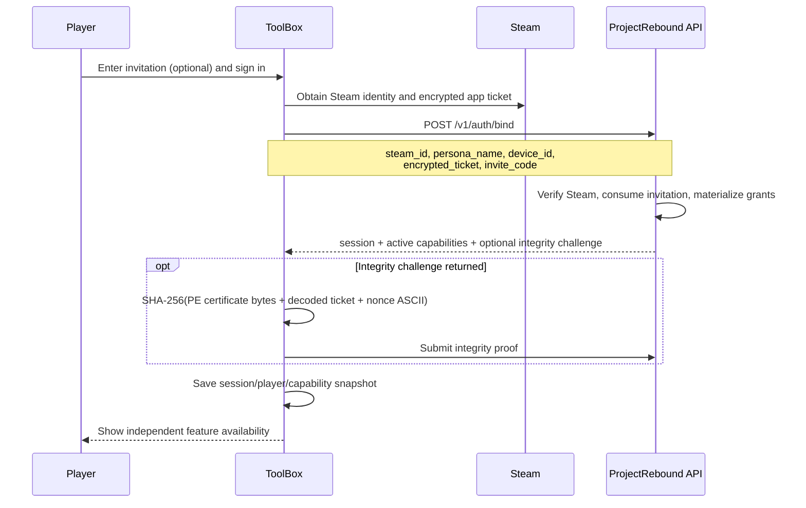
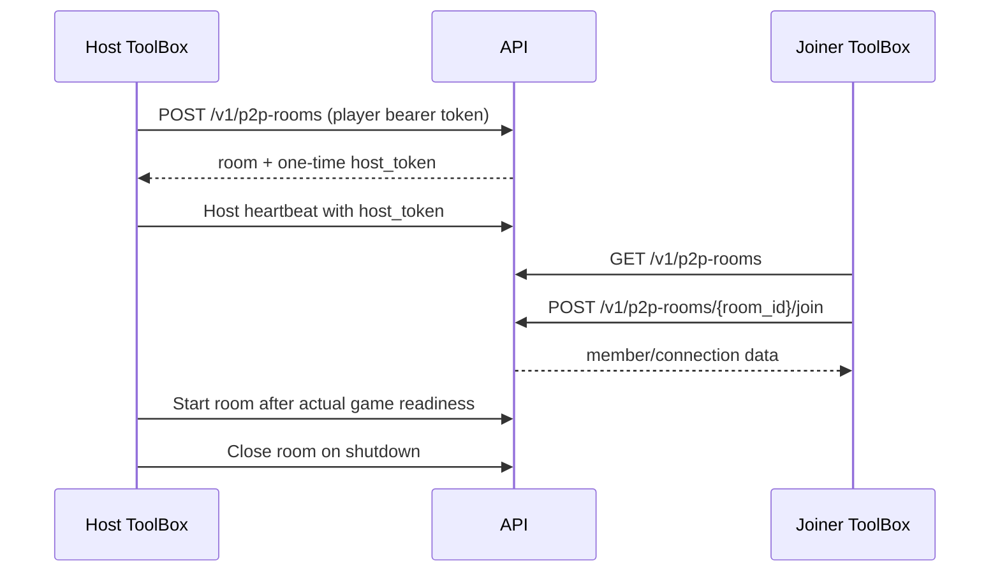

# ToolBox registration and integration guide

English | [简体中文](toolbox-integration-guide.zh-CN.md)

This guide describes the current ProjectRebound ToolBox integration for player sign-in, dedicated-server registration, P2P rooms, VNT rooms, and community VNT nodes. It also identifies the code changes still required for a complete end-to-end client experience.

The machine-readable [OpenAPI contract](../../Backend/api/openapi/openapi.yaml) is authoritative for HTTP fields and status codes. Backend implementation and tests take precedence if this guide becomes stale. Paths beginning with `src/` are relative to the `ProjectReboundToolbox` repository; paths beginning with `Backend/` are relative to this repository.

Implementation baseline: 2026-08-04.

## 1. Current implementation status

| Flow | Current ToolBox state | Remaining integration |
| --- | --- | --- |
| Player sign-in and invitation redemption | Implemented. The invitation is sent with `/v1/auth/bind`; returned capabilities are saved and displayed. | Add an explicit re-redeem action for an already signed-in player; keep capabilities synchronized after every automatic refresh. |
| Dedicated-server runtime registration | Implemented after a Registration Token is supplied. ToolBox generates the key and CSR, enrolls, stores identity with DPAPI, sends signed heartbeats, and rotates credentials. | Add the player-facing request for `/v1/game-server-registration-tokens`; integrate the existing `ServerManager` into the production launch path. |
| Legacy P2P room browser/create/join | Basic API and UI are present. Room creation is capability-gated in the UI. | Preserve the one-time host token, run the host lifecycle, connect the selected room to game launch, and handle realtime/Relay signaling. |
| VNT P2P client | Security-sensitive API, runtime verification, node selection, and session manager modules exist behind the `vnt` Cargo feature. | Enable only for approved builds, connect `VntManager` to UI/realtime/game launch, ship verified runtime assets, and satisfy release gates. |
| Community VNT node enrollment | `VntApiClient::create_node_enrollment` exists. | Add owner node listing/enrollment/recovery UX and a separate node Supervisor that consumes the code, stores node credentials, heartbeats, rotates, recovers, and retires. |

Do not interpret a visible capability as a permanent grant. The backend remains authoritative at the time of each protected operation.

## 2. Permission and credential model

### 2.1 Independent invitation permissions

An invitation may grant any combination of these capabilities:

| Capability returned to ToolBox | Invitation permission | Permitted operation |
| --- | --- | --- |
| `p2p_room_registration` | `allow_p2p_room_registration` | Create a P2P room. It is not required merely to join another player's room. |
| `game_server_registration` | `allow_game_server_registration` | Request a one-time dedicated-server Registration Token. |
| `vnt_node_registration` | `allow_vnt_node_registration` | Request a one-time community VNT Node Enrollment Code. |

Each granted capability expires at the invitation's expiry. An invitation without an expiry creates a non-expiring grant. Redeeming a later qualifying invitation may extend a grant but must never shorten it; a non-expiring grant wins. Editing or revoking an invitation affects future redemption and does not retroactively rewrite a grant already issued to a player.

The backend returns only currently active capabilities from bind, refresh, and current-player responses. If a capability expires while ToolBox is open, the UI can temporarily show a stale snapshot; the next protected backend request can return `403`. ToolBox must then refresh the session/capabilities and update the UI rather than retrying blindly.

### 2.2 Credential classes

| Credential | Holder | Lifetime and use | Storage rule |
| --- | --- | --- | --- |
| Invitation code | Player ToolBox | Consumed during player bind; expiry is configured by an administrator. | Keep only until bind succeeds. Never log it. |
| Player access token | Player ToolBox | Short-lived bearer token for player APIs. | Current code stores it in `app_config.json`; migrate to an OS-protected store. Never pass on a command line. |
| Player refresh token | Player ToolBox | Rotated by `/v1/auth/refresh`. | Same protection as the access token. Clear both on terminal refresh failure/logout. |
| Dedicated-server Registration Token | Player ToolBox to one server instance | Single use, 10 minutes. It authorizes enrollment, not runtime traffic. | Hold only long enough to launch/enroll; clear it from configuration after successful consumption. |
| Dedicated-server runtime token/key/certificate | Dedicated-server ToolBox process | Runtime identity; currently issued for 24 hours and rotated before expiry. | DPAPI-protected identity file; never expose to the game process or UI. |
| P2P host token | Host ToolBox process | Returned once when a room is created; controls host heartbeat/start/close. Room hard limit is 8 hours. | Memory only. Never save to `app_config.json` or logs. |
| VNT room/bootstrap secrets | Player ToolBox and VNT helper | Short-lived, room- and generation-bound. | Restricted temporary file only while starting the helper, then delete and zeroize. |
| VNT Node Enrollment Code | Player ToolBox to node operator/Supervisor | Single use, 10 minutes. | Show/export once; do not retain after transfer. |
| VNT node token | Node Supervisor only | Node runtime identity; currently 90 days, with rotation. | OS-protected service storage. It must never return to the player ToolBox. |

## 3. Module map and required code changes

### 3.1 ToolBox modules

| Module | Current responsibility | Required follow-up |
| --- | --- | --- |
| `src/api/auth.rs` | Bind and refresh DTOs, invitation field, returned capabilities. | Keep DTOs aligned with OpenAPI and expose capability expiry metadata if the API adds it later. |
| `src/api/api_worker.rs` | Serializes auth and legacy room work away from the UI thread. | Return complete room creation data to the controller; add commands for server token and node enrollment requests. |
| `src/api/http.rs` | Shared HTTPS client and one-time `401` refresh retry. | Its internal refresh DTO currently keeps only session tokens. Update it to persist returned capabilities as well; preserve `request_id`, structured details, and `Retry-After`. |
| `src/core/app.rs` | Auto-bind, auto-refresh, login state, and capability snapshot. | Centralize capability replacement/clearing and expose a deliberate invitation redemption action for existing players. |
| `src/config/config_types.rs` | Persists player session and capabilities in `app_config.json`. | Move bearer/refresh tokens to Windows credential protection; keep only non-secret preferences in JSON. |
| `src/pages/settings.rs` | Invitation input while logged out and three capability indicators. | Add re-auth/redeem UX, expiry/stale messaging, and protected action error refresh. |
| `src/Server/config.rs` | Loads `serverconfig.json`, including one-time `registrationToken` and instance identity. | Keep the one-time token optional and avoid writing it until the user explicitly starts enrollment. |
| `src/Server/registration.rs` | CSR enrollment, DPAPI identity, signed heartbeat, and credential rotation. | Reuse through `ServerManager`; surface only redacted health and actionable errors. |
| `src/Server/pipe.rs` | Random same-user/session named pipe and non-secret game status exchange. | Keep registration secrets outside the pipe protocol. |
| `src/Server/manager.rs` | Server ownership, registration supervisor, process/job lifecycle. | Replace duplicate launch orchestration in `src/launching/launch.rs` with this production path. |
| `src/api/rooms.rs` | Legacy room list/create/join/leave/heartbeat/start/close calls. | Add `transport_kind` where appropriate and retain the complete create response. |
| `src/pages/launch.rs` | Room browser and basic create/join actions. | Introduce an in-memory active-room controller; connect selected room, signaling, and actual game launch. |
| `src/api/vnt.rs` | Fail-closed VNT room/node API client. | Wire it to controller/UI only when both build and backend feature gates are enabled. |
| `src/vnt/runtime.rs` | Verifies helper/runtime manifest, hashes, signatures, architecture, and Wintun. | Package signed assets and set the trusted manifest hash in release builds. |
| `src/vnt/nodes.rs` | Filters, probes, and deterministically selects eligible nodes. | Show safe selection diagnostics without exposing room secrets. |
| `src/vnt/session.rs` | Restricted config, VNT helper lifecycle, readiness, zeroization, and cleanup. | Keep it as the only owner of tunnel secrets/processes. |
| `src/vnt/manager.rs` | Host/join orchestration, heartbeat, presence, rebind, reconnect, and shutdown order. | Provide production `GameLaunchAdapter` and realtime event adapter; connect them to the launch page. |

### 3.2 Backend modules

| Module | Responsibility |
| --- | --- |
| `Backend/internal/auth/` | Player bind, refresh, Steam ticket verification, integrity challenge/proof, and session issuance. |
| `Backend/internal/entitlement/` | The three capability names, invitation grant materialization, expiry, and active-capability lookup. |
| `Backend/internal/gameserverregistration/` | One-time Registration Token storage, hashing, consumption, and association with a stable instance ID. |
| `Backend/internal/gameserver/` | Token issuance handler, server enrollment, heartbeat verification, and credential rotation. |
| `Backend/internal/p2proom/` | Legacy Relay and VNT room state, host tokens, members, hard expiry, heartbeat, start/close, and generation rules. |
| `Backend/internal/vnt/` | VNT owner query/quota/recovery, Enrollment Codes, node registration/heartbeat/rotation/retirement, security audit, independent limits, probing, node states, and sweeper. |
| `Backend/internal/controlplane/server.go` | Public route registration and authentication middleware boundaries. |

## 4. Player login and invitation redemption

### 4.1 Current ToolBox flow



`src/pages/settings.rs` captures the optional invitation only while logged out. `src/core/app.rs::start_auto_bind` passes it through `ApiCmd::AuthBind`; `src/api/auth.rs` sends it as `invite_code` to `POST /v1/auth/bind`. On success, ToolBox stores the player/session/capabilities and clears the invitation input.

The bind request is conceptually:

```json
{
  "steam_id": "7656119...",
  "persona_name": "Player",
  "device_id": "stable-device-id",
  "encrypted_ticket": "base64-ticket",
  "invite_code": "one-player-invitation"
}
```

The invitation is per player. It must not be copied into dedicated-server or VNT-node configuration. The server consumes it against the bound player and returns a capability list such as:

```json
{
  "capabilities": [
    "p2p_room_registration",
    "game_server_registration",
    "vnt_node_registration"
  ]
}
```

### 4.2 Refresh and expiry behavior

1. On startup, ToolBox uses the stored refresh token when available.
2. A normal authenticated request may retry once after `401` by refreshing the session.
3. Every successful bind, explicit refresh, or `/v1/auth/me` synchronization must replace the local capability set; do not merge it. A missing capability may have expired.
4. A terminal refresh failure clears access token, refresh token, player identity, and capabilities and returns the UI to signed-out state.
5. A protected action returning `403` must be treated as authoritative. Refresh state, disable the affected action, and explain that the invitation permission may have expired.

Current caveat: the refresh path in `src/api/http.rs` deserializes only the replacement session. Update that DTO and configuration write so an automatic retry also replaces `capabilities`; otherwise settings can remain stale until the next explicit auth operation.

### 4.3 Redeeming a later invitation

The current UI only accepts an invitation while logged out. An existing player therefore has to log out, enter the new code, and bind again. A better integration is an explicit **Redeem invitation** action that:

1. requires a live Steam ticket and never sends only a bearer token plus code;
2. calls the same bind operation with the existing Steam identity and new `invite_code`;
3. replaces the returned session and capability snapshot atomically;
4. clears the code on success and keeps a redacted, user-correctable error on failure;
5. never promises extension until the backend accepts the code.

## 5. Dedicated-server registration

Dedicated-server onboarding has two identities and must remain a two-phase flow:

1. an authorized **player** requests a short-lived Registration Token;
2. the **server ToolBox process** consumes it once and receives an independent runtime identity.

The player's invitation, access token, and refresh token must never be installed on the dedicated server.

### 5.1 Requesting a Registration Token

In the normal ToolBox flow, the player is Steam-verified and already has active `game_server_registration` from login-time invitation redemption. ToolBox should add a command and page action that calls:

```http
POST /v1/game-server-registration-tokens
Authorization: Bearer <player-access-token>
Content-Type: application/json
```

```json
{
  "instance_id": "owner-selected-stable-instance-id"
}
```

The contract also accepts an optional `invite_code` and can redeem it atomically when the verified player has no existing Dedicated Server grant. The normal ToolBox UI should omit that field because it already handles the player's invitation during bind; keep the endpoint option only for compatible clients and recovery workflows.

The exact response schema is defined by OpenAPI. The returned Registration Token is single-use and expires after 10 minutes. `instance_id` must be stable for the intended server installation, not regenerated on every click.

Current status: ProjectReboundToolbox has no production call to this endpoint. Operators must currently request the token through another authorized client/admin workflow and place it temporarily in `serverconfig.json` as `registrationToken`.

Recommended code change:

- add `src/api/game_server_registration.rs` with typed issue request/response;
- add `ApiCmd::IssueGameServerRegistrationToken` to `src/api/api_worker.rs`;
- gate the UI button with `game_server_registration`, while still handling backend `403`;
- display the 10-minute deadline and write the token only when launching the matching server instance;
- do not copy, log, telemetry-record, or pass the token in process arguments.

### 5.2 Current server enrollment flow

`serverconfig.json` contains ordinary launch settings and, only before first enrollment, a one-time token:

```json
{
  "serverName": "Example Server",
  "serverRegion": "china-east",
  "port": 7777,
  "externalPort": 7777,
  "publicHost": "203.0.113.10",
  "maxPlayers": 32,
  "gameVersion": "current-version",
  "backend": "https://api.project-rebound.space",
  "offline": false,
  "registrationToken": "single-use-token",
  "serverUniqueId": "stable-instance-id"
}
```

Field names and optionality must follow `src/Server/config.rs`; the example is illustrative and not a replacement for the configuration schema.

On launch, the current registration worker performs these steps:

1. Validate online configuration and move `registrationToken` into zeroizing memory.
2. Open a random 192-bit named pipe restricted to the same Windows user/session.
3. Start the game Payload with the pipe name. The pipe exposes only non-secret server status such as state, player count, and round state.
4. Look for `game-server-identity-<sanitized-instance>.dpapi`.
5. If no identity exists, generate an Ed25519 private key locally and create a PKCS#10 CSR.
6. Call `POST /v1/game-servers` with `Authorization: Bearer <registration-token>` and the public enrollment data.
7. Atomically save server ID, runtime token, private key, certificate, CA, fingerprint, expiry, generation, and heartbeat interval in the DPAPI-protected identity.
8. Clear `registrationToken` from `serverconfig.json` and zeroize the in-memory copy.
9. Send signed heartbeats to `/v1/game-servers/{server_id}/heartbeat` using the server bearer token and signature headers.
10. Rotate with a fresh key and CSR when the token/certificate is within 6 hours of expiry. The backend accepts the prior generation only during its bounded overlap window.

The server runtime identity is currently valid for 24 hours. Capability expiry later prevents the player from requesting a new Registration Token; it does not invalidate an already enrolled server's independent runtime identity. Normal rotation therefore does not require the player to remain signed in.

### 5.3 Launch ownership change

`src/Server/manager.rs` already owns the intended process, registration supervisor, and Windows Job lifecycle, but the production PvE path in `src/launching/launch.rs` still duplicates parts of this orchestration. Complete the integration by making `ServerManager` the sole owner:

- launch Payload/game and registration supervisor as one transaction;
- cancel enrollment and terminate children if startup fails;
- expose redacted state to UI, never raw credentials;
- preserve the identity across restarts for the same stable instance;
- require a new one-time token only if no valid/recoverable identity remains.

## 6. Legacy P2P room registration and joining

### 6.1 Permission boundary

`p2p_room_registration` is required to create a room. It is not required to list rooms or join another player's compatible open room, although joining still requires an active, verified player session. ToolBox currently follows the capability distinction in the launch page: the create button checks the capability, while the join action checks login and room availability; the backend remains responsible for account and verification enforcement.

### 6.2 Current create/join flow



`src/api/rooms.rs` implements list, get, create, join, leave, heartbeat, start, and close. `src/pages/launch.rs` currently creates a fixed test-style request and refreshes the list after success.

Important current gap: `ApiCmd::CreateRoom` discards `CreateRoomData`, including the one-time `host_token`. Consequently the UI cannot yet run host heartbeat, start, or close. Fix this before considering P2P hosting complete.

The active-room controller should:

1. retain `room_id`, `host_token`, state, transport, and deadlines in memory only;
2. start heartbeat immediately and stop it deterministically on close/logout/process exit;
3. use an idempotency key for operations whose contract supports it;
4. connect returned signaling/Relay information to the selected game launch;
5. call start only after the actual game/listen host is ready;
6. call close on normal shutdown and tolerate room expiry/loss;
7. never let a joiner use or receive the host token.

Rooms have an 8-hour hard expiry even if heartbeats continue. Host heartbeat freshness and room state are separate from the player's invitation expiry. If creation is rejected because the capability expired, refresh capabilities and disable only new creation; do not reinterpret that response as permission to expose or reuse an old host token.

## 7. VNT P2P room flow

VNT rooms reuse `p2p_room_registration`; they do not use `vnt_node_registration`. The latter is only for contributing a community VNT node.

### 7.1 Build and runtime gates

The VNT client is compiled only with:

```powershell
cargo build --release --features vnt
```

It is also gated by the backend client configuration (`features.vnt_rooms`) and runtime verification. The backend publishes this value from the deployment setting `VNT_ROOMS_ENABLED`, which defaults to `false`; the same gate rejects new VNT create/rebind operations server-side. Node discovery exposes `version_compatible`, computed from the exact `VNT_ALLOWED_VNTS_VERSIONS` and `VNT_ALLOWED_WRAPPER_VERSIONS` deployment allowlists. ToolBox must hide incompatible nodes and still handle `VNT_NODE_UNAVAILABLE`, because the backend rechecks compatibility transactionally during create/rebind. `src/vnt/runtime.rs` fail-closes unless the architecture, helper capabilities, Wintun, manifest, version, hashes, and release signatures are trusted. Release builds must embed the approved `PROJECT_REBOUND_VNT_MANIFEST_SHA256` value and ship exactly the assets described by that manifest.

Do not expose VNT actions merely because `--features vnt` compiled. Both the server flag and runtime preflight must pass.

### 7.2 Host flow already implemented in `VntManager`

1. Confirm the manager has no active session and VNT is enabled/healthy.
2. List and probe eligible ONLINE nodes. Filter incompatible versions, capacity, UDP support, and certificate fingerprint before ranking.
3. Create a room with `transport_kind=VNT` and an idempotency key.
4. Request the host bootstrap package.
5. Validate the pinned node endpoint/fingerprint, cryptographic policy, generation, expiry, and host virtual IP.
6. Write a restricted temporary helper configuration, start the VNT helper/client, wait for structured readiness, then remove and zeroize bootstrap secrets.
7. Notify the backend that the host is ready.
8. Keep the host token only in `VntManager` memory; run room heartbeat and presence.
9. Pass only a non-secret `VntGameContext` to `GameLaunchAdapter`.
10. Mark the match started only after the game actually starts.

### 7.3 Joiner flow already implemented in `VntManager`

1. Fetch the room and accept only its backend-pinned node; a joiner must not substitute a faster node.
2. Join the room, request bootstrap, validate it, and start the restricted session.
3. Verify the host at its assigned virtual address (currently `10.26.0.2`) within the bounded readiness window.
4. Launch the game with non-secret VNT connection context.
5. On failure, leave the room and tear down the tunnel rather than retaining partial state.

Rebind is allowed only before match start and creates a new generation with rotated secrets. Reconnect is limited to the same node and a bounded number of attempts; there is no hot migration. Shutdown order is game, tunnel/helper, then backend close/leave.

### 7.4 Missing production wiring

The modules above are not currently connected to `src/core/app.rs` or `src/pages/launch.rs`, and no production `GameLaunchAdapter`/realtime adapter drives them. Required integration work is:

- create one application-owned `VntManager` and expose immutable view state to the UI;
- route create/join/rebind/reconnect/realtime events through the manager, not directly from widgets;
- implement the game adapter without passing host/bootstrap/node secrets;
- make cancellation and application exit call the manager's ordered shutdown;
- render safe diagnostics for preflight, probing, readiness, and backend error codes;
- keep the legacy Relay path selectable/fallback only according to server policy, never by silently downgrading a VNT room.

## 8. Community VNT node registration

Community node onboarding is deliberately split between two programs:

- **Player ToolBox** proves player identity and permission, then requests a short-lived Enrollment Code.
- **VNT Node Supervisor** runs on the node host, consumes that code once, owns the node token, heartbeats, rotates, and retires.

The player ToolBox must not become the long-running node supervisor and must never receive the resulting node token.

### 8.1 Player ToolBox: request an Enrollment Code

Requirements: an ACTIVE, Steam-verified, integrity-trusted player session, active `vnt_node_registration`, and available ownership quota. The backend defaults to three non-`RETIRED` nodes per player and returns `409 VNT_NODE_QUOTA_EXCEEDED` at the limit.

```http
POST /v1/vnt/node-enrollments
Authorization: Bearer <player-access-token>
Content-Type: application/json
```

```json
{
  "label": "hk-node-01"
}
```

The label must match `[A-Za-z0-9][A-Za-z0-9._-]{0,63}`. The response contains a `vne_...` single-use code with a 10-minute expiry and `Cache-Control: no-store`.

`src/api/vnt.rs::create_node_enrollment` already performs the API call, but there is no UI/controller caller. Add a settings or VNT-node page that:

- checks the local capability to improve UX but accepts backend `403` as final;
- requests only after an explicit confirmation;
- shows the code once with a countdown and copy/export action;
- never writes it to `app_config.json`, clipboard history telemetry, logs, crash reports, or process arguments;
- clears it when consumed, expired, dismissed, or the player logs out.

Use the paginated `GET /v1/users/me/vnt-nodes` route to show only the caller's nodes, safe lifecycle state, and credential-expiry metadata, and to recover a stable `node_id` after local state loss. This read-only route requires an ACTIVE, Steam-verified session but not integrity step-up; it never returns a node token or hash.

### 8.2 Node Supervisor: consume the Enrollment Code

The separate Supervisor calls:

```http
POST /v1/vnt/nodes
Authorization: VNTEnrollment <enrollment-code>
Content-Type: application/json
```

```json
{
  "advertised_host": "203.0.113.20",
  "port": 29872,
  "region": "asia-east",
  "location": "Hong Kong",
  "vnts_version": "approved-version",
  "wrapper_version": "approved-version",
  "server_key_fingerprint": "sha256:<64-lowercase-hex-characters>",
  "supported_transports": ["udp", "tcp"],
  "max_rooms": 100
}
```

The port must be `1024..65535`; version strings are at most 32 characters; the server-key fingerprint must contain a complete SHA-256 digest and is normalized by the backend; `max_rooms` is `1..10000`. The current contract requires both `udp` for VNT traffic and `tcp` for control-plane reachability probing. A successful TCP probe alone is not evidence that UDP/VNT traffic works.

The response returns `node_id`, a one-time `node_token` beginning with `vnn_`, initial state `REGISTERING`, a 30-second heartbeat interval, and the credential expiry (currently 90 days). Store the token under the Supervisor's OS service identity and remove the Enrollment Code immediately.

The Supervisor then:

1. sends authenticated heartbeat data including wrapper/VNT versions, uptime, reported sessions, and health;
2. waits for backend reachability probing to move the node to `ONLINE`;
3. rotates the node credential before expiry and atomically replaces the protected token;
4. drains/retire via the delete endpoint instead of simply disappearing;
5. treats approximately 90 seconds without heartbeat as stale and 5 minutes as offline from the control plane's perspective.

A successful rotation returns the one-time replacement `node_token`, `credential_expires_at`, and `previous_valid_until`. Use the new token immediately for every management request. The old token is accepted only for heartbeat during the default 60-second overlap and cannot rotate again or retire the node. The Supervisor must atomically persist the replacement before switching heartbeat and finish before the deadline; if the response is lost, enter operator recovery instead of blindly retrying rotation with the old token.

### 8.3 Owner recovery and retirement

When a node credential or rotation response is lost, the owner completes integrity step-up, requests a fresh Enrollment Code, and gives it once to the Supervisor. The Supervisor calls `POST /v1/vnt/nodes/{node_id}/recover` with the normal registration body and `Authorization: VNTEnrollment <fresh-code>`. The backend verifies ownership, revokes every old credential immediately, preserves `DRAINING` or otherwise returns to `REGISTERING`, and returns one replacement credential. Endpoint or fingerprint changes are rejected while active rooms remain. A non-owner receives a non-enumerating `404`.

The Supervisor normally retires with the current Node Credential. An integrity-trusted owner may also call `DELETE /v1/vnt/nodes/{node_id}` with Player Access; the backend verifies ownership. `DRAINING` must keep heartbeats and existing sessions alive until the sweeper reaches `RETIRED` and revokes credentials.

No Node Supervisor implementation is currently present in ProjectReboundToolbox. It should be a separate service-oriented binary or repository with least privilege, not code hidden behind the player's launch button.

## 9. Error handling and retry rules

| Result | ToolBox behavior |
| --- | --- |
| `400` | Show field-level validation without echoing secrets; do not retry unchanged input. |
| `401` player API | Refresh once, atomically replace session and capabilities, then retry once. On failure, sign out. |
| `401`/`403` server or node runtime | Do not fall back to a player token. Check rotation/generation/retirement and surface a redacted operator error. |
| `403` protected creation/enrollment | Refresh capabilities; disable that action if the grant expired. Do not retry by reusing an invitation. |
| `404` | Treat expired/closed room or retired resource as terminal for the local active session. |
| `409` | Branch on the structured code: idempotency conflict, stale generation, room state, consumed token, or existing instance are different recovery cases. |
| `410` | Treat a one-time or expired credential/resource as terminal and request a new authorized credential where permitted. |
| `429` | Honor `Retry-After`; do not busy-loop or issue parallel replacement enrollments. |
| `5xx`/network | Retry only idempotent calls with bounded exponential backoff and jitter. Reconcile state before repeating a create/enroll operation. |

Preserve and display the backend `request_id` in a copyable diagnostic message. Redact authorization headers, invitation codes, registration/enrollment tokens, host tokens, bootstrap payloads, private keys, and full error response bodies that may contain secrets.

## 10. Recommended implementation order

1. **Auth correctness:** make automatic refresh replace capabilities; add explicit invitation redemption and OS-protected player token storage.
2. **Dedicated server:** add player Registration Token issuance, then make `ServerManager` the only production launch owner.
3. **Legacy P2P:** retain the host token in an in-memory active-room state, implement heartbeat/start/close, and connect join data to game launch.
4. **VNT P2P:** package and verify runtime assets, add application-owned `VntManager`, adapters, UI, realtime events, and cancellation.
5. **Community node:** add one-time Enrollment Code UI, then implement and deploy the separate Node Supervisor.
6. **Operational hardening:** structured diagnostics, `Retry-After`, request IDs, telemetry redaction, crash recovery, and expiry simulations.

## 11. Acceptance checklist

### Player and invitation

- Redeem invitations granting each permission independently and in combinations.
- Verify expiry removes the corresponding capability from bind/refresh/me and causes protected APIs to reject new operations.
- Verify a later shorter invitation never shortens a grant and a permanent grant remains permanent.
- Verify logout/terminal refresh clears tokens and all capability UI state.
- Verify no invitation or bearer/refresh token appears in logs, command lines, or crash reports.

### Dedicated server

- Request a token only with active `game_server_registration`; verify `403` after expiry.
- Enroll once within 10 minutes; verify reuse and expired tokens fail.
- Restart using only the DPAPI identity, with no player credential or registration token present.
- Verify signed heartbeats, 6-hour pre-expiry rotation trigger, bounded prior-generation overlap, and failure cleanup.
- Verify one stable instance ID maps to the intended server installation.

### P2P and VNT rooms

- Verify an unentitled player can join but cannot create.
- Verify the host token exists only in memory and drives heartbeat/start/close.
- Verify the 8-hour hard expiry and stale-host behavior.
- Verify VNT is hidden when build, server flag, manifest, signature, architecture, Wintun, or helper capability checks fail.
- Verify host/join success, generation rebind before start, bounded same-node reconnect, no node substitution by joiners, and ordered shutdown.

### Community VNT node

- Request an Enrollment Code only with ACTIVE/Steam-verified/integrity-trusted state, active `vnt_node_registration`, and free owner quota; verify it expires in 10 minutes and is single-use.
- Verify the player ToolBox never receives or stores `node_token`.
- Verify Supervisor DPAPI/service storage, 30-second heartbeat, ONLINE probing, 90-day rotation, stale/offline behavior, and drain/retire.
- Verify owner-only node listing, credential-loss recovery, immediate old-token revocation, non-enumerating cross-owner failures, and the active-room identity-change guard.
- Confirm secrets are absent from UI history, logs, telemetry, process lists, and configuration files.
