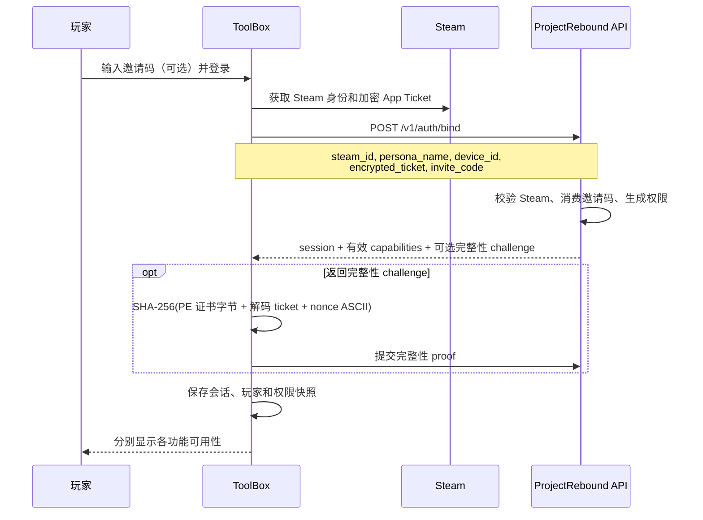
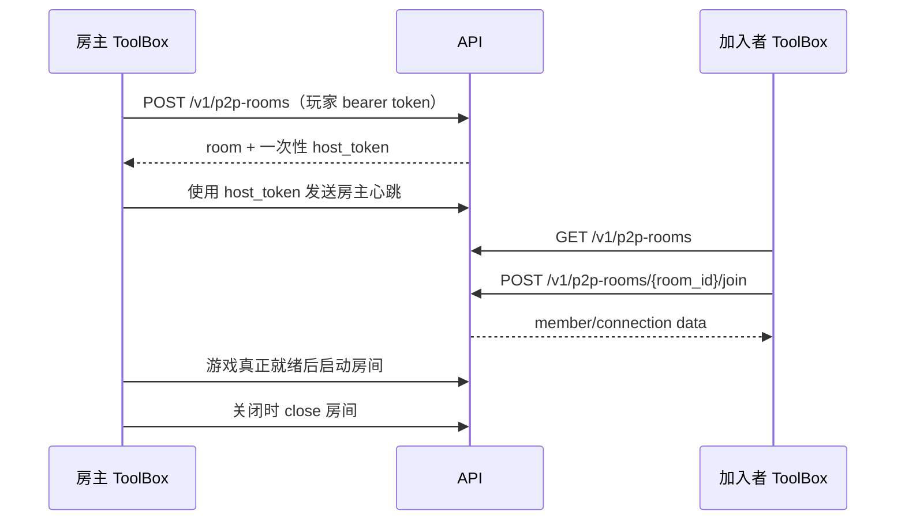

# ToolBox 注册与接入指导书

[English](toolbox-integration-guide.md) | 简体中文

本文详细说明 ProjectRebound ToolBox 当前的玩家登录、专用服务器注册、P2P 房间、VNT 房间和社区 VNT 节点接入流程，并列出要形成完整端到端体验仍需完成的代码更改。

HTTP 字段与状态码以机器可读的 [OpenAPI 契约](../../Backend/api/openapi/openapi.yaml)为准；如果本文滞后，以后端实现和测试为准。以 `src/` 开头的路径相对于 `ProjectReboundToolbox` 仓库，以 `Backend/` 开头的路径相对于本仓库。

实现基线日期：2026-08-04。

## 1. 当前实现状态

| 流程 | ToolBox 当前状态 | 尚需接入的内容 |
| --- | --- | --- |
| 玩家登录与邀请码兑换 | 已实现。邀请码随 `/v1/auth/bind` 发送，返回的权限会保存并显示。 | 为已登录玩家增加明确的再次兑换入口；每次自动刷新后同步权限。 |
| 专服运行时注册 | 提供 Registration Token 后的流程已实现。ToolBox 会生成密钥与 CSR、注册、通过 DPAPI 保存身份、发送签名心跳并轮换凭据。 | 增加玩家侧 `/v1/game-server-registration-tokens` 请求；将现有 `ServerManager` 接入生产启动路径。 |
| 传统 P2P 房间浏览/创建/加入 | 基础 API 和 UI 已存在，UI 会按权限控制创建。 | 保存只返回一次的房主 Token，运行完整房主生命周期，把选中房间接到游戏启动，并处理实时事件/Relay 信令。 |
| VNT P2P 客户端 | 安全敏感的 API、运行时校验、节点选择和会话管理模块已存在，受 `vnt` Cargo feature 控制。 | 只在批准构建中启用；把 `VntManager` 接到 UI、实时事件和游戏启动；发布已验证运行时资产并满足发布门槛。 |
| 社区 VNT 节点注册 | 已有 `VntApiClient::create_node_enrollment`。 | 增加 owner 节点查询/Enrollment/恢复 UI，并提供单独的节点 Supervisor 负责消费代码、保存节点凭据、心跳、轮换、恢复与退役。 |

UI 中可见的权限不代表永久授权。每次受保护操作仍以后端当时的判定为准。

## 2. 权限与凭据模型

### 2.1 三项独立的邀请码权限

一个邀请码可以授予下列权限的任意组合：

| ToolBox 收到的 capability | 邀请码 permission | 允许的操作 |
| --- | --- | --- |
| `p2p_room_registration` | `allow_p2p_room_registration` | 创建 P2P 房间；仅加入其他玩家的房间不需要此权限。 |
| `game_server_registration` | `allow_game_server_registration` | 申请一次性专服 Registration Token。 |
| `vnt_node_registration` | `allow_vnt_node_registration` | 申请一次性社区 VNT Node Enrollment Code。 |

每项已授予权限与邀请码同时到期；无到期时间的邀请码产生永久权限。以后兑换符合条件的邀请码可以延长权限，但不能缩短已有期限；永久权限优先。修改或撤销邀请码只影响未来兑换，不会追溯改写已经发给玩家的权限。

bind、refresh 和当前玩家响应只返回当时仍有效的权限。如果权限在 ToolBox 运行期间到期，UI 可能短暂保留旧快照；下一次受保护请求会返回 `403`。此时 ToolBox 必须刷新会话/权限并更新 UI，不能盲目重试。

### 2.2 凭据分类

| 凭据 | 持有者 | 有效时间与用途 | 保存规则 |
| --- | --- | --- | --- |
| 邀请码 | 玩家 ToolBox | 玩家 bind 时消费；期限由管理员设置。 | 只保存到 bind 成功，禁止记录日志。 |
| 玩家 access token | 玩家 ToolBox | 调用玩家 API 的短期 bearer token。 | 当前代码保存在 `app_config.json`；应迁移到操作系统保护的存储。禁止放入命令行。 |
| 玩家 refresh token | 玩家 ToolBox | 由 `/v1/auth/refresh` 轮换。 | 与 access token 同等保护；最终刷新失败或退出登录时全部清除。 |
| 专服 Registration Token | 从玩家 ToolBox 交给一个服务器实例 | 一次性、10 分钟；只授权注册，不用于运行时流量。 | 只保留到启动/注册，消费成功后从配置中清除。 |
| 专服运行时 token/密钥/证书 | 专服 ToolBox 进程 | 运行时身份；当前有效 24 小时，并在到期前轮换。 | DPAPI 保护的身份文件；不得交给游戏进程或 UI。 |
| P2P host token | 房主 ToolBox 进程 | 创建房间时只返回一次，用于房主心跳/start/close；房间最长 8 小时。 | 只存内存；禁止写入 `app_config.json` 或日志。 |
| VNT 房间/bootstrap 密钥材料 | 玩家 ToolBox 与 VNT helper | 短期，并绑定房间和 generation。 | 仅启动 helper 时写入受限临时文件，随后删除并清零。 |
| VNT Node Enrollment Code | 从玩家 ToolBox 交给节点运营者/Supervisor | 一次性、10 分钟。 | 只展示/导出一次，交付后不再保留。 |
| VNT node token | 仅 Node Supervisor | 节点运行时身份；当前 90 天，并支持轮换。 | 使用操作系统保护的服务存储；不得返回玩家 ToolBox。 |

## 3. 模块与代码更改清单

### 3.1 ToolBox 模块

| 模块 | 当前职责 | 后续更改 |
| --- | --- | --- |
| `src/api/auth.rs` | bind/refresh DTO、邀请码字段和返回权限。 | 持续与 OpenAPI 同步；如果以后 API 返回权限到期元数据，也在此暴露。 |
| `src/api/api_worker.rs` | 在 UI 线程外串行处理认证和传统房间操作。 | 把完整房间创建结果返回控制器；增加专服 Token 与节点 Enrollment 请求命令。 |
| `src/api/http.rs` | 通用 HTTPS 客户端与 `401` 后一次刷新重试。 | 内部刷新 DTO 当前只保留 session token；应同时保存返回的 capabilities，并保留 `request_id`、结构化 details 与 `Retry-After`。 |
| `src/core/app.rs` | 自动 bind、自动刷新、登录状态和权限快照。 | 集中处理权限替换/清除，为已有玩家提供明确的邀请码兑换动作。 |
| `src/config/config_types.rs` | 把玩家会话和权限持久化到 `app_config.json`。 | 将 bearer/refresh token 迁移到 Windows 凭据保护，只在 JSON 中保留非秘密偏好。 |
| `src/pages/settings.rs` | 未登录时的邀请码输入和三项权限状态。 | 增加重新认证/兑换入口、到期/陈旧提示，以及受保护操作失败后的刷新。 |
| `src/Server/config.rs` | 读取 `serverconfig.json`，包括一次性 `registrationToken` 和实例身份。 | Token 保持可选，只在用户明确启动注册时写入。 |
| `src/Server/registration.rs` | CSR 注册、DPAPI 身份、签名心跳和凭据轮换。 | 通过 `ServerManager` 复用；只向 UI 暴露脱敏健康状态和可操作错误。 |
| `src/Server/pipe.rs` | 随机同用户/同会话命名管道和非秘密游戏状态交换。 | 注册秘密不得进入管道协议。 |
| `src/Server/manager.rs` | 服务进程、注册 supervisor 与 Job 生命周期所有权。 | 用它替换 `src/launching/launch.rs` 中重复的生产启动编排。 |
| `src/api/rooms.rs` | 传统房间 list/get/create/join/leave/heartbeat/start/close。 | 在适用处加入 `transport_kind`，并保留完整 create 响应。 |
| `src/pages/launch.rs` | 房间浏览和基础 create/join 操作。 | 增加内存 Active Room 控制器，将选中房间、信令和实际游戏启动接通。 |
| `src/api/vnt.rs` | 失败即关闭的 VNT 房间/节点 API 客户端。 | 只有构建开关和后端 feature gate 都开启时才接到控制器/UI。 |
| `src/vnt/runtime.rs` | 校验 helper/runtime manifest、哈希、签名、架构和 Wintun。 | 打包签名资产，并在发布构建中设置受信 manifest 哈希。 |
| `src/vnt/nodes.rs` | 筛选、探测并确定性选择合格节点。 | 提供安全的选择诊断，不能泄漏房间秘密。 |
| `src/vnt/session.rs` | 受限配置、VNT helper 生命周期、就绪、清零与清理。 | 保持为隧道秘密和进程的唯一所有者。 |
| `src/vnt/manager.rs` | 房主/加入编排、心跳、presence、rebind、重连与关闭顺序。 | 提供生产 `GameLaunchAdapter` 和实时事件 adapter，并接入启动页。 |

### 3.2 后端模块

| 模块 | 职责 |
| --- | --- |
| `Backend/internal/auth/` | 玩家 bind/refresh、Steam ticket 校验、完整性 challenge/proof 和会话签发。 |
| `Backend/internal/entitlement/` | 三项 capability 名称、邀请码权限落库、到期与有效权限查询。 |
| `Backend/internal/gameserverregistration/` | 一次性 Registration Token 的保存、哈希、消费及与稳定 instance ID 的关联。 |
| `Backend/internal/gameserver/` | Token 签发 handler、服务器注册、心跳验证和凭据轮换。 |
| `Backend/internal/p2proom/` | 传统 Relay/VNT 房间状态、host token、成员、硬到期、心跳、start/close 与 generation 规则。 |
| `Backend/internal/vnt/` | VNT owner 查询/配额/恢复、Enrollment Code、节点注册/心跳/轮换/退役、安全审计、独立限流、探测、状态和 sweeper。 |
| `Backend/internal/controlplane/server.go` | 公网路由注册与认证中间件边界。 |

## 4. 玩家登录与邀请码兑换

### 4.1 当前 ToolBox 流程



`src/pages/settings.rs` 只在未登录时收集可选邀请码。`src/core/app.rs::start_auto_bind` 通过 `ApiCmd::AuthBind` 传递邀请码，`src/api/auth.rs` 将其作为 `invite_code` 发送至 `POST /v1/auth/bind`。成功后 ToolBox 保存玩家、会话和权限，并清除邀请码输入。

bind 请求的概念形式如下：

```json
{
  "steam_id": "7656119...",
  "persona_name": "Player",
  "device_id": "stable-device-id",
  "encrypted_ticket": "base64-ticket",
  "invite_code": "one-player-invitation"
}
```

邀请码属于单个玩家，不能复制到专服或 VNT 节点配置。后端将其绑定到该玩家，并返回类似以下 capability 列表：

```json
{
  "capabilities": [
    "p2p_room_registration",
    "game_server_registration",
    "vnt_node_registration"
  ]
}
```

### 4.2 刷新与到期行为

1. ToolBox 启动时，如果存在 refresh token，先尝试刷新。
2. 普通认证请求遇到 `401` 时，可刷新会话并重试一次。
3. 每次 bind、显式 refresh 或 `/v1/auth/me` 同步成功，都必须**替换**本地权限集合，不能合并；缺失权限可能已经到期。
4. 最终刷新失败时，清除 access token、refresh token、玩家身份和 capabilities，并回到未登录状态。
5. 受保护操作返回 `403` 时，以后端为准；刷新状态、禁用对应动作，并提示邀请码权限可能已到期。

当前注意事项：`src/api/http.rs` 的刷新路径只反序列化替换后的 session。应更新 DTO 和配置写入，让自动重试也替换 `capabilities`；否则设置页会一直显示旧状态，直到下一次显式认证操作。

### 4.3 已有玩家兑换新邀请码

当前 UI 只允许未登录时输入邀请码，因此已有玩家需要退出登录、输入新码并重新 bind。更完整的做法是增加明确的 **兑换邀请码** 动作：

1. 要求有效 Steam ticket，不能只发送 bearer token 和邀请码；
2. 使用已有 Steam 身份与新 `invite_code` 调用同一个 bind 操作；
3. 原子替换返回的 session 和权限快照；
4. 成功时清除邀请码，失败时只保留脱敏且可纠正的错误；
5. 在后端接受前，不向玩家承诺权限已经延长。

## 5. 专用服务器注册

专服接入包含两种身份，必须保持两阶段流程：

1. 有权限的**玩家**申请短期 Registration Token；
2. **服务器 ToolBox 进程**一次性消费它，取得独立的运行时身份。

玩家的邀请码、access token 和 refresh token 绝不能安装到专服。

### 5.1 申请 Registration Token

在正常 ToolBox 流程中，玩家已通过 Steam 验证，并已在登录时通过邀请码获得有效 `game_server_registration`。ToolBox 应增加调用以下接口的命令和页面动作：

```http
POST /v1/game-server-registration-tokens
Authorization: Bearer <player-access-token>
Content-Type: application/json
```

```json
{
  "instance_id": "owner-selected-stable-instance-id"
}
```

契约还接受可选 `invite_code`：当已验证玩家尚无专服权限时，可以在同一事务中兑换。正常 ToolBox UI 应省略该字段，因为它已经在 bind 时处理玩家邀请码；该端点选项只保留给兼容客户端和恢复流程。

准确响应结构以 OpenAPI 为准。返回的 Registration Token 一次性使用，10 分钟后到期。`instance_id` 必须稳定标识目标服务器安装，不能每次点击都重新生成。

当前状态：ProjectReboundToolbox 还没有该端点的生产调用。运营者目前必须通过其他授权客户端/管理流程申请 Token，再临时放入 `serverconfig.json` 的 `registrationToken`。

建议代码更改：

- 新增 `src/api/game_server_registration.rs`，定义强类型签发请求/响应；
- 在 `src/api/api_worker.rs` 增加 `ApiCmd::IssueGameServerRegistrationToken`；
- UI 按 `game_server_registration` 控制按钮，同时仍以后端 `403` 为准；
- 显示 10 分钟期限，只在启动匹配服务器实例时写入 Token；
- 禁止复制到日志、遥测或进程参数。

### 5.2 当前服务器注册流程

`serverconfig.json` 保存普通启动设置；首次注册前才临时包含一次性 Token：

```json
{
  "serverName": "Example Server",
  "serverRegion": "china-east",
  "port": 7777,
  "externalPort": 7777,
  "publicHost": "203.0.113.10",
  "maxPlayers": 32,
  "gameVersion": "current-version",
  "backend": "https://api.project-rebound.space",
  "offline": false,
  "registrationToken": "single-use-token",
  "serverUniqueId": "stable-instance-id"
}
```

字段名和可选性以 `src/Server/config.rs` 为准；该示例不能替代配置 schema。

启动时，现有注册 worker 执行：

1. 校验在线配置，将 `registrationToken` 移入会清零的内存容器。
2. 建立随机 192-bit、限制同一 Windows 用户/会话访问的命名管道。
3. 使用管道名启动游戏 Payload；管道只传递 state、玩家数和回合状态等非秘密信息。
4. 查找 `game-server-identity-<sanitized-instance>.dpapi`。
5. 如果身份不存在，在本地生成 Ed25519 私钥并创建 PKCS#10 CSR。
6. 使用 `Authorization: Bearer <registration-token>` 和公开注册信息调用 `POST /v1/game-servers`。
7. 将 server ID、运行时 token、私钥、证书、CA、指纹、到期、generation 与心跳间隔原子写入 DPAPI 保护身份。
8. 从 `serverconfig.json` 清除 `registrationToken`，并清零内存副本。
9. 使用服务器 bearer token 与签名头向 `/v1/game-servers/{server_id}/heartbeat` 发送签名心跳。
10. token/证书距到期不足 6 小时时，使用新密钥和 CSR 轮换；后端只在有限重叠窗口接受旧 generation。

服务器运行时身份当前有效 24 小时。玩家权限以后到期，只会阻止申请新的 Registration Token，不会使已经注册的服务器独立身份失效；正常轮换无需玩家保持登录。

### 5.3 启动所有权更改

`src/Server/manager.rs` 已包含预期的进程、注册 supervisor 和 Windows Job 生命周期所有权，但 `src/launching/launch.rs` 的生产 PvE 路径仍重复了部分编排。完成接入时应让 `ServerManager` 成为唯一所有者：

- 将 Payload/game 与注册 supervisor 作为同一事务启动；
- 启动失败时取消注册并终止子进程；
- 只向 UI 暴露脱敏状态，不暴露原始凭据；
- 同一稳定实例在重启时复用身份；
- 只有不存在有效/可恢复身份时才要求新的一次性 Token。

## 6. 传统 P2P 房间注册与加入

### 6.1 权限边界

创建房间需要 `p2p_room_registration`；列出房间或加入其他玩家的兼容开放房间不需要该权限，但加入仍要求有效且已验证的玩家会话。当前启动页遵循 capability 边界：创建按钮检查 capability，加入动作检查登录和房间可用状态；账号状态与验证仍由后端最终执行。

### 6.2 当前 create/join 流程



`src/api/rooms.rs` 已实现 list、get、create、join、leave、heartbeat、start 和 close。`src/pages/launch.rs` 当前创建固定的测试式请求，成功后刷新列表。

重要缺口：`ApiCmd::CreateRoom` 会丢弃 `CreateRoomData`，其中包括只返回一次的 `host_token`。因此 UI 目前不能运行房主 heartbeat、start 或 close。在宣布 P2P 托管完成前必须修复。

Active Room 控制器应：

1. 只在内存中保存 `room_id`、`host_token`、状态、transport 和期限；
2. 立即启动心跳，并在 close、退出登录或进程退出时确定性停止；
3. 对契约支持的操作使用幂等键；
4. 把返回的信令/Relay 信息接到所选游戏启动；
5. 只有实际游戏/listen host 就绪后才调用 start；
6. 正常关闭时调用 close，并容忍房间到期/丢失；
7. 绝不把 host token 交给加入者。

即使持续心跳，房间也有 8 小时硬到期。房主心跳新鲜度和房间状态独立于玩家邀请码期限。创建因权限到期被拒绝时，应刷新权限并只禁用新的创建动作；不能因此暴露或复用旧 host token。

## 7. VNT P2P 房间流程

VNT 房间使用 `p2p_room_registration`，不使用 `vnt_node_registration`；后者只用于贡献社区 VNT 节点。

### 7.1 构建和运行时门控

VNT 客户端只在以下构建中编译：

```powershell
cargo build --release --features vnt
```

它还受后端客户端配置 `features.vnt_rooms` 和运行时验证控制。后端根据部署设置 `VNT_ROOMS_ENABLED` 发布该值，默认值为 `false`；同一开关也会在服务端拒绝新的 VNT create/rebind 操作。节点目录中的 `version_compatible` 由精确匹配的部署白名单 `VNT_ALLOWED_VNTS_VERSIONS` 与 `VNT_ALLOWED_WRAPPER_VERSIONS` 计算；ToolBox 应隐藏不兼容节点，同时仍处理 `VNT_NODE_UNAVAILABLE`，因为后端会在 create/rebind 事务中再次检查兼容性。`src/vnt/runtime.rs` 在架构、helper capability、Wintun、manifest、版本、哈希或发布签名不可信时会失败关闭。发布构建必须嵌入批准的 `PROJECT_REBOUND_VNT_MANIFEST_SHA256`，并精确携带 manifest 描述的资产。

不能因为 `--features vnt` 编译成功就显示 VNT 操作；后端开关与运行时预检必须同时通过。

### 7.2 `VntManager` 已实现的房主流程

1. 确认 manager 没有活动会话，且 VNT 已启用并健康。
2. 列出并探测合格 ONLINE 节点；先过滤版本、容量、UDP 支持和证书指纹，再排序。
3. 使用 `transport_kind=VNT` 和幂等键创建房间。
4. 请求房主 bootstrap 包。
5. 校验固定节点 endpoint/fingerprint、密码学策略、generation、期限和房主虚拟 IP。
6. 写入受限临时 helper 配置，启动 VNT helper/client，等待结构化就绪，然后删除并清零 bootstrap 秘密。
7. 通知后端房主已就绪。
8. host token 只保存在 `VntManager` 内存，运行房间 heartbeat 和 presence。
9. 只把非秘密 `VntGameContext` 交给 `GameLaunchAdapter`。
10. 游戏实际启动后才标记 match started。

### 7.3 `VntManager` 已实现的加入者流程

1. 获取房间，只接受后端固定的节点；加入者不能替换为更快节点。
2. 加入房间、请求并校验 bootstrap，然后启动受限会话。
3. 在有限就绪窗口内验证房主分配的虚拟地址（当前为 `10.26.0.2`）。
4. 使用非秘密 VNT 连接上下文启动游戏。
5. 失败时离开房间并拆除隧道，不保留半完成状态。

rebind 只允许在比赛开始前发生，并创建新 generation、轮换秘密。重连仅限同一节点且次数有上限，不支持热迁移。关闭顺序为游戏、隧道/helper、后端 close/leave。

### 7.4 尚缺的生产接线

上述模块当前未接到 `src/core/app.rs` 或 `src/pages/launch.rs`，也没有生产 `GameLaunchAdapter`/实时 adapter 驱动它们。需要：

- 创建由应用唯一持有的 `VntManager`，向 UI 暴露不可变视图状态；
- create/join/rebind/reconnect/实时事件全部经过 manager，widget 不能直接调用；
- 实现游戏 adapter，禁止传递 host/bootstrap/node 秘密；
- 取消与应用退出必须调用 manager 的有序 shutdown；
- 对预检、探测、就绪和后端错误码提供安全诊断；
- 传统 Relay 只能按服务端策略选择/回退，不能静默降级一个 VNT 房间。

## 8. 社区 VNT 节点注册

社区节点接入刻意拆成两个程序：

- **玩家 ToolBox** 证明玩家身份和权限，然后申请短期 Enrollment Code；
- **VNT Node Supervisor** 在节点主机运行，一次性消费代码，持有 node token，并负责心跳、轮换与退役。

玩家 ToolBox 不能变成长驻节点 Supervisor，也绝不能收到最终的 node token。

### 8.1 玩家 ToolBox：申请 Enrollment Code

要求：ACTIVE、Steam verified、integrity trusted 的玩家会话、有效 `vnt_node_registration`，且仍有 owner 配额。后端默认每位玩家最多拥有 3 个非 `RETIRED` 节点，达到上限返回 `409 VNT_NODE_QUOTA_EXCEEDED`。

```http
POST /v1/vnt/node-enrollments
Authorization: Bearer <player-access-token>
Content-Type: application/json
```

```json
{
  "label": "hk-node-01"
}
```

label 必须匹配 `[A-Za-z0-9][A-Za-z0-9._-]{0,63}`。响应包含一个 `vne_...` 一次性代码，10 分钟到期，并带 `Cache-Control: no-store`。

`src/api/vnt.rs::create_node_enrollment` 已实现 API 调用，但没有 UI/控制器调用者。应增加设置页或 VNT 节点页：

- 本地 capability 只用于改善 UX，最终以后端 `403` 为准；
- 只有用户明确确认后才申请；
- 代码只显示一次，并提供倒计时和复制/导出；
- 禁止写入 `app_config.json`、剪贴板历史遥测、日志、崩溃报告或进程参数；
- 消费、到期、关闭窗口或退出登录时立即清除。

使用分页的 `GET /v1/users/me/vnt-nodes` 只展示调用者自己的节点、安全的生命周期状态和凭据到期信息，并在本地状态丢失后找回稳定 `node_id`。该只读接口要求 ACTIVE、Steam verified，但不要求完整性 Step-up；它绝不返回 Node Token 或哈希。

### 8.2 Node Supervisor：消费 Enrollment Code

单独的 Supervisor 调用：

```http
POST /v1/vnt/nodes
Authorization: VNTEnrollment <enrollment-code>
Content-Type: application/json
```

```json
{
  "advertised_host": "203.0.113.20",
  "port": 29872,
  "region": "asia-east",
  "location": "Hong Kong",
  "vnts_version": "approved-version",
  "wrapper_version": "approved-version",
  "server_key_fingerprint": "sha256:<64-lowercase-hex-characters>",
  "supported_transports": ["udp", "tcp"],
  "max_rooms": 100
}
```

端口必须在 `1024..65535`；版本字符串最多 32 个字符；服务器密钥指纹必须包含完整 SHA-256，并由后端规范化；`max_rooms` 为 `1..10000`。当前契约要求同时包含用于 VNT 流量的 `udp` 和用于控制面可达性探测的 `tcp`；仅 TCP 探测成功不能证明 UDP/VNT 流量可用。

响应返回 `node_id`、以 `vnn_` 开头且只返回一次的 `node_token`、初始状态 `REGISTERING`、30 秒心跳间隔和凭据期限（当前 90 天）。应在 Supervisor 的操作系统服务身份下保护 token，并立即删除 Enrollment Code。

随后 Supervisor：

1. 发送包含 wrapper/VNT 版本、uptime、reported sessions 和健康状态的认证心跳；
2. 等待后端可达性探测把节点转为 `ONLINE`；
3. 到期前轮换节点凭据，并原子替换受保护 token；
4. 使用 delete 端点 drain/retire，而不是直接消失；
5. 从控制面角度，约 90 秒无心跳会 stale，5 分钟会 offline。

轮换成功响应含只返回一次的新 `node_token`、`credential_expires_at` 和 `previous_valid_until`。新 Token 立即用于所有管理请求；旧 Token 在默认 60 秒重叠窗口内只允许 heartbeat，不能再次轮换或 retire。Supervisor 必须先原子持久化新 Token，再切换心跳，并在截止时间前完成；响应丢失时进入人工恢复状态，不能用旧 Token 盲目重复轮换。

### 8.3 Owner 恢复与退役

节点凭据或轮换响应丢失时，owner 完成完整性 Step-up、申请新的 Enrollment Code，并把它一次性交给 Supervisor。Supervisor 使用正常注册请求体和 `Authorization: VNTEnrollment <fresh-code>` 调用 `POST /v1/vnt/nodes/{node_id}/recover`。后端核对 owner、立即撤销全部旧凭据、保留 `DRAINING` 或回到 `REGISTERING`，并只返回一次替换凭据；仍有活动房间时拒绝 endpoint/fingerprint 变更。非 owner 收到不可枚举的 `404`。

Supervisor 通常使用当前 Node Credential 退役；integrity-trusted owner 也可用 Player Access 调用 `DELETE /v1/vnt/nodes/{node_id}`，后端会核对 owner。进入 `DRAINING` 后必须继续 heartbeat 和既有 session，直到 sweeper 转为 `RETIRED` 并撤销凭据。

ProjectReboundToolbox 当前没有 Node Supervisor 实现。它应是最小权限、面向服务的独立二进制或仓库，不能藏在玩家启动按钮后面。

## 9. 错误处理与重试规则

| 结果 | ToolBox 行为 |
| --- | --- |
| `400` | 显示字段级校验但不回显秘密；相同输入不重试。 |
| 玩家 API `401` | 刷新一次，原子替换 session 与 capabilities，再重试一次；失败则退出登录。 |
| 服务器/节点运行时 `401`/`403` | 禁止回退到玩家 token；检查轮换、generation、retirement，并显示脱敏运营错误。 |
| 受保护 create/enrollment 的 `403` | 刷新权限；如果权限到期，禁用对应动作。禁止通过复用邀请码重试。 |
| `404` | 对本地活动会话而言，把已到期/关闭房间或已退役资源视为终止。 |
| `409` | 按结构化错误码分支：幂等冲突、旧 generation、房间状态、Token 已消费和实例已存在的恢复方式不同。 |
| `410` | 一次性凭据或资源已过期，视为终止；仍有权限时申请新的凭据。 |
| `429` | 遵守 `Retry-After`，禁止忙循环或并行申请替换 enrollment。 |
| `5xx`/网络错误 | 只对幂等调用做有界指数退避与抖动；重复 create/enroll 前先对账状态。 |

保留后端 `request_id`，并在诊断中允许复制。必须脱敏 Authorization 头、邀请码、Registration/Enrollment Token、host token、bootstrap 内容、私钥，以及可能含秘密的完整错误响应体。

## 10. 建议实施顺序

1. **认证正确性：** 自动 refresh 同步替换权限；增加显式邀请码兑换和操作系统保护的玩家 Token 存储。
2. **专服：** 增加玩家侧 Registration Token 签发，然后让 `ServerManager` 成为唯一生产启动所有者。
3. **传统 P2P：** 在内存 Active Room 状态中保留 host token，实现 heartbeat/start/close，并把 join 数据接到游戏启动。
4. **VNT P2P：** 打包并验证运行时资产，增加应用所有的 `VntManager`、adapter、UI、实时事件和取消流程。
5. **社区节点：** 增加一次性 Enrollment Code UI，然后实现并部署独立 Node Supervisor。
6. **运营加固：** 结构化诊断、`Retry-After`、request ID、遥测脱敏、崩溃恢复和到期模拟。

## 11. 验收清单

### 玩家与邀请码

- 分别及组合兑换授予三种 permission 的邀请码。
- 验证到期后 bind/refresh/me 不再返回对应权限，受保护 API 拒绝新操作。
- 验证后兑换的更短邀请码不会缩短权限，永久权限保持永久。
- 验证退出登录/最终刷新失败清除 token 和全部权限 UI 状态。
- 验证日志、命令行和崩溃报告中不存在邀请码或 bearer/refresh token。

### 专服

- 只有有效 `game_server_registration` 可申请 Token；到期后返回 `403`。
- 在 10 分钟内注册一次；复用和过期 Token 必须失败。
- 只使用 DPAPI 身份重启，机器上不再存在玩家凭据或 Registration Token。
- 验证签名心跳、到期前 6 小时轮换触发、有限旧 generation 重叠和失败清理。
- 验证一个稳定 instance ID 对应预期服务器安装。

### P2P 与 VNT 房间

- 验证无创建权限的玩家可加入但不能创建。
- 验证 host token 仅在内存，并实际驱动 heartbeat/start/close。
- 验证 8 小时硬到期和房主心跳陈旧行为。
- 构建、后端开关、manifest、签名、架构、Wintun 或 helper capability 任一检查失败时，VNT 必须隐藏。
- 验证房主/加入成功、开局前 generation rebind、有限同节点重连、加入者不能换节点，以及有序关闭。

### 社区 VNT 节点

- 只有 ACTIVE/Steam verified/integrity trusted、具有有效 `vnt_node_registration` 且 owner 配额未满时可申请 Enrollment Code；验证 10 分钟到期且只能使用一次。
- 验证玩家 ToolBox 永远不会收到或保存 `node_token`。
- 验证 Supervisor DPAPI/服务存储、30 秒心跳、ONLINE 探测、90 天轮换、stale/offline 和 drain/retire。
- 验证 owner-only 节点查询、凭据丢失恢复、旧 Token 立即撤销、跨 owner 不可枚举失败，以及活动房间期间的身份变更保护。
- 确认 UI 历史、日志、遥测、进程列表和配置文件中不存在秘密。
