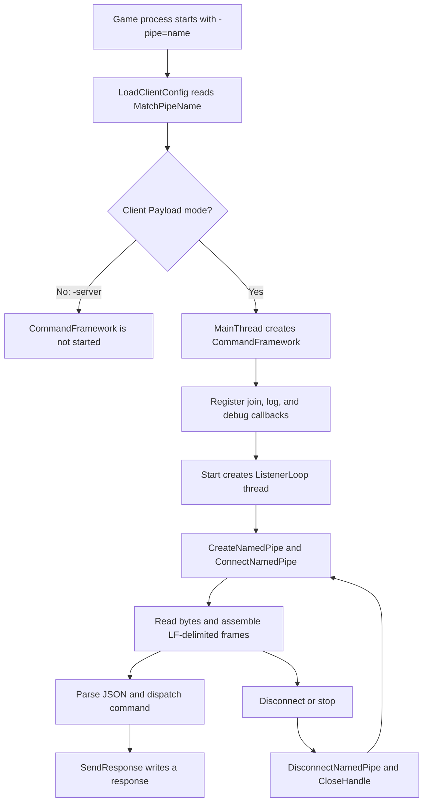

# CommandFramework C++ implementation analysis guide

English | [简体中文](command-framework-code-analysis.zh-CN.md)

## Status and scope

This guide is a source-level analysis of the Windows named-pipe implementation at commit
`bab8eb01a0a867bce53880e6104d1a4b5229abb4`. It records the code that exists, the behavior
that follows from it, known mismatches with the protocol documentation, and a repeatable
review method for future changes.

The implementation is a client-game Payload service. It is not the anonymous pipe used by
the server wrappers to redirect child-process output. The repository no longer contains the
former .NET named-pipe client, so this guide cannot treat an in-repository client/server run
as an available end-to-end path.

Read the shorter [wire-protocol overview](command-framework.md) first when only the frame
format is needed. Use this document for implementation, maintenance, security, and testing
work.

## Executive assessment

The current C++ source contains a recognizable single-client named-pipe server:

- opt-in activation through `-pipe=<name>`;
- a duplex, message-type Windows named pipe;
- one listener thread using overlapped connect and read operations;
- newline-delimited command frames with JSON payloads;
- `ping`, `join`, and `debug` dispatch;
- disconnection cleanup followed by pipe recreation.

It should still be classified as an experimental implementation rather than a reliable
production transport. The response write violates the overlapped-handle contract, the
configured watchdog is not used, the common `join` path ignores the requested address,
several input shapes can terminate the process through an uncaught exception, cancellation
and object lifetime are unsafe, and the security descriptor authorizes every principal.

## Source map

| File | Responsibility | Relevant code |
| --- | --- | --- |
| [`Payload/Communication/CommandFramework.h`](../../Payload/Communication/CommandFramework.h) | Public API, callbacks, protocol constants, runtime state | Entire class |
| [`Payload/Communication/CommandFramework.cpp`](../../Payload/Communication/CommandFramework.cpp) | Pipe creation, connect/read loop, framing, dispatch, response writing | Lines 25–400 |
| [`Payload/Config/Config.cpp`](../../Payload/Config/Config.cpp) | Reads `-pipe=` and `-match=` from the process command line | Lines 24–36 and 136–156 |
| [`Payload/Config/Config.h`](../../Payload/Config/Config.h) | Declares `MatchIP` and `MatchPipeName` | Lines 24–28 |
| [`Payload/dllmain.cpp`](../../Payload/dllmain.cpp) | Creates the framework and wires callbacks in non-server mode | Lines 36–56 and 139–186 |
| [`Payload/ClientLogic/ClientLogic.cpp`](../../Payload/ClientLogic/ClientLogic.cpp) | Implements the game transition reached by `join` | Lines 20–92 |
| [`Payload/Debug/DebugTool.cpp`](../../Payload/Debug/DebugTool.cpp) | Current `debug` callback target | Lines 28–32 |
| [`Payload/Payload.vcxproj`](../../Payload/Payload.vcxproj) | Includes the header and translation unit in the Payload build | Lines 152 and 162 |
| [`docs/architecture/command-framework.md`](command-framework.md) | Human-readable wire contract | Entire document |

The calls to `CreatePipe` in `ServerWrapper` and `ServerLauncherGUI` create anonymous pipes
for stdout/stderr capture. They do not create or consume `CommandFramework` named pipes.

## Activation and control flow



Important activation facts:

1. `LoadClientConfig()` only stores the pipe name. It does not validate it or create a pipe.
2. `CommandFramework` is constructed only in the non-server branch of `MainThread()`.
3. No pipe is created when `-pipe=` is absent or empty.
4. `Start()` is called after the Payload has waited for a non-null `UWorld` and initialized
   client hooks.
5. The return value of `Start()` is ignored by `dllmain.cpp`.
6. The current repository has no launcher code that passes `-pipe=`. An external consumer
   must generate the name, launch the game, connect, and implement the wire contract.

## Class structure

### Callback types

| Type | Signature | Calling thread | Current binding |
| --- | --- | --- | --- |
| `JoinCallback` | `void(ip, token)` | Listener thread | `OnJoinFromPipe` |
| `LogCallback` | `void(message)` | Calling thread, usually listener or owner thread | `ClientLog` lambda |
| `DebugCallback` | `json(args)` | Listener thread | `DebugTool::ExecuteJson` lambda |

Callbacks are synchronous. A slow or blocking callback stops all pipe reads and delays its
response. Exceptions from callbacks are not caught at the listener boundary.

### Configuration members

| Member | Intended meaning | Actual use |
| --- | --- | --- |
| `pipeName` | Complete `\\.\pipe\<name>` path | Used by `CreateNamedPipeA` |
| `watchdogTimeoutMs` | Idle read timeout, default 30 seconds | Initialized and settable, but never read by the listener |
| `onJoin` | Runtime match-change handler | Called for non-empty `ip` |
| `onLog` | Framework logger | Called without exception protection |
| `onDebug` | Debug command handler | Registered unconditionally when the pipe starts |

### Runtime members

| Member | Intended invariant | Current protection |
| --- | --- | --- |
| `running` | True while the listener is expected to run | Atomic boolean |
| `hCurrentPipe` | Connected pipe handle or `INVALID_HANDLE_VALUE` | `writeMutex` |
| `writeMutex` | Serialize handle publication, clearing, cancellation, and writes | Does not protect local `hPipe` or callbacks |
| `listenerThread` | At most one joinable listener | Start/stop calls themselves are not serialized |
| `sa`, `sd` | Persistent security structures used by pipe creation | Initialized once before thread start |
| `saInitialized` | Security structures have been initialized | Ordinary boolean; configuration is documented as pre-start only |

### Win32 object ownership

| Object | Created by | Expected release | Current release path |
| --- | --- | --- | --- |
| Named-pipe handle | `CreateNamedPipeA` | After disconnect or failed connect | `CloseHandle(hPipe)` |
| Connect event | `CreateEventA` | After connect completion/cancellation | `CloseHandle(connectOl.hEvent)` |
| Read event | `CreateEventA` per read | After read completion/cancellation | `CloseHandle(readOl.hEvent)` |
| Listener thread | `std::thread` in `Start()` | `join()` before object destruction | `join()` or unsafe timeout `detach()` |
| Framework object | `new` in `dllmain.cpp` | DLL/process shutdown | Never deleted by current wiring |

## Function-by-function analysis

### `CommandFramework::CommandFramework`

The constructor sets a 30-second nominal timeout, clears the running state, marks the
connected handle invalid, and zeroes both security structures. It does not allocate Win32
resources.

The `watchdogTimeoutMs` default currently has no behavioral effect because `ListenerLoop()`
never reads it.

### `CommandFramework::~CommandFramework`

The destructor calls `Stop()`. This would be a reasonable RAII boundary only if `Stop()`
guaranteed that the listener no longer accesses the object. The timeout branch instead
detaches the thread, so destruction can leave a thread accessing destroyed members and
unloaded code.

The current global framework is leaked, which usually hides this destructor defect during
normal process termination but makes explicit DLL unloading unsafe.

### `SetPipeName`

The function prepends `\\.\pipe\` to the supplied name.

Preconditions assumed but not enforced:

- the caller passes a bare pipe name, not a complete path;
- the name is non-empty, ASCII-compatible, contains no backslash, and fits the Windows pipe
  name limit;
- the name is unpredictable enough to avoid accidental collision;
- the name came from a trusted launcher.

Because the implementation uses `CreateNamedPipeA`, non-ASCII names depend on the active
Windows ANSI code page. A wide-character implementation would remove that ambiguity.

### `SetWatchdogTimeout`

The function stores the value but the listener never consumes it. A caller can therefore
observe a successful configuration call with no timeout behavior.

Historical commit `6951aad` accumulated one-second waits against this value. That logic is
absent from the current tree and should not be restored without also repairing cancellation
completion and overlapped-object lifetime.

### Callback setters

`SetJoinCallback`, `SetLogCallback`, and `SetDebugCallback` move a `std::function` into the
object. There is no lock around callback replacement. The header correctly states that
configuration must finish before `Start()`; changing callbacks concurrently with dispatch
would be a data race.

### `Start`

`Start()` performs these steps:

1. Rejects a start when `running` is already true.
2. Rejects an empty complete pipe path.
3. Initializes an absolute security descriptor with a present NULL DACL.
4. Stores `running = true`.
5. constructs the listener thread.
6. Logs the nominal start and returns true.

Issues:

- the load/store pair is not an atomic compare-and-swap, so concurrent `Start()` calls are
  not serialized;
- return values from `InitializeSecurityDescriptor` and `SetSecurityDescriptorDacl` are not
  checked;
- a NULL DACL grants access to every principal that can reach the pipe;
- thread-construction failure leaves exception-based control flow rather than returning
  false;
- success means only that a thread was launched, not that `CreateNamedPipeA` succeeded;
- the caller ignores the returned status.

### `Stop`

`Stop()` clears `running`, locks `writeMutex`, calls `CancelIo` for the published handle,
waits up to five seconds for the native thread handle, and either joins or detaches.

Correctness defects:

- `CancelIo` only cancels I/O issued by the calling thread; reads are issued by the listener
  thread, so owner-thread cancellation is ineffective. Use `CancelIoEx` for cross-thread
  cancellation.
- The pipe is not published in `hCurrentPipe` while `ConnectNamedPipe` is pending, so Stop
  cannot directly cancel that phase.
- Lock acquisition has no timeout. If a response write blocks while holding `writeMutex`,
  Stop blocks before reaching its five-second thread wait.
- `WAIT_FAILED` is treated like a successful wait and followed by `join()` without logging
  the Win32 error.
- Detaching is not safe: the thread captures `this` and continues to use object members.
- An early return when `running` is false does not independently reconcile a joinable thread.

The required invariant is stronger: `Stop()` must not return until every outstanding I/O has
completed or completed with cancellation and the listener has exited.

### `SendResponse`

The function serializes a frame as:

```text
<command>\t<compact-json>\n
```

It holds `writeMutex`, silently drops the message when no handle is published, then calls
`WriteFile` once.

The pipe was created with `FILE_FLAG_OVERLAPPED`, but the call supplies a null
`OVERLAPPED`. Windows requires a valid, unique `OVERLAPPED` for such a handle. The bytes-
written pointer should not be used as the asynchronous completion result. The function also
ignores the return value, `ERROR_IO_PENDING`, other errors, and the final transfer length.

Consequences include lost responses, falsely reported completion, a client waiting forever,
and an unobservable broken connection. See the Microsoft
[`WriteFile`](https://learn.microsoft.com/en-us/windows/win32/api/fileapi/nf-fileapi-writefile)
contract.

### `ListenerLoop`: pipe creation

The server creates:

```cpp
PIPE_ACCESS_DUPLEX | FILE_FLAG_OVERLAPPED
PIPE_TYPE_MESSAGE | PIPE_READMODE_MESSAGE | PIPE_WAIT
nMaxInstances = 1
input/output buffer hints = 4096
```

This establishes a duplex, message-type, blocking-wait pipe with overlapped operations and a
single instance. The default remote-client mode is not overridden with
`PIPE_REJECT_REMOTE_CLIENTS`.

On failure, the code logs `GetLastError()`, sleeps one second, and retries. That retry is
unbounded and does not distinguish permanent errors such as an invalid name or access
denial from transient resource pressure.

### `ListenerLoop`: connect phase

The code creates a manual-reset event and passes its `OVERLAPPED` to `ConnectNamedPipe`.
It handles:

- immediate success;
- `ERROR_IO_PENDING`, polled in one-second slices;
- `ERROR_PIPE_CONNECTED`, the race where the client connected before the server called
  `ConnectNamedPipe`;
- other immediate errors by closing and retrying.

Missing checks:

- `CreateEventA` failure;
- `GetOverlappedResult` or `HasOverlappedIoCompleted` after the event is signaled;
- the final connect completion status;
- completion of cancellation before closing the event and allowing the stack
  `OVERLAPPED` to disappear.

An event signal means the operation completed, not necessarily that it succeeded.

### `ListenerLoop`: handle publication

After connect handling, `hPipe` is copied into `hCurrentPipe` under `writeMutex`. This allows
responses from any thread and prevents cleanup from racing a write that already holds the
same mutex.

It does not authenticate the connected client, inspect its process ID, or bind the session
to the launcher that supplied the pipe name.

### `ListenerLoop`: read phase

For every read, the listener allocates a new event, creates a stack `OVERLAPPED`, and asks
for at most 4095 bytes.

When `ReadFile` returns `ERROR_IO_PENDING`, the code waits in one-second slices while
`running` remains true. It does not count slices against `watchdogTimeoutMs`, so an idle
connection is retained indefinitely.

After an event signal, it calls `GetOverlappedResult` but ignores the Boolean result and
error code. Immediate errors other than `ERROR_IO_PENDING` are also not classified.
`bytesRead == 0` is treated as a normal disconnect even when it actually follows an error.

For message-mode pipes, a message larger than the read buffer can complete with
`ERROR_MORE_DATA`. The current code may retain transferred bytes, but it does so implicitly
rather than explicitly recognizing and testing this state.

When stopping, the listener calls `CancelIo` from the issuing thread, but immediately closes
the event and exits the scope. Cancellation is only a request; the `OVERLAPPED`, event, and
buffer must remain valid until completion is observed.

### `ListenerLoop`: framing

Read chunks are appended to `lineBuf`. Every LF extracts one frame; a preceding CR is
removed for CRLF compatibility. Empty lines are ignored.

The residual buffer is cleared after it exceeds 65,536 bytes. This is a safety valve rather
than a precise frame-size contract:

- a complete line is extracted before the residual-size check;
- after clearing an oversized prefix, a later suffix can be parsed as a new frame;
- the client is not disconnected and receives no explicit frame-too-large response;
- repeated front erasure from `std::string` can cause unnecessary copying under many frames.

### `ListenerLoop`: disconnect cleanup

The published handle is first reset under `writeMutex`; then the local handle is passed to
`DisconnectNamedPipe` and `CloseHandle`. Return values are ignored. The outer loop creates a
new instance when `running` remains true.

There is no `FlushFileBuffers` before a server-initiated disconnect, so a final buffered
response is not explicitly drained before the client handle is invalidated.

### `ParseAndDispatch`

The parser splits on the first tab. A missing tab returns an `error` frame. A non-empty JSON
suffix is parsed, and only `nlohmann::json::parse_error` is caught.

The parser does not enforce the documented object requirement. An empty suffix leaves
`args` as JSON null. Arrays, strings, numbers, booleans, and null therefore reach dispatch.

This is process-critical because `Dispatch()` calls `value()` for `join`; nlohmann JSON
throws `type_error` when `value()` is applied to a non-object or when a present field cannot
convert to the requested type. No exception boundary surrounds the listener thread, so such
an exception invokes `std::terminate`.

Examples that must be included in negative tests:

```text
join\t
join\t[]
join\t{"ip":123}
debug\t"string"
```

### `Dispatch`

Actual command behavior:

| Request | Actual validation | Side effect | Response |
| --- | --- | --- | --- |
| `ping` | None | None | `pong\t{}\n` |
| `join` | Calls `value()`; only invokes callback when `ip` is non-empty and callback exists | May start game transition | Always `join_ack\t{"status":"ok"}\n` if no exception |
| `debug` | None | Calls registered debug callback | Callback JSON in `debug_ack` |
| Other | None | Logs unknown command | `error` with `msg` and `cmd` |

The `join` acknowledgement does not prove that the command was accepted, scheduled, or
completed. Missing IP and missing callback still receive `status=ok`. The reserved `token`
is parsed but ignored by `OnJoinFromPipe`.

The protocol has no request ID, version, negotiated capability set, or asynchronous event
model. A client must serialize requests and consume exactly one response per request.

### `Log`

`Log()` invokes the configured callback directly. It neither catches exceptions nor adds
thread identity, error code, connection ID, or severity. The current `ClientLog` target also
writes global stream state without its own mutex, so logs from pipe, game, and background
threads may interleave.

## Integration-function analysis

### `GetCmdValue` and `LoadClientConfig`

`GetCmdValue` searches the ANSI command-line string for the first matching key and returns
characters up to the next space. It is not a Windows command-line parser and does not handle
quoted values, escaped quotes, duplicate keys, or key-boundary ambiguity.

`LoadClientConfig` stores `-match=` in global `MatchIP` and `-pipe=` in global
`MatchPipeName`. Neither value is validated. Pipe names generated from GUID-style ASCII are
compatible with the current assumptions, but the API itself does not enforce that profile.

### `MainThread`

In client mode, `MainThread` registers all three callbacks and starts the pipe after client
hook initialization. It does not set the watchdog explicitly and does not check the start
result.

The debug callback is registered whenever a pipe name is supplied, independently of the
`-debug` switch. Its current implementation only logs the JSON and returns `{"ok":true}`,
but the channel is already an unauthenticated extension point.

### `OnJoinFromPipe`

The function executes synchronously on the listener thread. It logs the requested address,
writes global `MatchIP` under a file-local mutex, and then:

- calls `ConnectToMatch()` when world and game instance are present;
- otherwise spawns `AutoConnectToMatchFromCmdline()`.

The mutex protects only this write. Readers in `ClientLogic.cpp` do not use the same mutex,
so `MatchIP` remains subject to a C++ data race.

The callback also invokes Unreal-facing logic from a non-game thread. Unless the SDK call
path explicitly guarantees thread safety, the operation should instead enqueue a command
for execution on the game thread.

### `ConnectToMatch`

The current implementation ignores `MatchIP` and executes `travel 127.0.0.1`. Therefore the
normal runtime `join` path does not honor the pipe request.

Historical commit `6951aad` copied `MatchIP` under a shared mutex and constructed a travel
command from that target. That behavior was lost in the current tree. Restoring the address
alone is insufficient: the value still needs syntax validation, correct UTF-8 conversion,
game-thread scheduling, and protection against console-command injection.

### `AutoConnectToMatchFromCmdline`

This function starts a detached thread, waits for world, game instance, local player, and
login state, enters the range, and eventually builds an `open` command from `MatchIP`.

Risks:

- reads `MatchIP` without synchronization while pipe `join` can modify it;
- reads `LoginCompleted` and writes `ReadyToAutoconnect` as ordinary booleans across threads;
- has no stop token or process/DLL unload coordination;
- can be started more than once;
- directly calls Unreal APIs from a background thread;
- performs byte-wise `std::string` to `std::wstring` conversion rather than UTF-8 decoding;
- places an unvalidated address into a console command.

## Protocol and boundary analysis

### Actual frame grammar

The effective grammar is broader than the documented grammar:

```text
frame       = command TAB json-text LF
command     = any bytes other than the first TAB boundary
json-text   = empty | any syntactically valid JSON value
```

The documentation says JSON must be an object, but the parser accepts every JSON type and
does not safely reject incompatible types. Text is intended to be UTF-8, while the pipe name
and command-line ingestion use ANSI Win32 APIs.

### Size and buffering

- read request: 4095 bytes;
- pipe buffer hints: 4096 bytes in each direction;
- residual line safety valve: greater than 65,536 bytes;
- no explicit outbound-frame limit;
- no queue depth, backpressure metric, or write timeout;
- message-type pipe boundaries are not used as protocol boundaries; LF remains authoritative.

### Security model

Current controls:

- a per-launch pipe name is expected but not generated by this repository;
- handle inheritance is disabled;
- one instance limits concurrent consumers.

Missing controls:

- the NULL DACL grants access to all reachable principals;
- `PIPE_REJECT_REMOTE_CLIENTS` is not set;
- no client PID, SID, session, integrity-level, or launcher-parent verification;
- no challenge/nonce or message authentication;
- `token` is not validated;
- no first-instance protection against pipe-name squatting;
- no rate limit or malformed-message disconnect policy;
- the debug extension is enabled with every pipe session.

On systems where SMB named-pipe access is reachable, the default pipe mode can accept remote
clients subject to system policy. The implementation should explicitly reject remote clients
for a local launcher-to-game channel. See
[`CreateNamedPipe`](https://learn.microsoft.com/en-us/windows/win32/api/namedpipeapi/nf-namedpipeapi-createnamedpipew).

## Concurrency and lifetime model

### Thread inventory

| Thread | Pipe responsibilities | Shared data touched |
| --- | --- | --- |
| Payload `MainThread` | Constructs and starts framework | configuration, callbacks, framework pointer |
| Listener thread | connect, read, parse, dispatch, most responses | `running`, `hCurrentPipe`, callbacks, `MatchIP` through callback |
| Arbitrary callback caller | May call `SendResponse` | `hCurrentPipe`, pipe output |
| Detached auto-connect thread | Executes game transition | Unreal objects, `MatchIP`, login flags |
| DLL/process teardown thread | Would call destructor/Stop if ownership were implemented | all framework state |

### Intended invariants

A repaired implementation should maintain all of these invariants:

1. At most one listener owns a pipe instance.
2. Every outstanding overlapped operation owns a unique `OVERLAPPED`, event, and stable buffer
   until completion is observed.
3. A handle is not closed while another thread can begin or complete I/O on it.
4. Stop is idempotent and joins the listener; it never detaches a thread that captures `this`.
5. No callback exception crosses the listener boundary.
6. Gameplay work is scheduled onto the game thread.
7. Match target reads and writes use a single synchronization strategy or immutable message
   passing.
8. Every accepted request receives one correlated response, or the connection is closed with
   a logged reason.

The current code fully maintains only the first invariant during ordinary single-threaded
startup.

## Error-path inventory

| Operation | Current behavior | Required behavior |
| --- | --- | --- |
| Security descriptor initialization fails | Ignored | Fail `Start()` and log the Win32 error |
| Thread creation fails | Exception escapes after `running=true` | Roll back state and return/throw consistently |
| `CreateNamedPipeA` fails | Log and retry forever | Classify permanent/transient failure and apply bounded backoff |
| Event creation fails | Null handle continues into I/O/wait | Close pipe and report failure |
| Connect completes with error | Event signal treated as connection | Read final result before publication |
| Read completes with error | Often collapsed to zero-byte disconnect | Classify broken pipe, cancellation, more-data, and unexpected failure |
| JSON syntax invalid | Send `error` | Keep, but bound and sanitize detail |
| JSON type invalid | Exception may terminate process | Return structured validation error |
| Callback throws | Process may terminate | Catch, log, return internal error, preserve listener |
| Response write fails | Silently ignored | Mark connection failed, cancel/close session, expose diagnostics |
| Stop during I/O | Cancellation requested without completion wait | Cancel with `CancelIoEx`, then observe completion before release |
| Listener exceeds stop deadline | Detached | Treat as fatal ownership failure; never destroy owner while thread lives |

## Historical regression notes

Commit `6951aad` introduced three relevant improvements that are absent from the current
tree:

- `CancelIoEx` in `Stop()`;
- elapsed watchdog accounting in the read wait loop;
- a shared `MatchIPMutex` plus target-based reconnect commands.

These changes demonstrate intended behavior and help locate regressions, but they are not a
complete safe implementation. That revision still used a null `OVERLAPPED` for response
writes, released cancellation state too early, exposed a NULL DACL, lacked schema validation,
and called game code from background threads. It should be used as evidence, not blindly
cherry-picked as the final fix.

The former .NET `PipeClient` and launcher wiring were removed in commit `ebb624ee`. The
current protocol document intentionally says consuming clients live outside this repository.

## Defect register and priority

| Priority | Defect | Impact |
| --- | --- | --- |
| P0 | Null `OVERLAPPED` passed to `WriteFile` on an overlapped handle | Responses are not reliable |
| P0 | Uncaught JSON type/callback exceptions | Malformed input can terminate the game process |
| P0 | `ConnectToMatch` hardcodes `127.0.0.1` | Runtime `join` does not honor its request |
| P0 | NULL DACL plus no authentication | Unauthorized local clients can control or crash the channel |
| P1 | Watchdog value is unused | Idle client can occupy the only instance forever |
| P1 | Cross-thread `CancelIo` and early overlapped cleanup | Shutdown races and memory-lifetime hazards |
| P1 | Stop timeout detaches a thread using `this` | Use-after-free or execution after DLL unload |
| P1 | Unreal calls run off the game thread | Engine-state race or crash risk |
| P1 | `MatchIP` and readiness flags have data races | Undefined behavior under concurrent commands |
| P1 | `join_ack` always reports success | Client cannot know whether work was accepted |
| P2 | Event/Win32 result checks and diagnostics are incomplete | Failures become silent disconnects |
| P2 | No in-repository client, native tests, or Windows C++ CI | Regressions are not automatically detected |
| P2 | ANSI APIs and byte-wise string widening | Non-ASCII behavior is incorrect or environment-dependent |

## Target implementation guidance

### Transport layer

1. Wrap every `HANDLE` in a non-copyable RAII type.
2. Give each connect, read, and write operation its own operation object containing the
   `OVERLAPPED`, manual-reset event, and stable buffer.
3. Complete every pending operation through `GetOverlappedResult` before destroying its
   operation object.
4. Use `CancelIoEx` for owner-thread cancellation and still wait for final completion.
5. Replace the detach fallback with deterministic join-based ownership.
6. Check all Win32 return values and preserve the first relevant `GetLastError()` value.
7. Either implement proper overlapped writes or create a synchronous handle and isolate all
   blocking I/O on a dedicated thread; do not mix contracts.
8. Apply a real idle deadline to pending reads and define whether `0` disables it.
9. Disconnect on oversized frames instead of clearing a prefix and parsing the suffix.
10. Add `PIPE_REJECT_REMOTE_CLIENTS` and consider `FILE_FLAG_FIRST_PIPE_INSTANCE` where the
    ownership model permits it.

### Protocol layer

1. Require a JSON object before dispatch.
2. Validate command-specific fields and types without throwing through the listener.
3. Define a protocol version and request ID.
4. Distinguish `accepted`, `completed`, and `failed` outcomes.
5. Define maximum inbound and outbound frame sizes.
6. Treat protocol violations consistently: respond when safe, then disconnect after a bounded
   number of violations.
7. Do not expose exception internals or unbounded attacker-controlled text in responses.

A safer envelope would resemble:

```json
{"version":1,"id":"request-id","command":"join","args":{"ip":"203.0.113.10:7777"}}
```

and:

```json
{"version":1,"id":"request-id","status":"accepted","result":{}}
```

### Game-integration layer

1. Validate and normalize `host:port` independently of console-command construction.
2. Copy the target into an immutable work item.
3. enqueue that work item onto the Unreal game thread.
4. Ensure only one transition is active or define cancellation/replacement semantics.
5. Return an acknowledgement only after scheduling succeeds.
6. Report eventual transition success/failure as a correlated event if the client needs it.
7. Gate debug commands behind an explicit development policy, not merely possession of a
   pipe name.

### Security layer

1. Build an ACL limited to the expected interactive user SID and required system identities.
2. Reject remote clients explicitly.
3. Verify the connected client PID/SID and, where practical, its relationship to the
   launcher process.
4. Use a per-launch cryptographic nonce or authenticated handshake; do not treat the pipe
   name as a secret.
5. Validate the `token` or remove it from the contract until validation exists.
6. Keep all payload fields untrusted even after transport authentication.

## Review procedure for future changes

Use this sequence when reviewing the implementation:

1. **Find every producer and consumer.** Search for `CreateNamedPipe`, `ConnectNamedPipe`,
   `-pipe=`, protocol command names, and `SendResponse`.
2. **Map ownership.** For every handle, thread, `OVERLAPPED`, event, and buffer, identify its
   creator, final user, cancellation owner, and release site.
3. **Draw the state machine.** Cover stopped, listening, connecting, connected, reading,
   writing, disconnecting, and stopping states.
4. **Audit every Win32 result.** Include immediate success, pending completion, completed
   failure, timeout, cancellation, broken pipe, more data, and invalid handle.
5. **Audit exception boundaries.** Test invalid syntax, valid-but-wrong JSON types, missing
   fields, callback failures, allocation failures, and logging failures.
6. **Audit thread affinity.** Mark all shared C++ state and every Unreal call with its owning
   thread.
7. **Compare code with the wire document.** Commands, required fields, response meaning,
   maximum sizes, timeout, security, and concurrency must agree.
8. **Inspect history for regressions.** In particular compare against `6951aad`, but evaluate
   old code under current requirements.
9. **Demand executable evidence.** A source review cannot replace Windows integration tests
   using the actual Payload build and a real client.

## Required test matrix

### Lifecycle tests

- start without a name;
- start, connect, disconnect, and reconnect;
- stop while waiting for a connection;
- stop during a pending read;
- stop during a pending or backpressured write;
- repeated start/stop;
- explicit DLL unload if supported;
- pipe-name collision and access-denied creation failures.

### Framing tests

- one frame per write;
- multiple frames per write;
- one frame split across writes;
- CRLF and LF;
- exact 4095/4096-byte boundaries;
- exact maximum frame and one byte over maximum;
- message-mode `ERROR_MORE_DATA` path;
- incomplete frame followed by disconnect.

### Protocol tests

- every valid command and response;
- missing tab and empty command;
- empty JSON, malformed JSON, null, array, string, number, and boolean;
- missing and wrongly typed fields;
- unknown command;
- callback exception;
- concurrent requests and request correlation;
- response larger than the pipe buffer.

### Security tests

- expected launcher can connect;
- unrelated same-user and different-user processes are handled according to policy;
- remote connection is rejected;
- first-connector squatting attempt;
- invalid or replayed handshake/token;
- malformed-message rate and memory-growth limits;
- debug command denied outside development policy.

### Tooling gates

- a Windows CI job builds `Payload.vcxproj` with the supported Visual Studio toolset;
- unit tests cover parser/validation without Win32 dependencies;
- a native integration test launches a real server/client pipe pair;
- Thread Sanitizer-equivalent reasoning or targeted stress tests cover shared non-atomic state;
- Application Verifier or comparable handle/I/O diagnostics run on cancellation tests;
- documentation link and bilingual checks pass.

## Acceptance criteria for declaring the pipe production-ready

The implementation should not be described as production-ready until all of the following
are true:

1. All connect/read/write operations follow one consistent synchronous or overlapped model.
2. Stop deterministically cancels, observes completion, and joins without detach.
3. Malformed or adversarial frames cannot terminate or indefinitely block the process.
4. `join` uses a validated requested target and schedules Unreal work on the correct thread.
5. Responses accurately represent validation and scheduling outcomes.
6. Idle timeout, frame limits, and reconnect behavior are tested and match documentation.
7. Local-only access and client authentication are enforced, not merely documented.
8. A maintained client or protocol conformance harness exists.
9. Windows native build and pipe integration tests run in CI.
10. Resource-leak, cancellation-race, and reconnect stress tests pass.

## Authoritative API references

- [CreateNamedPipe](https://learn.microsoft.com/en-us/windows/win32/api/namedpipeapi/nf-namedpipeapi-createnamedpipew)
- [ConnectNamedPipe](https://learn.microsoft.com/en-us/windows/win32/api/namedpipeapi/nf-namedpipeapi-connectnamedpipe)
- [ReadFile](https://learn.microsoft.com/en-us/windows/win32/api/fileapi/nf-fileapi-readfile)
- [WriteFile](https://learn.microsoft.com/en-us/windows/win32/api/fileapi/nf-fileapi-writefile)
- [GetOverlappedResult](https://learn.microsoft.com/en-us/windows/win32/api/ioapiset/nf-ioapiset-getoverlappedresult)
- [CancelIo](https://learn.microsoft.com/en-us/windows/win32/api/ioapiset/nf-ioapiset-cancelio)
- [Canceling pending I/O](https://learn.microsoft.com/en-us/windows/win32/fileio/canceling-pending-i-o-operations)
- [Named-pipe type, read, and wait modes](https://learn.microsoft.com/en-us/windows/win32/ipc/named-pipe-type-read-and-wait-modes)
- [Named-pipe security and access rights](https://learn.microsoft.com/en-us/windows/win32/ipc/named-pipe-security-and-access-rights)
