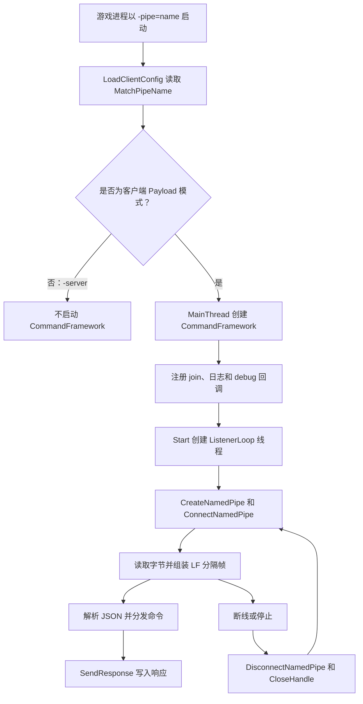

# CommandFramework C++ 实现分析指南

[English](command-framework-code-analysis.md) | 简体中文

## 状态与范围

本文是基于提交 `bab8eb01a0a867bce53880e6104d1a4b5229abb4` 对 Windows 命名管道实现进行的源码级分析，记录当前代码、由代码推导出的实际行为、与协议文档的已知差异，以及供后续变更复用的审查方法。

该实现是客户端游戏进程内 Payload 提供的服务，不是服务器包装器用于重定向子进程输出的匿名管道。仓库已经移除原有的 .NET 命名管道客户端，因此不能把仓库内客户端/服务端端到端运行视为当前可用路径。

如果只需要帧格式，先阅读较短的[线协议概览](command-framework.zh-CN.md)；实现维护、安全审查和测试工作以本文为入口。

## 执行摘要

当前 C++ 源码已经具备一个可以辨认的单客户端命名管道服务端：

- 通过 `-pipe=<name>` 选择性启用；
- 创建双向、消息型 Windows 命名管道；
- 使用一个监听线程执行 Overlapped 连接和读取；
- 采用带 JSON 参数的换行分隔命令帧；
- 分发 `ping`、`join` 和 `debug`；
- 断线清理后重新创建管道。

但它仍应被归类为实验性实现，而不是可靠的生产通信层。响应写入违反 Overlapped 句柄契约，配置的看门狗没有被使用，常见的 `join` 路径忽略请求地址，多种输入形态会通过未捕获异常终止进程，取消与对象生命周期不安全，安全描述符还允许所有主体访问。

## 源码地图

| 文件 | 职责 | 相关代码 |
| --- | --- | --- |
| [`Payload/Communication/CommandFramework.h`](../../Payload/Communication/CommandFramework.h) | 公共 API、回调、协议常量和运行时状态 | 整个类 |
| [`Payload/Communication/CommandFramework.cpp`](../../Payload/Communication/CommandFramework.cpp) | 管道创建、连接/读取循环、组帧、分发和响应写入 | 第 25–400 行 |
| [`Payload/Config/Config.cpp`](../../Payload/Config/Config.cpp) | 从进程命令行读取 `-pipe=` 和 `-match=` | 第 24–36、136–156 行 |
| [`Payload/Config/Config.h`](../../Payload/Config/Config.h) | 声明 `MatchIP` 和 `MatchPipeName` | 第 24–28 行 |
| [`Payload/dllmain.cpp`](../../Payload/dllmain.cpp) | 在非服务端模式构造框架并接线回调 | 第 36–56、139–186 行 |
| [`Payload/ClientLogic/ClientLogic.cpp`](../../Payload/ClientLogic/ClientLogic.cpp) | 实现 `join` 到达的游戏跳转逻辑 | 第 20–92 行 |
| [`Payload/Debug/DebugTool.cpp`](../../Payload/Debug/DebugTool.cpp) | 当前 `debug` 回调目标 | 第 28–32 行 |
| [`Payload/Payload.vcxproj`](../../Payload/Payload.vcxproj) | 将头文件和实现单元加入 Payload 构建 | 第 152、162 行 |
| [`docs/architecture/command-framework.zh-CN.md`](command-framework.zh-CN.md) | 人类可读线协议 | 全文 |

`ServerWrapper` 和 `ServerLauncherGUI` 中的 `CreatePipe` 用于捕获 stdout/stderr，创建的是匿名管道，不会创建或消费 `CommandFramework` 命名管道。

## 激活与控制流



激活过程的重要事实：

1. `LoadClientConfig()` 只保存管道名，不校验也不创建管道。
2. `CommandFramework` 仅在 `MainThread()` 的非服务端分支构造。
3. 缺少 `-pipe=` 或值为空时不会创建管道。
4. Payload 已经等待到非空 `UWorld` 并初始化客户端 Hook 后，才调用 `Start()`。
5. `dllmain.cpp` 忽略 `Start()` 的返回值。
6. 当前仓库没有传入 `-pipe=` 的启动器代码；外部消费者必须生成名称、启动游戏、连接并实现线协议。

## 类结构

### 回调类型

| 类型 | 签名 | 调用线程 | 当前绑定 |
| --- | --- | --- | --- |
| `JoinCallback` | `void(ip, token)` | 监听线程 | `OnJoinFromPipe` |
| `LogCallback` | `void(message)` | 调用方线程，通常是监听或所有者线程 | `ClientLog` lambda |
| `DebugCallback` | `json(args)` | 监听线程 | `DebugTool::ExecuteJson` lambda |

所有回调均为同步调用。回调缓慢或阻塞会停止所有管道读取并延迟响应；监听线程边界也没有捕获回调异常。

### 配置成员

| 成员 | 设计含义 | 实际使用 |
| --- | --- | --- |
| `pipeName` | 完整的 `\\.\pipe\<name>` 路径 | 传给 `CreateNamedPipeA` |
| `watchdogTimeoutMs` | 空闲读取超时，默认 30 秒 | 已初始化且可设置，但监听器从未读取 |
| `onJoin` | 运行期比赛切换处理器 | `ip` 非空时调用 |
| `onLog` | 框架日志器 | 直接调用，没有异常保护 |
| `onDebug` | 调试命令处理器 | 只要启动管道就会无条件注册 |

### 运行时成员

| 成员 | 预期不变量 | 当前保护方式 |
| --- | --- | --- |
| `running` | 监听器预期运行时为 true | 原子布尔值 |
| `hCurrentPipe` | 已连接句柄或 `INVALID_HANDLE_VALUE` | `writeMutex` |
| `writeMutex` | 串行化句柄发布、清空、取消与写入 | 不保护局部 `hPipe` 或回调 |
| `listenerThread` | 至多存在一个可 join 的监听线程 | Start/Stop 调用本身未串行化 |
| `sa`、`sd` | 创建管道期间持续有效的安全结构 | 启动线程前初始化一次 |
| `saInitialized` | 安全结构已经初始化 | 普通布尔值；文档要求所有配置在启动前完成 |

### Win32 对象所有权

| 对象 | 创建位置 | 预期释放时机 | 当前释放路径 |
| --- | --- | --- | --- |
| 命名管道句柄 | `CreateNamedPipeA` | 断线或连接失败后 | `CloseHandle(hPipe)` |
| 连接事件 | `CreateEventA` | 连接完成或取消后 | `CloseHandle(connectOl.hEvent)` |
| 读取事件 | 每次读取的 `CreateEventA` | 读取完成或取消后 | `CloseHandle(readOl.hEvent)` |
| 监听线程 | `Start()` 中的 `std::thread` | 对象析构前 `join()` | `join()` 或不安全的超时 `detach()` |
| 框架对象 | `dllmain.cpp` 中的 `new` | DLL/进程关闭 | 当前接线从不删除 |

## 逐函数分析

### `CommandFramework::CommandFramework`

构造函数设置名义上的 30 秒超时、清空运行状态、把连接句柄标记为无效，并将两个安全结构清零。此时不分配 Win32 资源。

由于 `ListenerLoop()` 从不读取 `watchdogTimeoutMs`，30 秒默认值当前不会产生任何行为。

### `CommandFramework::~CommandFramework`

析构函数调用 `Stop()`。只有在 `Stop()` 能保证监听器不再访问对象时，这才是合理的 RAII 边界；当前超时分支会 `detach()`，因此析构后仍可能有线程访问已销毁成员或已卸载代码。

当前全局框架对象被泄漏，正常进程退出时通常会掩盖该析构缺陷，但显式卸载 DLL 不安全。

### `SetPipeName`

该函数在输入名称前添加 `\\.\pipe\`。

代码假设但没有强制执行的前置条件：

- 调用者传入裸管道名，而非完整路径；
- 名称非空、兼容 ASCII、不含反斜杠且不超过 Windows 管道名上限；
- 名称具有足够不可预测性，不会意外冲突；
- 名称来自可信启动器。

实现使用 `CreateNamedPipeA`，因此非 ASCII 名称依赖 Windows 当前 ANSI 代码页；宽字符实现可以消除该歧义。

### `SetWatchdogTimeout`

函数会保存参数，但监听器完全不使用它。因此调用方能看到配置成功，却不会得到超时行为。

历史提交 `6951aad` 曾按一秒等待片累计该数值；当前代码已经缺失这一逻辑。即使恢复，也必须同时修复取消完成等待和 Overlapped 对象生命周期。

### 回调 Setter

`SetJoinCallback`、`SetLogCallback` 和 `SetDebugCallback` 将 `std::function` 移入对象。回调替换没有加锁；头文件要求在 `Start()` 前完成配置是正确的，运行期并发替换回调会形成数据竞争。

### `Start`

`Start()` 按顺序执行：

1. `running` 已为 true 时拒绝启动。
2. 完整管道路径为空时拒绝启动。
3. 初始化带“存在的 NULL DACL”的绝对安全描述符。
4. 写入 `running = true`。
5. 构造监听线程。
6. 记录名义上的启动日志并返回 true。

问题：

- load/store 不是原子 compare-and-swap，并发 `Start()` 没有被串行化；
- 未检查 `InitializeSecurityDescriptor` 和 `SetSecurityDescriptorDacl` 返回值；
- NULL DACL 会向所有能访问管道的主体授权；
- 线程构造失败会走异常路径，而不是返回 false；
- 返回成功只表示线程已启动，不代表 `CreateNamedPipeA` 成功；
- 调用方忽略返回状态。

### `Stop`

`Stop()` 清除 `running`，锁定 `writeMutex`，对已发布句柄调用 `CancelIo`，等待原生线程句柄最多五秒，然后 join 或 detach。

正确性缺陷：

- `CancelIo` 只能取消调用线程发起的 I/O；读取由监听线程发起，因此所有者线程的取消无效。跨线程取消应使用 `CancelIoEx`。
- `ConnectNamedPipe` 挂起期间，管道尚未发布到 `hCurrentPipe`，Stop 无法直接取消该阶段。
- 获取互斥锁没有超时；如果响应写入持有 `writeMutex` 并阻塞，Stop 会在到达五秒线程等待前就卡住。
- `WAIT_FAILED` 被当作成功等待并继续 `join()`，也没有记录 Win32 错误。
- `detach()` 不安全：线程捕获了 `this` 并继续使用对象成员。
- `running` 已为 false 时直接返回，不能独立处理仍然 joinable 的线程。

需要满足的更强不变量是：`Stop()` 返回前，所有挂起 I/O 必须已成功完成或以取消完成，并且监听线程已经退出。

### `SendResponse`

函数将响应序列化为：

```text
<command>\t<compact-json>\n
```

它持有 `writeMutex`；没有已发布句柄时静默丢弃消息，否则只调用一次 `WriteFile`。

管道使用 `FILE_FLAG_OVERLAPPED` 创建，但这里传入空 `OVERLAPPED`。Windows 要求这类句柄使用有效且唯一的 `OVERLAPPED`；异步完成结果也不应通过当前的 bytes-written 指针获取。函数还忽略返回值、`ERROR_IO_PENDING`、其他错误和最终传输长度。

后果包括响应丢失、错误地报告完成、客户端永久等待以及连接损坏不可观测。参见 Microsoft [`WriteFile`](https://learn.microsoft.com/en-us/windows/win32/api/fileapi/nf-fileapi-writefile) 契约。

### `ListenerLoop`：创建管道

服务端创建参数如下：

```cpp
PIPE_ACCESS_DUPLEX | FILE_FLAG_OVERLAPPED
PIPE_TYPE_MESSAGE | PIPE_READMODE_MESSAGE | PIPE_WAIT
nMaxInstances = 1
输入/输出缓冲提示值 = 4096
```

这会建立一个双向、消息型、阻塞等待、使用 Overlapped 操作的单实例管道。代码没有用 `PIPE_REJECT_REMOTE_CLIENTS` 覆盖默认远程客户端模式。

创建失败时记录 `GetLastError()`，休眠一秒并重试。该重试没有上限，也不区分非法名称、拒绝访问等永久错误与临时资源压力。

### `ListenerLoop`：连接阶段

代码创建手动重置事件，将对应 `OVERLAPPED` 传给 `ConnectNamedPipe`，并处理：

- 立即成功；
- `ERROR_IO_PENDING`，按一秒间隔轮询；
- `ERROR_PIPE_CONNECTED`，即客户端在服务端调用连接前已连接的竞态；
- 其他立即错误，关闭并重试。

缺失检查：

- `CreateEventA` 失败；
- 事件触发后的 `GetOverlappedResult` 或 `HasOverlappedIoCompleted`；
- 连接最终完成状态；
- 关闭事件和销毁栈上 `OVERLAPPED` 前，确认取消已经完成。

事件被触发只代表操作完成，并不代表操作成功。

### `ListenerLoop`：发布句柄

连接处理后，代码在 `writeMutex` 下把 `hPipe` 复制到 `hCurrentPipe`。这样任何线程都可以发响应，也能阻止清理过程与已经持有同一互斥锁的写入竞态。

代码没有认证已连接客户端，没有检查其进程 ID，也没有把会话绑定到提供管道名的启动器。

### `ListenerLoop`：读取阶段

每次读取都新建一个事件和一个栈上 `OVERLAPPED`，最多请求 4095 字节。

`ReadFile` 返回 `ERROR_IO_PENDING` 后，只要 `running` 仍为 true，就按一秒间隔等待。代码没有把等待次数计入 `watchdogTimeoutMs`，所以空闲连接可以永久保留。

事件触发后调用 `GetOverlappedResult`，但忽略布尔返回值和错误码。除 `ERROR_IO_PENDING` 外的立即错误也未分类；即使零字节来自错误，仍会被视为正常断线。

对于消息型管道，大于读取缓冲的消息可能以 `ERROR_MORE_DATA` 完成。当前代码可能保留已传输字节，但只是隐式产生该行为，没有显式识别或测试这一状态。

停止时，监听线程会从发起 I/O 的线程调用 `CancelIo`，随后立即关闭事件并离开作用域。取消仅仅是一个请求；在观察到完成之前，`OVERLAPPED`、事件和缓冲区都必须保持有效。

### `ListenerLoop`：组帧

读取块被追加到 `lineBuf`。每个 LF 提取一帧；如果前一字节是 CR，则移除以兼容 CRLF；空行会被忽略。

残留缓冲超过 65,536 字节后会被清空。这只是安全阀，不是精确的帧大小契约：

- 完整行在检查残留大小前已经被提取；
- 清除超长前缀后，后续尾部可能被当成新帧解析；
- 客户端不会被断开，也收不到明确的 frame-too-large 错误；
- 大量帧下反复从 `std::string` 前部 erase 会造成额外复制。

### `ListenerLoop`：断线清理

代码先在 `writeMutex` 下清空已发布句柄，再对局部句柄调用 `DisconnectNamedPipe` 和 `CloseHandle`。返回值均被忽略；只要 `running` 仍为 true，外层循环就会创建新实例。

服务端主动断开前没有调用 `FlushFileBuffers`，因此不会显式等待客户端读取最后一个已缓冲响应。

### `ParseAndDispatch`

解析器按第一个 Tab 分割。缺少 Tab 时返回 `error` 帧；非空 JSON 后缀会被解析，但只捕获 `nlohmann::json::parse_error`。

解析器没有执行文档要求的对象类型校验。空后缀会让 `args` 保持 JSON null，数组、字符串、数字、布尔值和 null 都能进入 Dispatch。

这会危及整个进程，因为 `Dispatch()` 在 `join` 中调用 `value()`；nlohmann JSON 对非对象调用 `value()`，或字段存在但无法转换为目标类型时，会抛出 `type_error`。监听线程外层没有异常边界，因此异常会触发 `std::terminate`。

负向测试必须覆盖：

```text
join\t
join\t[]
join\t{"ip":123}
debug\t"string"
```

### `Dispatch`

实际命令行为：

| 请求 | 实际校验 | 副作用 | 响应 |
| --- | --- | --- | --- |
| `ping` | 无 | 无 | `pong\t{}\n` |
| `join` | 调用 `value()`；仅在 `ip` 非空且存在回调时调用回调 | 可能启动游戏跳转 | 无异常时始终返回 `join_ack\t{"status":"ok"}\n` |
| `debug` | 无 | 调用已注册调试回调 | 用 `debug_ack` 包装回调 JSON |
| 其他 | 无 | 记录未知命令 | 带 `msg` 和 `cmd` 的 `error` |

`join` 确认不代表命令已经被接受、调度或完成。缺少 IP 或回调时仍返回 `status=ok`。预留 `token` 会被解析，但 `OnJoinFromPipe` 完全忽略它。

协议没有请求 ID、版本、能力协商或异步事件模型。客户端必须串行发送请求，并对每个请求恰好消费一个响应。

### `Log`

`Log()` 直接调用已配置回调，不捕获异常，也不附加线程身份、错误码、连接 ID 或严重级别。当前 `ClientLog` 目标同样没有用互斥锁保护全局流状态，所以管道、游戏和后台线程日志可能交错。

## 集成函数分析

### `GetCmdValue` 与 `LoadClientConfig`

`GetCmdValue` 在 ANSI 命令行字符串中搜索第一个键，并返回到下一个空格之间的字符。它不是 Windows 命令行解析器，不支持带引号值、转义引号、重复键或键边界歧义。

`LoadClientConfig` 把 `-match=` 保存到全局 `MatchIP`，把 `-pipe=` 保存到全局 `MatchPipeName`，两者都不校验。GUID 风格 ASCII 管道名符合当前假设，但 API 本身没有强制该输入轮廓。

### `MainThread`

在客户端模式，`MainThread` 注册全部三个回调，并在客户端 Hook 初始化后启动管道。它没有显式设置看门狗，也不检查启动结果。

只要提供管道名，调试回调就会被注册，与 `-debug` 开关无关。当前实现只记录 JSON 并返回 `{"ok":true}`，但该通道已经是一个未认证扩展点。

### `OnJoinFromPipe`

该函数在监听线程同步执行。它记录请求地址，在文件局部互斥锁下写入全局 `MatchIP`，然后：

- 世界和 GameInstance 存在时调用 `ConnectToMatch()`；
- 否则启动 `AutoConnectToMatchFromCmdline()`。

该互斥锁只保护这次写入；`ClientLogic.cpp` 中的读取者不使用同一把锁，因此 `MatchIP` 仍存在 C++ 数据竞争。

回调还会从非游戏线程调用面向 Unreal 的逻辑。除非 SDK 调用链明确保证线程安全，否则应将操作排队到游戏线程执行。

### `ConnectToMatch`

当前实现忽略 `MatchIP`，固定执行 `travel 127.0.0.1`。所以通常的运行期 `join` 路径不会遵从管道请求。

历史提交 `6951aad` 曾在共享互斥锁下复制 `MatchIP`，并用该目标构造 travel 命令；当前版本已经丢失该行为。仅恢复地址仍然不够，还需要语法校验、正确 UTF-8 转换、游戏线程调度和控制台命令注入防护。

### `AutoConnectToMatchFromCmdline`

该函数创建一个 detach 线程，等待世界、GameInstance、LocalPlayer 和登录状态，进入靶场，最后用 `MatchIP` 构造 `open` 命令。

风险：

- 读取 `MatchIP` 时没有同步，而管道 `join` 可以修改它；
- 跨线程读取 `LoginCompleted`、写入 `ReadyToAutoconnect` 使用普通布尔值；
- 没有停止令牌，也不协调进程/DLL 卸载；
- 可以被启动多次；
- 从后台线程直接调用 Unreal API；
- 使用逐字节 `std::string` 到 `std::wstring` 转换，而不是 UTF-8 解码；
- 把未校验地址放入控制台命令。

## 协议与边界分析

### 实际帧语法

有效语法比文档描述更宽松：

```text
frame       = command TAB json-text LF
command     = 第一个 TAB 边界前的任意字节
json-text   = 空 | 任意语法有效的 JSON 值
```

文档要求 JSON 必须是对象，但解析器接受所有 JSON 类型，且不能安全拒绝不兼容类型。文本设计为 UTF-8，而管道名和命令行读取使用 ANSI Win32 API。

### 大小与缓冲

- 单次读取请求：4095 字节；
- 双向管道缓冲提示值：4096 字节；
- 残留行安全阀：大于 65,536 字节；
- 没有明确的出站帧上限；
- 没有队列深度、背压指标或写超时；
- 消息型管道边界不作为协议边界，LF 才是权威边界。

### 安全模型

当前已有控制：

- 预期每次启动使用独立管道名，但该名称不由本仓库生成；
- 禁止句柄继承；
- 单实例限制并发消费者数量。

缺失控制：

- NULL DACL 向所有能访问管道的主体授权；
- 未设置 `PIPE_REJECT_REMOTE_CLIENTS`；
- 不校验客户端 PID、SID、会话、完整性级别或启动器父子关系；
- 没有 challenge/nonce 或消息认证；
- 不验证 `token`；
- 没有 first-instance 保护来阻止管道名抢占；
- 没有速率限制或畸形消息断线策略；
- 每次管道会话都启用 debug 扩展。

在 SMB 命名管道可达的系统上，默认模式可以按照系统策略接受远程客户端。本地启动器到游戏的通道应显式拒绝远程客户端。参见 [`CreateNamedPipe`](https://learn.microsoft.com/en-us/windows/win32/api/namedpipeapi/nf-namedpipeapi-createnamedpipew)。

## 并发与生命周期模型

### 线程清单

| 线程 | 管道职责 | 访问的共享数据 |
| --- | --- | --- |
| Payload `MainThread` | 构造并启动框架 | 配置、回调、框架指针 |
| 监听线程 | 连接、读取、解析、分发和大部分响应 | `running`、`hCurrentPipe`、回调、通过回调访问 `MatchIP` |
| 任意回调调用方 | 可能调用 `SendResponse` | `hCurrentPipe`、管道输出 |
| detach 自动连接线程 | 执行游戏跳转 | Unreal 对象、`MatchIP`、登录标志 |
| DLL/进程清理线程 | 如果实现所有权，应调用析构/Stop | 全部框架状态 |

### 预期不变量

修复后的实现应满足全部不变量：

1. 至多一个监听器拥有一个管道实例。
2. 每个挂起 Overlapped 操作拥有独立 `OVERLAPPED`、事件和稳定缓冲，直到观察到完成。
3. 只要其他线程仍可能开始或完成该句柄上的 I/O，就不能关闭句柄。
4. Stop 幂等并 join 监听器；绝不 detach 捕获 `this` 的线程。
5. 回调异常不能越过监听线程边界。
6. 游戏逻辑工作必须调度到游戏线程。
7. 比赛目标读写使用同一种同步策略，或改为不可变消息传递。
8. 每个已接受请求都收到一个可关联响应，否则以记录原因的断线结束。

当前代码在普通单线程启动场景下只完整满足第一项。

## 错误路径清单

| 操作 | 当前行为 | 目标行为 |
| --- | --- | --- |
| 安全描述符初始化失败 | 忽略 | `Start()` 失败并记录 Win32 错误 |
| 创建线程失败 | `running=true` 后异常逃逸 | 回滚状态并一致地返回或抛出 |
| `CreateNamedPipeA` 失败 | 记录并无限重试 | 区分永久/临时失败并有限退避 |
| 创建事件失败 | 空句柄继续进入 I/O/等待 | 关闭管道并报告失败 |
| 连接以错误完成 | 事件触发即当作已连接 | 发布前读取最终结果 |
| 读取以错误完成 | 经常退化为零字节断线 | 区分 broken pipe、取消、more-data 和意外失败 |
| JSON 语法错误 | 返回 `error` | 保留，但限制并清理 detail |
| JSON 类型错误 | 异常可能终止进程 | 返回结构化校验错误 |
| 回调抛异常 | 进程可能终止 | 捕获、记录、返回内部错误并保持监听器 |
| 响应写入失败 | 静默忽略 | 标记连接失败、取消/关闭会话并提供诊断 |
| I/O 中 Stop | 请求取消但不等待完成 | `CancelIoEx` 后观察完成再释放 |
| 监听线程超过停止期限 | detach | 视为所有权致命故障；线程存活时不得销毁所有者 |

## 历史回退说明

提交 `6951aad` 引入了当前代码缺失的三项相关改进：

- `Stop()` 使用 `CancelIoEx`；
- 读取等待循环累计看门狗时间；
- 共享 `MatchIPMutex`，并按目标地址执行重连。

这些变更可以证明原始意图并帮助定位回退，但不是完整的安全实现。该版本仍然为响应写入传入空 `OVERLAPPED`、过早释放取消状态、暴露 NULL DACL、缺少模式校验，并从后台线程调用游戏代码。应将其作为证据，而不是直接 cherry-pick 成最终修复。

原 .NET `PipeClient` 和启动器接线在提交 `ebb624ee` 中移除。当前协议文档明确规定消费客户端位于仓库外部。

## 缺陷登记与优先级

| 优先级 | 缺陷 | 影响 |
| --- | --- | --- |
| P0 | Overlapped 句柄的 `WriteFile` 收到空 `OVERLAPPED` | 响应不可靠 |
| P0 | 未捕获 JSON 类型/回调异常 | 畸形输入可终止游戏进程 |
| P0 | `ConnectToMatch` 硬编码 `127.0.0.1` | 运行期 `join` 不执行请求目标 |
| P0 | NULL DACL 且无认证 | 未授权本地客户端可控制或击垮通道 |
| P1 | 看门狗数值未使用 | 空闲客户端可永久占用唯一实例 |
| P1 | 跨线程 `CancelIo` 且过早清理 Overlapped | 关闭竞态和内存生命周期风险 |
| P1 | Stop 超时后 detach 使用 `this` 的线程 | use-after-free 或 DLL 卸载后继续执行 |
| P1 | Unreal 调用不在游戏线程 | 引擎状态竞态或崩溃风险 |
| P1 | `MatchIP` 和就绪标志存在数据竞争 | 并发命令下出现未定义行为 |
| P1 | `join_ack` 始终报告成功 | 客户端无法知道工作是否被接受 |
| P2 | 事件/Win32 结果检查和诊断不完整 | 故障表现为无信息断线 |
| P2 | 没有仓库内客户端、原生测试和 Windows C++ CI | 无法自动发现回退 |
| P2 | ANSI API 和逐字节宽化 | 非 ASCII 行为错误或依赖环境 |

## 目标实现指南

### 传输层

1. 用不可复制的 RAII 类型包装每个 `HANDLE`。
2. 为每个连接、读取和写入操作建立独立操作对象，包含 `OVERLAPPED`、手动重置事件和稳定缓冲。
3. 所有挂起操作都必须通过 `GetOverlappedResult` 观察完成后，才能销毁操作对象。
4. 所有者线程使用 `CancelIoEx` 取消，但仍必须等待最终完成。
5. 用确定性 join 所有权替代 detach 兜底。
6. 检查所有 Win32 返回值，并保留第一个相关的 `GetLastError()`。
7. 要么正确实现 Overlapped 写入，要么创建同步句柄并把全部阻塞 I/O 隔离在专用线程；不能混用契约。
8. 对挂起读取应用真正的空闲截止时间，并定义 `0` 是否表示禁用。
9. 超大帧应断开连接，不能只清除前缀再继续解析尾部。
10. 添加 `PIPE_REJECT_REMOTE_CLIENTS`，并在所有权模型允许时考虑 `FILE_FLAG_FIRST_PIPE_INSTANCE`。

### 协议层

1. 分发前强制 JSON 为对象。
2. 校验命令专属字段和类型，不能让异常穿过监听线程。
3. 定义协议版本和请求 ID。
4. 区分 `accepted`、`completed` 和 `failed`。
5. 定义入站和出站帧最大值。
6. 一致处理协议违规：安全时响应，累计到有限次数后断开。
7. 响应不得暴露异常内部信息或无限长度的攻击者输入。

更安全的请求信封可以是：

```json
{"version":1,"id":"request-id","command":"join","args":{"ip":"203.0.113.10:7777"}}
```

响应示例：

```json
{"version":1,"id":"request-id","status":"accepted","result":{}}
```

### 游戏集成层

1. 独立校验并规范化 `host:port`，不要依赖控制台命令构造完成校验。
2. 把目标复制进不可变工作项。
3. 将工作项排队到 Unreal 游戏线程。
4. 只允许一个活动跳转，或明确取消/替换语义。
5. 只有调度成功后才返回确认。
6. 如果客户端需要最终结果，以可关联事件报告跳转成功/失败。
7. 用明确的开发策略限制 debug 命令，不能只依赖持有管道名。

### 安全层

1. 构造仅允许预期交互用户 SID 和必要系统身份的 ACL。
2. 显式拒绝远程客户端。
3. 校验连接客户端 PID/SID，并在可行时校验它与启动器的关系。
4. 使用每次启动的加密随机 nonce 或认证握手；不能把管道名当作秘密。
5. 校验 `token`，或者在实现校验前从契约中移除它。
6. 即使传输已经认证，所有 Payload 字段仍应视为不可信。

## 后续变更审查步骤

每次审查该实现时按以下顺序执行：

1. **查找全部生产者和消费者。** 搜索 `CreateNamedPipe`、`ConnectNamedPipe`、`-pipe=`、协议命令名和 `SendResponse`。
2. **绘制所有权。** 为每个句柄、线程、`OVERLAPPED`、事件和缓冲明确创建者、最后使用者、取消所有者和释放点。
3. **绘制状态机。** 覆盖 stopped、listening、connecting、connected、reading、writing、disconnecting 和 stopping。
4. **审计每个 Win32 结果。** 包括立即成功、挂起完成、完成失败、超时、取消、broken pipe、more data 和 invalid handle。
5. **审计异常边界。** 测试非法语法、语法正确但类型错误的 JSON、字段缺失、回调失败、分配失败和日志失败。
6. **审计线程亲和。** 标记全部共享 C++ 状态和每个 Unreal 调用的所属线程。
7. **将代码与线协议对照。** 命令、必填字段、响应含义、最大尺寸、超时、安全与并发必须一致。
8. **检查历史回退。** 特别与 `6951aad` 对比，但仍需按当前要求评估旧代码。
9. **要求可执行证据。** 源码审查不能替代使用真实 Payload 构建和真实客户端的 Windows 集成测试。

## 必需测试矩阵

### 生命周期测试

- 无名称启动；
- 启动、连接、断开并重连；
- 等待连接期间停止；
- 挂起读取期间停止；
- 挂起或背压写入期间停止；
- 重复 Start/Stop；
- 如果支持，显式卸载 DLL；
- 管道名冲突和拒绝访问创建失败。

### 组帧测试

- 每次写入一帧；
- 每次写入多帧；
- 一帧拆成多次写入；
- CRLF 和 LF；
- 精确 4095/4096 字节边界；
- 精确最大帧和超过一字节；
- 消息型 `ERROR_MORE_DATA` 路径；
- 不完整帧后断线。

### 协议测试

- 每个有效命令与响应；
- 缺少 Tab 和空命令；
- 空 JSON、畸形 JSON、null、数组、字符串、数字和布尔值；
- 字段缺失和字段类型错误；
- 未知命令；
- 回调异常；
- 并发请求和请求关联；
- 大于管道缓冲的响应。

### 安全测试

- 预期启动器可以连接；
- 按策略处理无关同用户和其他用户进程；
- 拒绝远程连接；
- 首连接者抢占尝试；
- 无效或重放的握手/token；
- 畸形消息速率和内存增长限制；
- 非开发策略下拒绝 debug 命令。

### 工具门禁

- Windows CI 使用受支持 Visual Studio toolset 构建 `Payload.vcxproj`；
- 单元测试在不依赖 Win32 的情况下覆盖解析器/校验器；
- 原生集成测试启动真实的管道服务端/客户端对；
- 通过等价于 Thread Sanitizer 的推理或针对性压力测试覆盖共享非原子状态；
- 在取消测试上运行 Application Verifier 或同类句柄/I/O 诊断；
- 文档链接与双语检查通过。

## 宣布生产可用的验收条件

只有全部满足以下条件，才能将管道描述为生产可用：

1. 全部连接/读取/写入操作遵循一致的同步或 Overlapped 模型。
2. Stop 能确定性取消、观察完成并 join，不使用 detach。
3. 畸形或恶意帧不能终止进程，也不能无限阻塞进程。
4. `join` 使用已校验请求目标，并在正确线程调度 Unreal 工作。
5. 响应准确反映校验和调度结果。
6. 空闲超时、帧限制和重连行为有测试且与文档一致。
7. 真正执行本地访问限制和客户端认证，而不是只写在文档里。
8. 存在持续维护的客户端或协议一致性测试工具。
9. Windows 原生构建和管道集成测试进入 CI。
10. 资源泄漏、取消竞态和重连压力测试通过。

## 权威 API 参考

- [CreateNamedPipe](https://learn.microsoft.com/en-us/windows/win32/api/namedpipeapi/nf-namedpipeapi-createnamedpipew)
- [ConnectNamedPipe](https://learn.microsoft.com/en-us/windows/win32/api/namedpipeapi/nf-namedpipeapi-connectnamedpipe)
- [ReadFile](https://learn.microsoft.com/en-us/windows/win32/api/fileapi/nf-fileapi-readfile)
- [WriteFile](https://learn.microsoft.com/en-us/windows/win32/api/fileapi/nf-fileapi-writefile)
- [GetOverlappedResult](https://learn.microsoft.com/en-us/windows/win32/api/ioapiset/nf-ioapiset-getoverlappedresult)
- [CancelIo](https://learn.microsoft.com/en-us/windows/win32/api/ioapiset/nf-ioapiset-cancelio)
- [取消挂起 I/O](https://learn.microsoft.com/en-us/windows/win32/fileio/canceling-pending-i-o-operations)
- [命名管道类型、读取和等待模式](https://learn.microsoft.com/en-us/windows/win32/ipc/named-pipe-type-read-and-wait-modes)
- [命名管道安全与访问权限](https://learn.microsoft.com/en-us/windows/win32/ipc/named-pipe-security-and-access-rights)
