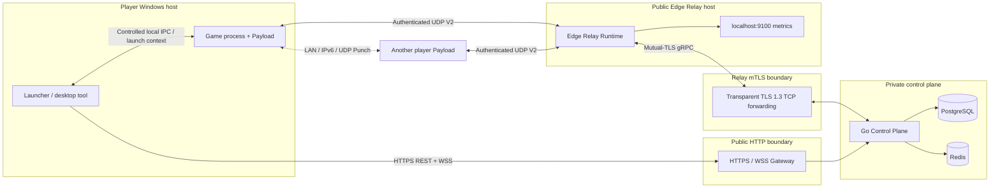
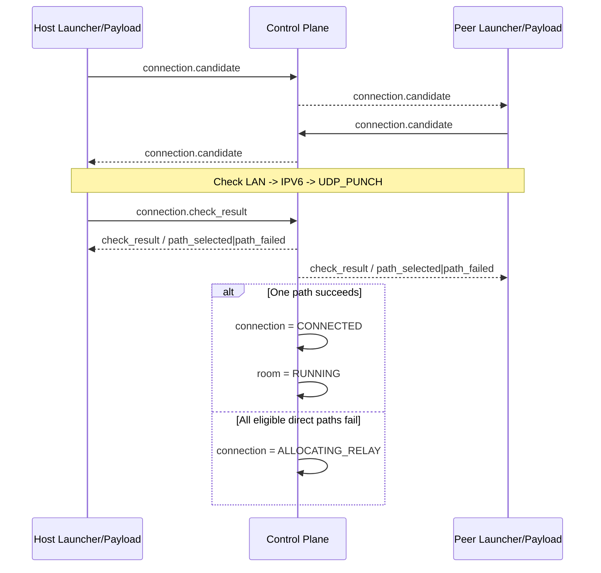
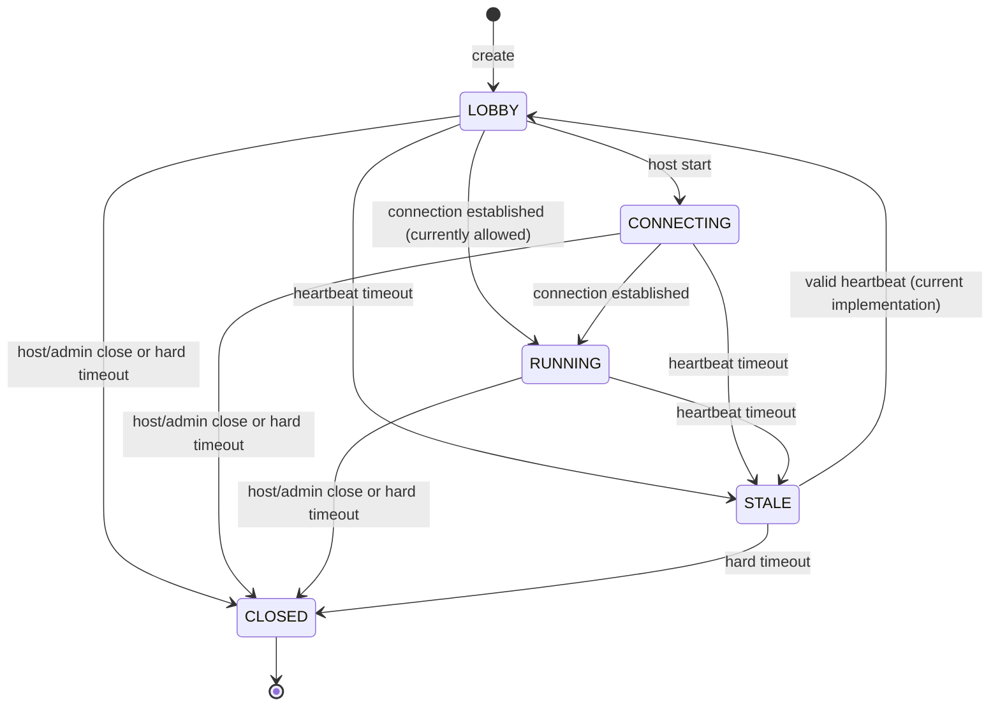
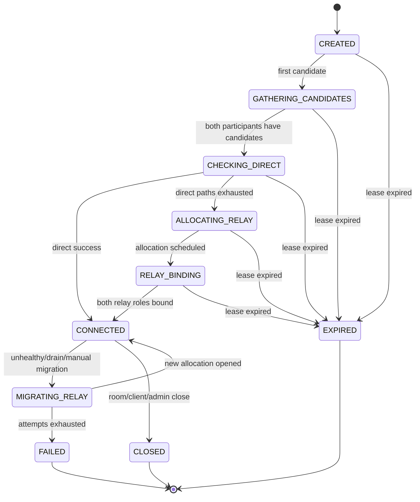

# Complete P2P Online Architecture

English | [简体中文](online-architecture.zh-CN.md)

This document describes the P2P online backend, independent Edge Relay, player Launcher/Payload integration boundary, and optional P2P BattleLog v3 evidence pipeline currently implemented in this repository. It is the complete navigation and implementation baseline for P2P online play, but it does not replace the machine-readable protocol contracts. The not-yet-implemented replacement is documented in the [community VNT node online target architecture](vnt-community-online-architecture.md).

## 1. Scope and sources of truth

### 1.1 Covered here

- Player binding and the session level required for P2P writes;
- P2P rooms, membership, and host heartbeats;
- Candidate exchange and direct-path checks for each host-to-peer connection;
- Relay scheduling, UDP V2 binding, forwarding, and migration after direct paths fail;
- P2P BattleLog v3 matches, presence, report capabilities, and server decisions;
- Administration, persistence, consistency, deployment, observability, and recovery;
- Implemented behavior and client integrations that are not yet closed end to end.

### 1.2 Not covered here

- Dedicated Server registration, matchmaking, and authoritative BattleLog;
- The native MetaServer TLS protocol, parties, and Dedicated matchmaking;
- The Unreal replication protocol itself;
- End-to-end encryption, reliable retransmission, ordering, or host migration for the game payload.

See [MetaServer Architecture](metaserver.md) for the Dedicated Server path. The paths reuse player identity and some infrastructure, but P2P rooms, P2P matches, Relay allocations, and Dedicated matches are separate resources.

### 1.3 Contract precedence

When sources disagree, supported behavior is determined in this order:

1. [HTTP OpenAPI](../../Backend/api/openapi/openapi.yaml), the [Relay UDP wire protocol](../../Backend/api/relay-protocol.md), and the [Relay gRPC protobuf](../../Backend/api/proto/relay_control.proto);
2. Database constraints, implementation code, and automated tests;
3. The [external API](../api/external.md), [internal API](../api/internal.md), and this document;
4. Historical, archived, or development handoff documents.

## 2. Architectural principles

1. **Separate the control plane and data plane.** HTTPS/WebSocket coordinates identity, rooms, candidates, state, and Relay allocations; game UDP never traverses the Control Plane.
2. **Prefer direct paths.** Peers try `LAN -> IPV6 -> UDP_PUNCH`; `UDP_RELAY` is allocated only after usable direct paths are exhausted.
3. **Use a modular-monolith Control Plane.** Auth, P2P Room, Connection, Relay Registry, and P2P BattleLog are separate domain modules in one Go process, not independent microservices.
4. **Treat PostgreSQL as authoritative.** Rooms, members, connections, candidates, checks, nodes, allocations, migrations, and BattleLog are database-backed.
5. **Make volatile real-time events recoverable.** WebSocket is a low-latency notification channel, not a durable queue; clients recover through REST GET after disconnection.
6. **Separate secrets by purpose.** Player, host, Relay, node, mTLS, and administrator credentials are not interchangeable.
7. **Prefer idempotency.** Repeated joins, closes, active-connection creation, identical report uploads, and duplicate allocation events should return current state instead of creating parallel resources.
8. **Never let the Relay trust arbitrary targets.** Packets identify an allocation handle and role and can only move between the verified HOST and PEER of one allocation.

## 3. Components and deployment topology



### 3.1 Responsibilities

| Component | Responsible for | Not responsible for |
| --- | --- | --- |
| Launcher / desktop tool | Login, token refresh, room UI, WebSocket, candidate/check orchestration, BattleLog upload credentials | Server signing, direct database access, injecting report tokens into the game |
| Game Payload | Candidate collection, direct checks, Relay bind, game packet I/O, raw BattleLog observation | Storing server secrets, choosing Relay nodes, deciding match results |
| HTTP Gateway | TLS termination, HTTPS/WSS forwarding, public path policy | Exposing management/internal APIs or terminating Relay node identity |
| Control Plane | Auth, rooms, connection state machine, Relay scheduling, signing, BattleLog, and administration | Forwarding game UDP or storing live Edge endpoints |
| PostgreSQL | Authoritative state, uniqueness, transactions, audit, and migrations | WebSocket broadcast and Edge UDP sessions |
| Redis | Rate limits, cache, and volatile coordination | Authoritative player, room, connection, or allocation state |
| Edge Relay | Token verification, cookie challenge, in-memory allocations, authenticated UDP forwarding | PostgreSQL/Redis access, player-facing HTTP business APIs, decrypting game payloads |
| Prometheus/Grafana | Metrics, capacity/fault visibility, and alerting | Driving business state or acting as an audit source |

### 3.2 Default network entry points

| Entry point | Default listen/mapping | Caller | Boundary |
| --- | --- | --- | --- |
| Player HTTP/WSS | Control Plane `:8080`, behind public HTTPS | Launcher/client | Only approved public paths |
| Admin/internal HTTP | `127.0.0.1:18080` mapped to the Control Plane | Admin Web, operators, Prometheus | Trusted CIDR plus the relevant credential; never public |
| Relay enrollment/renewal | Two public HTTPS `/internal/v1/relay-nodes/...` machine paths | New/enrolled Edge | Bootstrap Token or Node Token |
| Relay control stream | Control Plane TCP `9090` | Edge Relay | Mutual TLS 1.3 |
| Relay data plane | Edge UDP `8443`; advertised public port may differ | Game Payload | Relay Token plus UDP V2 challenge/proof |
| Edge metrics | `127.0.0.1:9100` | Node-local scraper | Loopback only |

See [Deployment Entry Point](../operations/deployment.md) for production roles and gateway policy.

## 4. Identity, authorization, and credentials

### 4.1 Player sessions

`POST /v1/auth/bind` establishes a database session and issues a short-lived Access Token plus rotating Refresh Token. A session without a valid Steam Encrypted App Ticket is `unverified`; successful decryption with a matching SteamID makes it `verified`; a successful integrity proof may promote it to `trusted`.

P2P room writes, connection creation/closure, WebSocket, and BattleLog require:

- A valid Player Access Token;
- An `ACTIVE` player account;
- A `verified` or `trusted` session.

Public room list/detail requires no login but does not return candidates, member secrets, or the Host Token. See [Authentication and Sessions](authentication.md).

### 4.2 Credential isolation

| Credential | Holder | Purpose | Storage rule |
| --- | --- | --- | --- |
| Player Access Token | Launcher | Player REST/WSS | Short lived; never in URLs or logs |
| Refresh Token | Launcher | Rotate Access Token | Secure local credential store; database stores only a hash |
| Room Host Token | Host Launcher | Heartbeat, start, and close | Returned once at creation; database stores only a hash |
| P2P Report Token | Launcher | Upload that player's P2P report | Memory or Windows current-user protection; never injected into the game |
| Relay Token | Corresponding HOST/PEER Payload | Bind one allocation on one node | Short-lived Ed25519 credential; distinct per endpoint |
| Bootstrap Token | New Edge | Initial enrollment | One-time; removed after success |
| Node Token | Edge | HTTP certificate renewal | Node-local `0600`; database stores only a hash |
| Node mTLS key/certificate | Edge | gRPC control identity | Node-local `identity.json`; never copied between nodes |
| Admin Access/Refresh/Step-up | Admin browser | Management reads and high-risk writes | Isolated from all player and machine tokens |

Logs, metrics, audit, and error responses must never contain full tokens, private keys, complete game payloads, or database passwords.

## 5. API and protocol planes

### 5.1 Public/player HTTP API

| Domain | Main endpoint | Purpose |
| --- | --- | --- |
| Client configuration | `GET /v1/client/config` | API/protocol versions, feature flags, STUN, and available Relay regions; never a concrete assignment |
| P2P room | `/v1/p2p-rooms*` | Directory, create, join, leave, heartbeat, start, close |
| Connection | `/v1/connections*` | Create/recover an active connection, read authority, close |
| Real-time signaling | `GET /v1/realtime/connect` | WebSocket candidate, check, and Relay lifecycle events |
| P2P BattleLog | `/v1/p2p-matches*` | Active match, capability, presence, report, and result |

Successful HTTP responses normally use `{data, request_id}` and failures use `{error, request_id}`. Clients should use the response `request_id` for diagnosis and automatically retry only idempotent or explicitly retryable operations.

### 5.2 WebSocket envelope

Both directions use:

```json
{
  "type": "connection.candidate",
  "payload": {
    "connection_id": "conn_..."
  }
}
```

Client types:

- `connection.candidate`
- `connection.check_result`

The server may also publish:

- `connection.created`
- `connection.path_selected`
- `connection.path_failed`
- `connection.relay_allocated`
- `connection.relay_migrating`
- `connection.relay_migrated`
- `connection.relay_failed`
- `connection.closed`
- `error`

`connection_id` is in the event-specific `payload`. The Access Token must be in the WebSocket Upgrade `Authorization` header, never in the query string.

### 5.3 Relay management and control

- Enrollment and certificate renewal use HTTPS;
- Node list, drain, resume, revoke, and signing-key activation use restricted management HTTP;
- Runtime node control uses one bidirectional mTLS gRPC stream;
- Game data uses the separate UDP V2 binary protocol.

See the [Internal API](../api/internal.md) for message types and authorization.

## 6. Data and ownership model

### 6.1 Authoritative PostgreSQL entities

| Domain | Main entities/tables | Key invariant |
| --- | --- | --- |
| Player/session | `players`, `auth_sessions`, refresh families | SteamID, revocation, and refresh-reuse constraints |
| Room | `p2p_rooms`, `p2p_room_members` | Host, capacity, version, role, and membership state |
| Connection | `connections`, `connection_candidates`, `connection_path_checks` | At most one non-terminal active connection per room/peer |
| Relay | `relay_nodes`, `relay_allocations`, `relay_migrations` | Active allocation/migration uniqueness, capacity, and node lease |
| P2P result | `p2p_match_sessions`, roster, presence, capabilities, reports, decisions | Frozen roster, one FINAL per player, report ID/content idempotency |
| Administration | Admin sessions, RBAC, audit, risk events | Human reason, step-up, and permission boundaries |

Cross-entity transitions are transactional where possible. Room heartbeat and non-terminal connection renewal share a transaction; room start and optional P2P match roster freezing also share a transaction.

### 6.2 Volatile in-process state

The following are not authoritative PostgreSQL state:

- Control Plane WebSocket subscriptions and per-subscription send queues;
- Edge live UDP endpoints, random handles, derived data keys, replay windows, and token buckets;
- Player integrity challenge nonces and decoded Steam ticket bytes;
- Edge UDP sockets and instantaneous packet counters.

A Control Plane or Edge restart must reconstruct the appropriate session; in-memory state is never assumed to revive.

## 7. End-to-end online flow

### 7.1 Login and capability discovery

1. The Launcher calls `POST /v1/auth/bind`, optionally with a Steam ticket.
2. It receives Access/Refresh Tokens; P2P writes require verified/trusted auth.
3. It calls `GET /v1/client/config` for protocol version, STUN, and feature flags.
4. It establishes WebSocket with the `Authorization` header.

The Control Plane is not a STUN server; clients use configured STUN servers to produce `SRFLX` candidates.

### 7.2 Create and join a room

1. The host creates a room and receives `room_id` plus a one-time `host_token`.
2. The host heartbeats at the interval returned by the server.
3. A peer chooses a public room and joins with the exact room `version`.
4. After committing membership/count, the room service idempotently ensures one host-peer connection.
5. A repeated join returns current room state and re-runs connection ensure, recovering from a failed post-commit ensure.

Rooms are listen-host stars: each non-host member has one `host_player_id -> peer_player_id` connection. Members do not form a full mesh.

### 7.3 Candidate gathering and exchange

Each endpoint gathers:

- `LAN`: private IPv4;
- `IPV6`: routable, non-link-local IPv6;
- `SRFLX`: public unicast returned by STUN.

Candidates are submitted through `connection.candidate`. The server validates address type, protocol, port, and priority, stores the candidate in PostgreSQL, and publishes it only to the connection HOST/PEER. Once both participants have candidates, the connection enters `CHECKING_DIRECT`.

### 7.4 Direct path selection



The server is not a complete ICE agent. It chooses the allowed path order and persists client reports. The current implementation stores one result per connection/path, and any valid participant report advances the shared state machine.

### 7.5 Relay fallback

```mermaid
sequenceDiagram
    participant H as Host Payload
    participant C as Control Plane
    participant P as Peer Payload
    participant E as Edge Relay

    C->>C: Select READY V2 node with capacity
    C->>C: Create allocation and HOST/PEER tokens
    C-->>H: connection.relay_allocated(HOST token)
    C-->>P: connection.relay_allocated(PEER token)
    H->>E: BIND_INIT / BIND_PROOF
    E-->>H: BIND_CHALLENGE / BIND_OK
    P->>E: BIND_INIT / BIND_PROOF
    E-->>P: BIND_CHALLENGE / BIND_OK
    E->>C: AllocationOpened (mTLS gRPC)
    C->>C: allocation = ACTIVE; connection = CONNECTED
    C-->>H: connection.path_selected
    C-->>P: connection.path_selected
    H-->>E: authenticated DATA
    P-->>E: authenticated DATA
```

The scheduler prefers the room region but may fall back across regions. It then ranks allocation utilization, egress utilization, and random spread. A node must be `READY`, `NORMAL`/`DEGRADED`, protocol V2, certificate/lease-valid, UDP-capable, and below capacity thresholds.

### 7.6 Start, run, and close

- Host `start` moves `LOBBY` to `CONNECTING`; when BattleLog is enabled it freezes a match roster in the same transaction.
- The current implementation marks the room `RUNNING` when any connection becomes established.
- Host heartbeat renews all non-terminal connections; `FAILED`, `EXPIRED`, and `CLOSED` never revive.
- Host close or heartbeat hard expiry closes the room and revokes/closes active connections and Relay allocations.
- Administrative room close/member remove also performs connection cleanup and audit.

### 7.7 P2P BattleLog v3

This pipeline is independent from path selection:

1. `start` creates the server match and frozen roster;
2. Each eligible player discovers the active match and obtains a refresh-family-bound report capability;
3. The Launcher injects only non-secret Match ID, Capability ID, server nonce, and observer kind into the game;
4. Payload/DLL atomically seals `*.json.ready`; Launcher reports presence and uploads exact bytes;
5. The server validates schema, context, roster, timeline hash chain, and immutable FINAL;
6. At the collection deadline it decides `PEER_CONFIRMED`, `SELF_REPORTED`, `DISPUTED`, `INCOMPLETE`, `ABORTED`, or `EXPIRED`.

Defaults are `p2p_battlelog.enabled: false` and `shadow_mode: true`. Disabled routes return `P2P_BATTLELOG_DISABLED`; Shadow Mode results are observational and must not drive rewards or leaderboards.

The detailed Launcher security and recovery handoff is currently maintained as the Chinese-only file `docs/architecture/p2p-battlelog-launcher-contract.zh-CN.md`.

## 8. State machines

### 8.1 Room



Repository heartbeat restores `STALE` to `LOBBY`, not the previous `CONNECTING`/`RUNNING` state. Any higher-level match recovery policy must handle that explicitly.

### 8.2 Connection



`TCP_TLS_RELAY` is reserved in the model, but current allocations are always `UDP` and default Edge nodes advertise only `UDP`; it is not a currently available player fallback.

### 8.3 Relay node

```text
BOOTSTRAPPING -> CONNECTING -> READY -> DRAINING
                         |          |      |
                         v          v      v
                     UNHEALTHY -> OFFLINE  READY(resume)
                         \          /
                          -> REVOKED
```

- Default heartbeat: 15 seconds;
- `UNHEALTHY` after 45 seconds without a fresh heartbeat;
- `OFFLINE` after 90 seconds;
- `REVOKED` is permanent;
- Recovery requires reconnect, fresh heartbeat, and `CONNECTING -> READY`; old in-memory allocations do not revive.

### 8.4 Allocation and migration

Normal allocation:

```text
ALLOCATED -> BINDING/ACTIVE -> CLOSED | FAILED
```

Fault and planned migration handle the old path differently:

```text
Failed node: old ACTIVE -> FAILED
             new ALLOCATED -> BINDING -> ACTIVE

Drain/manual: old ACTIVE -> MIGRATING (still forwarding and counted)
              new ALLOCATED -> BINDING -> ACTIVE
              success: old CLOSED, migration COMPLETED

Any new-path timeout: release this new allocation and choose another eligible node
Attempts exhausted: connection FAILED
```

Fault migration may interrupt immediately. Drain/manual migration is make-before-break but is still not lossless. The default bind deadline is 45 seconds with at most three attempts. Clients deduplicate by both `migration_id` and `allocation_id`.

### 8.5 BattleLog match

```text
STARTING -> RUNNING -> COLLECTING
                         |-> PEER_CONFIRMED
                         |-> SELF_REPORTED
                         |-> DISPUTED
                         |-> INCOMPLETE
                         |-> ABORTED
                         `-> EXPIRED
```

Terminal states do not reopen. Identical duplicate uploads may receive an idempotent acknowledgement but cannot alter the decision.

## 9. Relay UDP V2 data plane

### 9.1 Token

The Control Plane signs separate short-lived Ed25519 Relay Tokens for HOST and PEER. Claims bind at least:

- `relay_node_id`
- `allocation_id`
- `connection_id`
- `room_id`
- `endpoint_role`
- `protocol`
- `nbf`, `exp`, and allocation expiry
- Packet, byte-rate, and total-byte limits
- `kid` and unique `jti`

A token cannot be reused for another node, role, connection, or allocation.

### 9.2 Challenge/proof

1. Client sends `BIND_INIT(client_nonce, requested_mtu, token)`;
2. Edge returns `BIND_CHALLENGE(server_nonce, expires_in_ms, cookie)`;
3. Client sends `BIND_PROOF` from the same UDP endpoint;
4. Edge validates the stateless cookie before signature/replay checks and allocation binding;
5. Edge returns `BIND_OK(handle, role, mtu)`.

The cookie binds source IP/port, nonces, MTU, token hash, and a short time bucket to prevent spoofed-source amplification. Default payload MTU is 1200 bytes, configurable from 1000 to 1350.

### 9.3 DATA

DATA contains version, random 64-bit handle, sender role, sequence, a 16-byte HMAC tag, and game payload; it has no arbitrary target address. Edge validates:

- Handle, version, role, and source endpoint;
- Both endpoint credentials and expiry;
- HMAC tag;
- Sliding replay window;
- Negotiated MTU;
- Endpoint, node, and allocation rate/total limits.

Invalid packets are silently dropped. Relay provides authentication and limits, not payload encryption, reliable delivery, ordering, or retransmission; the game protocol protects its own content.

### 9.4 NAT rebind and control disconnect

- Edge permits port changes for the same token, role, and IP inside the configured NAT rebind window;
- Token `jti` cannot bind to another allocation, role, or source;
- Existing local allocations continue during a short gRPC outage grace period;
- After grace/drain deadlines, new binding is rejected and relevant state is cleaned up.

## 10. Consistency, idempotency, and recovery

| Scenario | Authoritative behavior | Client/operator recovery |
| --- | --- | --- |
| Repeated room join | Active member receives current room and connection ensure runs again | Keep the same room; do not create a shadow room |
| Repeated connection create | Returns existing non-terminal room/peer connection | Continue with returned ID |
| WebSocket disconnect | PostgreSQL state survives; missed events are not replayed | Reconnect, GET connection, resume state machine |
| Slow WebSocket client | Full in-process queue may drop events without blocking writes | GET authority; never rely on event counts |
| Host heartbeat | Commits with non-terminal connection renewal | Follow `next_heartbeat_seconds` |
| Heartbeat expiry | Room becomes STALE then CLOSED; close cleans connection/Relay | Do not blindly write to old room |
| Control Plane restart | PG survives; WebSocket/integrity nonce memory does not | Reconnect WSS/GET; re-bind identity if required |
| Relay control disconnect | Lease eventually becomes UNHEALTHY/OFFLINE; local UDP continues briefly | Edge backs off; Control Plane migrates as required |
| Relay process restart | Endpoints, handles, and replay windows are lost | Never revive old allocation; allocate and bind again |
| Duplicate migration events | Unique constraints and conditional updates are idempotent | Deduplicate by migration/allocation ID |
| Identical BattleLog retry | Same `report_id` and bytes return `duplicate=true` | Treat as successful ACK |
| PostgreSQL unavailable | Authoritative writes fail and readiness should fail | Bounded retry; never fake success in memory |
| Redis unavailable | Redis-backed limits/cache degrade or readiness fails | Never promote Redis data to authority |

### 10.1 Transaction boundaries

- Room creation and host membership commit atomically;
- Join commits member/count first, then runs connection ensure; retrying join reruns ensure;
- Heartbeat and connection lease renewal commit atomically;
- `start` and enabled match/roster creation commit atomically;
- Relay node selection, allocation insert, and node count update commit atomically with row locking and `SKIP LOCKED`;
- Both endpoint binds drive allocation/connection updates through an Edge event;
- WebSocket publication occurs after database commit and is outside the transaction.

## 11. Security boundaries

### 11.1 Public API

- HTTPS/WSS validates certificate chain and host name;
- Access Tokens appear only in headers;
- CORS allows only configured origins;
- Public gateway returns 404 for `/v1/admin*` and ordinary `/internal/*`;
- Relay enrollment/renewal are the only public internal machine paths and still require credentials;
- Candidates are participant-only and never appear in the public room directory.

### 11.2 Relay

- The mTLS private key exists only on its Edge; the public boundary transparently forwards TLS and cannot impersonate it;
- Scheduling uses registered nodes with fresh heartbeats; clients cannot select a Relay endpoint or migration target;
- Cookie challenge, silent drops, IP/packet/byte limits, and temporary bans constrain reflection and exhaustion;
- HOST/PEER tokens are isolated and packets have no arbitrary destination;
- V1 is disabled by default and must not be enabled in production.

### 11.3 BattleLog

- `report_token` is Launcher-only and never enters game environment, command line, logs, or ordinary state files;
- Reports bind frozen roster, player, refresh family, capability, nonce, and timeline;
- Raw evidence and normalized results are separated; raw reads require a distinct permission and return `no-store`;
- P2P client evidence is never a Dedicated Server authoritative report.

## 12. Scalability and high availability

### 12.1 Control Plane

- PostgreSQL transactions and uniqueness permit concurrent writes from multiple instances;
- The current WebSocket Hub is instance-local memory with no Redis Pub/Sub or external bus;
- Multi-instance deployments require player-sticky routing or a cross-instance event bus first;
- REST GET remains the recovery authority; no instance stores an event history;
- Database migrations must remain rolling-version compatible.

### 12.2 Edge Relay

- Nodes do not share allocation memory; capacity scales by adding nodes across region/zone;
- Scheduler stops assigning above its capacity threshold, while Edge reports `DEGRADED` or `REJECT_NEW` from runtime utilization;
- Two Edge processes must never run concurrently with one identity;
- Healthy nodes are not periodically restarted; planned upgrades drain one node to zero allocations at a time;
- Migration permits interruption and does not promise lossless switching.

### 12.3 Dependencies

- PostgreSQL is the primary authority and needs backup, restore drills, and an appropriate HA plan;
- Redis failure does not rewrite persisted room/connection state, but may affect limits and readiness;
- Public HTTP and mTLS TCP boundaries require independent health checks;
- One READY Relay in a region cannot provide same-region fault migration; retain cross-region spare capacity.

## 13. Configuration baseline

These are current development defaults, not hard-coded protocol constants:

| Setting | Default | Meaning |
| --- | ---: | --- |
| P2P room heartbeat | 15 s | Recommended host interval |
| Room stale / close | 45 s / 90 s | No-heartbeat transitions |
| Room maximum players | 64 | Maximum configured backend capacity |
| Connection TTL | 600 s | Non-terminal connection lease |
| WebSocket queue / max message | 64 / 16 KiB | Per-subscription queue and message limit |
| Relay heartbeat | 15 s | Node lease refresh |
| Relay unhealthy / offline | 45 s / 90 s | Node transitions |
| Relay token TTL | 120 s | Initial bind window |
| Allocation TTL | 1800 s | Database allocation limit |
| Scheduler capacity threshold | 80% | Scheduling cutoff |
| Migration timeout / attempts | 45 s / 3 | Bind deadline and maximum attempts |
| Edge control disconnect grace | 600 s | Existing UDP allocation grace |
| Edge allocation idle | 120 s | No-traffic cleanup window |
| Relay payload MTU | 1200 bytes | Default game payload limit |
| BattleLog report max | 512 KiB | Raw v3 JSON limit |
| BattleLog collect / hard expiry | 300 s / 8 h | Collection deadline and hard expiry |

Production clients use deployment configuration, `GET /v1/client/config`, and interval/expiry fields returned by the server rather than hard-coding this table.

## 14. Observability and operations

### 14.1 Metrics

Control Plane metrics cover HTTP volume/status/latency, auth and refresh replay, P2P rooms/connections/WebSockets, Relay nodes/leases/allocations/migrations, PostgreSQL/Redis/Go runtime, and BattleLog intake/validation/decision.

Edge metrics cover active allocations, bind success/failure, invalid/replayed tokens, forwarded/dropped packets and bytes, rate limits, load state, control connectivity, and reconnects.

### 14.2 Logging and audit

- HTTP `request_id` correlates logs and error responses;
- Management writes record actor, resource, reason, source, before/after state, and result;
- Relay enrollment, renewal, drain, resume, revoke, and key activation are auditable;
- Logs use safe summaries or short suffixes instead of full secrets;
- Raw BattleLog JSON never enters normal application logs.

### 14.3 Release and recovery

- Back up and preflight the Control Plane before compatible migrations and rollout;
- Upgrade Edge one at a time through `DRAINING -> 0 allocations -> deploy -> CONNECTING -> READY`;
- Let built-in control reconnect backoff run before recovery; never replace health checks with scheduled restart;
- Preserve logs and follow runbooks when Edge is stopped or crash-looping;
- Renew certificates online at 25% lifetime remaining and rebuild mTLS.

See [Relay Continuity and Recovery](../operations/relay-continuity.md) and the [Relay Outage Runbook](../operations/runbooks/relay-outage.md).

## 15. Current implementation status and boundaries

### 15.1 Implemented

| Capability | Backend status |
| --- | --- |
| P2P room CRUD, membership, heartbeat | Implemented and wired into Control Plane |
| Automatic host-peer connection ensure | Implemented after join, idempotently |
| Candidate/check WebSocket | Implemented with persisted state and in-process events |
| LAN/IPv6/UDP Punch order | Implemented |
| UDP Relay scheduling and role tokens | Implemented |
| Edge UDP V2, limits, NAT rebind | Implemented |
| Relay mTLS control, certificate, keyset | Implemented |
| Drain, fault/manual migration, bounded retry | Implemented |
| P2P BattleLog v3 backend/admin evidence | Implemented but disabled by default |
| P2P operations UI | AdminWeb integrated |

### 15.2 Not closed or requiring a decision

1. **Game-side integration.** Current Payload, ServerLauncherGUI, and ServerWrapper code does not contain calls for `/v1/p2p-rooms`, `/v1/connections`, `/v1/realtime/connect`, or Relay allocation events. The implemented backend is not yet an end-to-end player flow.
2. **BattleLog release flag.** Defaults remain `enabled: false`, `shadow_mode: true`; enable only after Launcher credential, file recovery, and Shadow Mode acceptance work.
3. **WebSocket horizontal scaling.** Hub is instance-local memory with no cross-Control-Plane bus.
4. **Start gate.** A connection established while the room is `LOBBY` can currently mark it `RUNNING`. Tighten transitions if host `start` must be a hard gate.
5. **Normal member leave.** Player `leave` updates membership/count but does not immediately close that member's connection; administrative remove does. Decide whether normal leave invokes `CloseForRoomMember`.
6. **STALE recovery.** A valid heartbeat restores `STALE` to `LOBBY`, not the previous running state.
7. **Initial Relay allocation failure.** The server publishes `connection.relay_failed` while the connection remains `ALLOCATING_RELAY` until lease expiry; there is no bounded initial-allocation retry loop yet.
8. **TCP/TLS Relay.** The model reserves the enum, but current scheduler and Edge data plane implement UDP only.

Clients must not work around these facts with private conventions. A change requires synchronized OpenAPI, state-machine tests, and documentation updates.

## 16. Validation and code map

### 16.1 Key implementation paths

| Domain | Path |
| --- | --- |
| Control Plane wiring | `Backend/internal/controlplane/server.go` |
| Room | `Backend/internal/p2proom/` |
| Connection and WebSocket Hub | `Backend/internal/connection/` |
| Relay scheduling, certificates, migration | `Backend/internal/relayregistry/` |
| Edge UDP Runtime | `Backend/internal/relayruntime/` |
| P2P BattleLog | `Backend/internal/p2pbattlelog/` |
| HTTP contract | `Backend/api/openapi/openapi.yaml` |
| Relay gRPC | `Backend/api/proto/relay_control.proto` |
| Relay UDP | `Backend/api/relay-protocol.md` |
| Database migrations | `Backend/migrations/` |

### 16.2 Recommended validation

```powershell
cd Backend
go test ./internal/p2proom ./internal/connection ./internal/relayregistry ./internal/relayruntime ./internal/p2pbattlelog ./api/openapi
```

```powershell
python Tools/Docs/check_markdown_links.py
python Tools/Docs/check_bilingual_docs.py
```

Changes involving real UDP, migration, or degraded networks also require `Backend/tests/integration`, `Backend/tests/netem`, and the relevant release gates; unit tests alone are insufficient.
