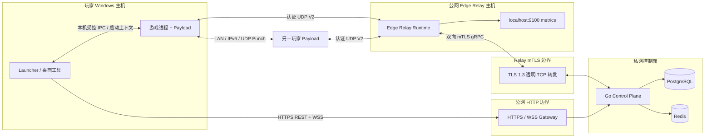
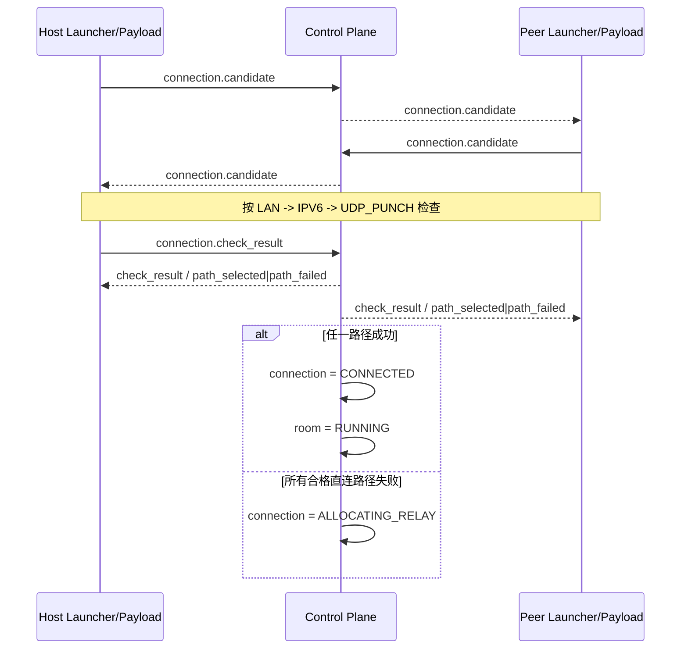
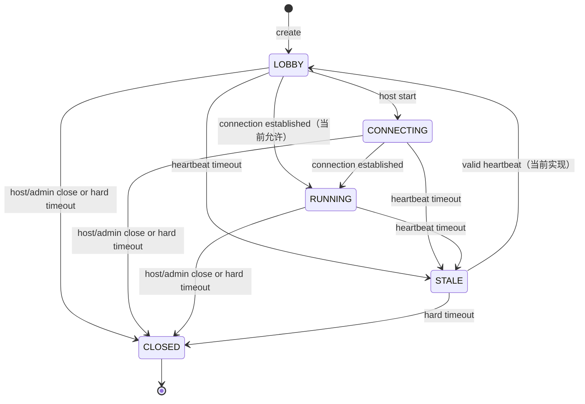
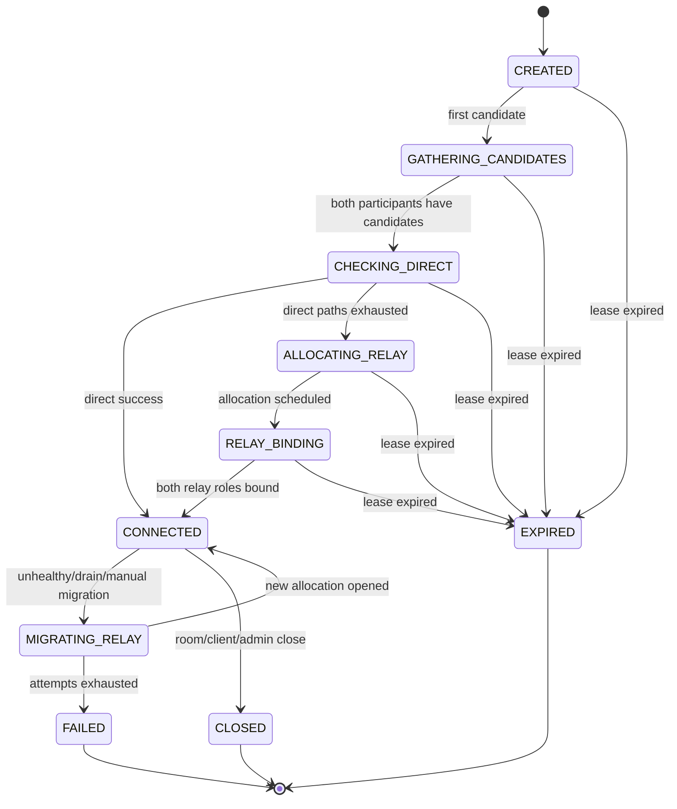

# P2P 联机完整架构

[English](online-architecture.md) | 简体中文

本文描述 `LEGACY_RELAY` P2P 后端、独立 Edge Relay、玩家 Launcher/Payload 接入边界，以及可选的 P2P BattleLog v3 证据链。它仍是 Legacy 数据路径的完整导航和实现基线，但不替代机器可读协议契约。并行社区 VNT 路径已完成的后端 MVP 与剩余端到端工作见[社区 VNT 节点联机目标架构](vnt-community-online-architecture.zh-CN.md)。

## 1. 范围与权威来源

### 1.1 本文覆盖

- 玩家身份绑定和进入 P2P 写操作所需的会话等级；
- P2P 房间、成员和房主心跳；
- 每个房主—成员连接的候选交换与直连检查；
- 直连失败后的 Relay 调度、UDP V2 BIND、转发与迁移；
- P2P BattleLog v3 Match、Presence、报告能力和服务端裁决；
- 管理 API、持久化、一致性、部署、监控和故障恢复；
- 当前代码已经实现的行为及尚未闭环的客户端集成。

### 1.2 本文不覆盖

- Dedicated Server 的注册、匹配和权威 BattleLog；
- MetaServer 原生 TLS 协议、Party 和 Dedicated Matchmaking；
- Unreal 游戏复制协议本身；
- 游戏 Payload 的端到端加密、可靠重传、顺序保证或主机迁移。

Dedicated Server 与 MetaServer 架构见 [MetaServer 架构](metaserver.zh-CN.md)。两条路径复用玩家身份和部分基础设施，但 P2P 房间、P2P Match、Relay allocation 与 Dedicated Match 是独立资源。

### 1.3 契约优先级

发生冲突时按以下顺序判断受支持行为：

1. [HTTP OpenAPI](../../Backend/api/openapi/openapi.yaml)、[Relay UDP 线协议](../../Backend/api/relay-protocol.zh-CN.md)和 [Relay gRPC protobuf](../../Backend/api/proto/relay_control.proto)；
2. 数据库约束、实现代码及自动化测试；
3. [外部 API](../api/external.zh-CN.md)、[内部 API](../api/internal.zh-CN.md)和本文；
4. 历史、归档或开发转交文档。

## 2. 架构原则

1. **控制面与数据面分离。** HTTPS/WebSocket 只协调身份、房间、候选、状态和 Relay allocation；游戏 UDP 不经过 Control Plane。
2. **直连优先。** 双方按 `LAN -> IPV6 -> UDP_PUNCH` 尝试；只有可用直连路径耗尽后才申请 `UDP_RELAY`。
3. **模块化单体控制面。** Auth、P2P Room、Connection、Relay Registry 和 P2P BattleLog 是同一个 Go 进程中的独立领域模块，不是独立微服务。
4. **PostgreSQL 是权威状态。** 房间、成员、连接、候选、检查结果、节点、allocation、迁移和 BattleLog 均以数据库为准。
5. **易失实时事件可恢复。** WebSocket 用于低延迟通知，不是持久消息队列；客户端断线后通过 REST GET 恢复当前状态。
6. **秘密按用途隔离。** 玩家 Token、Host Token、Relay Token、Node Token、mTLS 私钥和管理员凭据不可互换。
7. **幂等优先。** 重复加入、关闭、创建活动连接、相同报告上传和重复 allocation 事件应得到当前结果而不是创建平行资源。
8. **Relay 不信任任意目标地址。** 数据包只携带 allocation handle 和角色，只能在同一 allocation 已验证的 HOST/PEER 间转发。

## 3. 组件与部署拓扑



### 3.1 组件职责

| 组件 | 负责 | 不负责 |
| --- | --- | --- |
| Launcher / 桌面工具 | 玩家登录、Token 刷新、房间 UI、WebSocket、候选与检查编排、BattleLog 上传凭据 | 服务端签名、直接访问数据库、把报告 Token 注入游戏 |
| 游戏 Payload | 网络候选采集、直连检查、Relay BIND、游戏包收发、BattleLog 原始观察 | 保存服务端秘密、选择 Relay 节点、裁决比赛结果 |
| HTTP Gateway | TLS 终止、HTTPS/WSS 转发、公开路径策略 | 暴露管理/内部接口、终止 Relay 节点身份 |
| Control Plane | Auth、房间、连接状态机、Relay 调度、Token 签名、BattleLog、管理 API | 转发游戏 UDP、保存 Edge 的实时 endpoint |
| PostgreSQL | 权威状态、唯一约束、事务、审计、迁移 | 实时 WebSocket 广播、Edge UDP 会话 |
| Redis | 限流、缓存和易失协调 | 权威玩家、房间、连接或 allocation 状态 |
| Edge Relay | Token 验证、Cookie Challenge、allocation 内存状态、认证 UDP 转发 | 访问 PostgreSQL/Redis、运行玩家业务 HTTP API、解密游戏 Payload |
| Prometheus/Grafana | 指标抓取、容量与故障可视化、告警 | 控制业务状态或作为审计来源 |

### 3.2 默认网络入口

| 入口 | 默认监听/映射 | 调用方 | 边界 |
| --- | --- | --- | --- |
| 玩家 HTTP/WSS | Control Plane `:8080`，经公网 HTTPS Gateway | Launcher、客户端 | 仅公开 `/health`、`/v1/*` 等允许路径 |
| 管理/内部 HTTP | `127.0.0.1:18080` 映射到 Control Plane | Admin Web、运维、Prometheus | trusted CIDR + 对应凭据；不得公网暴露 |
| Relay 注册/续签 | 公网 HTTPS 的两条 `/internal/v1/relay-nodes/...` 机器路径 | 未注册/已注册 Edge | Bootstrap Token 或 Node Token |
| Relay 控制流 | Control Plane TCP `9090` | Edge Relay | TLS 1.3 双向证书认证 |
| Relay 数据面 | Edge UDP `8443`，公网 advertised port 可不同 | 游戏 Payload | Relay Token + UDP V2 Challenge/Proof |
| Edge 指标 | `127.0.0.1:9100` | 节点本地抓取代理 | 仅回环，不得公网暴露 |

生产部署角色和网关规则见 [部署入口](../operations/deployment.zh-CN.md)。

## 4. 身份、权限与凭据

### 4.1 玩家会话

`POST /v1/auth/bind` 建立数据库会话并签发短期 Access Token 与轮换 Refresh Token。未提交有效 Steam Encrypted App Ticket 的会话为 `unverified`；成功解密且 SteamID 匹配后为 `verified`；通过完整性 proof 后可提升为 `trusted`。

P2P 房间写操作、连接创建/关闭、WebSocket 和 BattleLog 要求：

- 有效 Player Access Token；
- 玩家账户状态为 `ACTIVE`；
- 会话为 `verified` 或 `trusted`。

公共房间列表和详情不要求登录，但不返回候选、成员秘密或 Host Token。完整认证设计见 [身份验证和会话](authentication.zh-CN.md)。

### 4.2 凭据隔离

| 凭据 | 持有方 | 用途 | 存储原则 |
| --- | --- | --- | --- |
| Player Access Token | Launcher | 玩家 REST/WSS | 短期；不得进 URL/日志 |
| Refresh Token | Launcher | 轮换 Access Token | 仅安全本地凭据库；数据库只存 hash |
| Room Host Token | 房主 Launcher | 心跳、开始、关闭 | 创建时仅返回一次；数据库只存 hash |
| P2P Report Token | Launcher | 上传该玩家的 P2P 报告 | 内存或 Windows 当前用户保护；绝不注入游戏 |
| Relay Token | 对应 HOST/PEER Payload | 在指定节点绑定指定 allocation | 短期 Ed25519 凭证；每端不同 |
| Bootstrap Token | 新 Edge | 首次注册 | 一次性；成功后移除 |
| Node Token | Edge | 证书续签 HTTP | 节点本地 `0600`；数据库只存 hash |
| Node mTLS 私钥/证书 | Edge | gRPC 控制流身份 | 节点本地 `identity.json`，不得复制到其他节点 |
| Admin Access/Refresh/Step-up | 管理浏览器 | 管理读取与高风险写入 | 与玩家及机器 Token 完全隔离 |

任何日志、指标、审计或错误响应都不得包含上述 Token 全文、私钥、完整游戏 Payload 或数据库密码。

## 5. API 与协议平面

### 5.1 公共和玩家 HTTP API

| 领域 | 主要端点 | 说明 |
| --- | --- | --- |
| 客户端配置 | `GET /v1/client/config` | API/协议版本、功能开关、STUN 和可用 Relay 区域；不返回具体分配节点 |
| P2P 房间 | `/v1/p2p-rooms*` | 目录、创建、加入、离开、心跳、开始和关闭 |
| 连接 | `/v1/connections*` | 创建/恢复活动连接、查询权威状态、关闭 |
| 实时信令 | `GET /v1/realtime/connect` | WebSocket 候选、检查和 Relay 生命周期事件 |
| P2P BattleLog | `/v1/p2p-matches*` | 活动 Match、报告能力、Presence、报告和裁决 |

成功 HTTP 响应通常使用 `{data, request_id}`，失败使用 `{error, request_id}`。客户端必须使用响应中的 `request_id` 排障，并只对幂等操作或明确允许重试的操作自动重试。

### 5.2 WebSocket envelope

客户端上行和服务端下行使用：

```json
{
  "type": "connection.candidate",
  "payload": {
    "connection_id": "conn_..."
  }
}
```

客户端上行 Type：

- `connection.candidate`
- `connection.check_result`

服务端还会发送：

- `connection.created`
- `connection.path_selected`
- `connection.path_failed`
- `connection.relay_allocated`
- `connection.relay_migrating`
- `connection.relay_migrated`
- `connection.relay_failed`
- `connection.closed`
- `error`

`connection_id` 位于具体事件的 `payload` 中。Access Token 必须放在 WebSocket Upgrade 的 `Authorization` Header，禁止放在查询参数。

### 5.3 Relay 管理与控制协议

- 首次注册和证书续签使用 HTTPS；
- 节点列表、Drain、Resume、Revoke 和签名 Key 激活使用受限管理 HTTP；
- 节点运行期使用一个双向 mTLS gRPC stream；
- 游戏数据使用独立 UDP V2 二进制协议。

内部消息类型和权限见 [内部 API](../api/internal.zh-CN.md)。

## 6. 数据与所有权模型

### 6.1 PostgreSQL 权威实体

| 领域 | 主要实体/表 | 关键约束 |
| --- | --- | --- |
| 玩家与会话 | `players`、`auth_sessions`、Refresh families | SteamID、会话撤销和轮换重放约束 |
| 房间 | `p2p_rooms`、`p2p_room_members` | 房主、容量、版本、成员角色和状态 |
| 连接 | `connections`、`connection_candidates`、`connection_path_checks` | 每个 room/peer 至多一条非终态活动连接 |
| Relay | `relay_nodes`、`relay_allocations`、`relay_migrations` | 活动 allocation、活动 migration、容量与节点租约 |
| P2P 战绩 | `p2p_match_sessions`、roster、presence、capabilities、reports、decisions | 冻结名单、每玩家唯一 FINAL、报告 ID/内容幂等 |
| 管理 | 管理会话、RBAC、审计、风险事件 | 人工原因、Step-up 和权限边界 |

所有跨实体状态变更尽量在数据库事务中完成。房间心跳与非终态连接续租处于同一事务；房间开始与可选 P2P Match 冻结也处于同一事务。

### 6.2 进程内易失状态

以下内容不会作为权威状态写入 PostgreSQL：

- Control Plane WebSocket subscription 和每连接发送队列；
- Edge allocation 的真实 UDP endpoint、随机 handle、派生数据密钥、重放窗口和 token bucket；
- 玩家完整性 challenge nonce 与已解码 Steam ticket 原始字节；
- Edge 当前 UDP socket 和瞬时包统计。

因此 Control Plane 或 Edge 重启后必须按相应恢复流程重建连接，不能假设内存会话可复活。

## 7. 端到端联机流程

### 7.1 登录与能力发现

1. Launcher 调用 `POST /v1/auth/bind`，必要时提交 Steam ticket。
2. 获得 Access/Refresh Token；P2P 写入要求 verified/trusted 会话。
3. 调用 `GET /v1/client/config` 获取协议版本、STUN 地址和功能开关。
4. 建立带 `Authorization` Header 的 WebSocket。

Control Plane 不提供 STUN 服务本身；客户端使用配置中的 STUN 生成 `SRFLX` candidate。

### 7.2 创建和加入房间

1. 房主创建房间，获得 `room_id` 和一次性 `host_token`。
2. 房主按服务端返回的间隔持续 heartbeat。
3. 成员从公共目录选择房间并携带精确 `version` 加入。
4. 加入事务提交成员与人数后，房间服务为该成员幂等确保一条 host-peer connection。
5. 重复 join 会返回当前房间并再次确保 connection，支持在前一次后置创建失败后恢复。

房间是 Listen Host 星型拓扑：每个非房主成员对应一条 `host_player_id -> peer_player_id` connection，不建立成员间全网状连接。

### 7.3 候选收集和交换

双方为各自 connection 采集：

- `LAN`：私有 IPv4；
- `IPV6`：可路由、非 link-local IPv6；
- `SRFLX`：STUN 得到的公网单播地址。

候选通过 `connection.candidate` 上报。服务端校验地址类型、协议、端口和优先级，写入 PostgreSQL，并只向该 connection 的 HOST/PEER 发布。双方都至少存在候选后，connection 进入 `CHECKING_DIRECT`。

### 7.4 直连选路



服务端不是完整 ICE agent；它决定允许的路径顺序并保存客户端报告。当前实现按 connection/path 记录一次检查结果，由收到的有效参与者报告推进共享状态机。

### 7.5 Relay 回退

```mermaid
sequenceDiagram
    participant H as Host Payload
    participant C as Control Plane
    participant P as Peer Payload
    participant E as Edge Relay

    C->>C: 选择 READY、V2、容量合格节点
    C->>C: 创建 allocation，签发 HOST/PEER Token
    C-->>H: connection.relay_allocated(HOST token)
    C-->>P: connection.relay_allocated(PEER token)
    H->>E: BIND_INIT / BIND_PROOF
    E-->>H: BIND_CHALLENGE / BIND_OK
    P->>E: BIND_INIT / BIND_PROOF
    E-->>P: BIND_CHALLENGE / BIND_OK
    E->>C: AllocationOpened (mTLS gRPC)
    C->>C: allocation = ACTIVE; connection = CONNECTED
    C-->>H: connection.path_selected
    C-->>P: connection.path_selected
    H-->>E: authenticated DATA
    P-->>E: authenticated DATA
```

调度器优先同 region 节点，但同区域不是硬约束；之后按 allocation 使用率、出口带宽使用率和随机打散选择。节点必须为 `READY`、负载为 `NORMAL`/`DEGRADED`、协议版本 2、证书和租约有效、支持 UDP 且低于容量阈值。

### 7.6 房间开始、运行和关闭

- 房主 `start` 将 `LOBBY` 转为 `CONNECTING`；启用 BattleLog 时同时冻结 Match roster。
- 任一 connection 建立成功后，当前实现把房间标记为 `RUNNING`。
- 房主 heartbeat 会续租所有非终态 connection；`FAILED`、`EXPIRED`、`CLOSED` 不会复活。
- 房主关闭或心跳超时最终关闭房间，并撤销/关闭仍活动的 connection 和 Relay allocation。
- 管理员关闭房间或移除成员时也会执行 connection 清理并记录审计。

### 7.7 P2P BattleLog v3

该流程独立于网络选路：

1. `start` 时服务端创建 Match 并冻结初始 roster；
2. 每个合格玩家查询 active Match 并申请与会话族绑定的 report capability；
3. Launcher 只把非秘密的 Match ID、Capability ID、server nonce 和 observer kind 注入游戏；
4. Payload/DLL 原子封存 `*.json.ready`，Launcher 上报 Presence 并原样上传报告；
5. 服务端验证 schema、上下文、名单、时间线哈希链和不可变 FINAL；
6. 收集窗口结束后裁决 `PEER_CONFIRMED`、`SELF_REPORTED`、`DISPUTED`、`INCOMPLETE`、`ABORTED` 或 `EXPIRED`。

默认配置 `p2p_battlelog.enabled: false`、`shadow_mode: true`。禁用时路由存在，但玩家调用返回 `P2P_BATTLELOG_DISABLED`；启用 Shadow Mode 后结果只用于观察和诊断，不应用于奖励或排行榜。

Launcher 的详细安全和恢复要求见 [P2P BattleLog v3 Launcher 契约](p2p-battlelog-launcher-contract.zh-CN.md)。

## 8. 状态机

### 8.1 房间



注意：Repository 的 heartbeat 会把 `STALE` 恢复为 `LOBBY`，不会恢复原来的 `CONNECTING`/`RUNNING`。如果调用方需要恢复对局语义，必须在客户端和后续状态操作中显式处理。

### 8.2 Connection



`TCP_TLS_RELAY` 在模型枚举中保留，但当前 allocation 固定调度 `UDP`，默认 Edge 也只声明 `UDP`；它不是当前可用的玩家回退路径。

### 8.3 Relay 节点

```text
BOOTSTRAPPING -> CONNECTING -> READY -> DRAINING
                         |          |      |
                         v          v      v
                     UNHEALTHY -> OFFLINE  READY(resume)
                         \          /
                          -> REVOKED
```

- 默认 15 秒 heartbeat；
- 45 秒无新鲜 heartbeat 转 `UNHEALTHY`；
- 90 秒转 `OFFLINE`；
- `REVOKED` 是永久管理状态；
- 恢复节点必须重新连接、上报 heartbeat 并经过 `CONNECTING -> READY`，旧内存 allocation 不会复活。

### 8.4 Allocation 与迁移

正常 allocation：

```text
ALLOCATED -> BINDING/ACTIVE -> CLOSED | FAILED
```

故障迁移与计划迁移的旧路径处理不同：

```text
故障节点：old ACTIVE -> FAILED
          new ALLOCATED -> BINDING -> ACTIVE

Drain/人工迁移：old ACTIVE -> MIGRATING（继续计容量和转发）
                new ALLOCATED -> BINDING -> ACTIVE
                success: old CLOSED, migration COMPLETED

任一新路径 timeout：释放本次 new allocation，改选另一合格节点
尝试耗尽：connection FAILED
```

故障迁移允许立即中断；Drain/人工迁移采用 make-before-break，但也不承诺无损。默认单次 BIND deadline 45 秒，最多 3 次。客户端必须同时以 `migration_id` 和 `allocation_id` 幂等处理事件。

### 8.5 BattleLog Match

```text
STARTING -> RUNNING -> COLLECTING
                         |-> PEER_CONFIRMED
                         |-> SELF_REPORTED
                         |-> DISPUTED
                         |-> INCOMPLETE
                         |-> ABORTED
                         `-> EXPIRED
```

终态不可重新打开；相同内容的重复上传可返回幂等 ACK，但不能改变已裁决结果。

## 9. Relay UDP V2 数据面

### 9.1 Token

Control Plane 为 HOST 和 PEER 分别签发短期 Ed25519 Relay Token。Claims 至少绑定：

- `relay_node_id`
- `allocation_id`
- `connection_id`
- `room_id`
- `endpoint_role`
- `protocol`
- `nbf` / `exp` / allocation expiry
- 每秒包数、每秒字节数和总字节上限
- `kid` 和唯一 `jti`

Token 不能在其他节点、其他角色、其他 connection 或其他 allocation 使用。

### 9.2 Challenge/Proof

1. Client 发送 `BIND_INIT(client_nonce, requested_mtu, token)`；
2. Edge 返回 `BIND_CHALLENGE(server_nonce, expires_in_ms, cookie)`；
3. Client 从相同 UDP endpoint 发送 `BIND_PROOF`；
4. Edge 无状态验证 Cookie 后才验签、检查重放和创建/绑定 allocation；
5. Edge 返回 `BIND_OK(handle, role, mtu)`。

Cookie 绑定源 IP/端口、nonce、MTU、Token hash 和短时间桶，避免伪造源地址造成 UDP 放大。默认 Payload MTU 1200 字节，可配置范围 1000～1350。

### 9.3 DATA

DATA 包含版本、随机 64 位 handle、发送方角色、序列号、16 字节 HMAC tag 和游戏 Payload，不包含任意目标地址。Edge 验证：

- handle、版本、角色和源 endpoint；
- 两端 Token/端点仍有效；
- HMAC tag；
- 滑动重放窗口；
- 协商 MTU；
- endpoint、节点和 allocation 速率/总量限制。

无效包静默丢弃。Relay 只提供认证和限流，不提供 Payload 加密、可靠重传、排序或重传；游戏协议必须自行保护内容。

### 9.4 NAT Rebind 与控制断链

- 同一 Token、角色、IP 且处于配置窗口内时，Edge 允许端口变化的 NAT rebind；
- Token `jti` 不能绑定到不同 allocation、角色或源地址；
- gRPC 控制流短时断开时，现有本地 allocation 在宽限期内继续转发；
- 宽限期结束或 Drain deadline 到达后拒绝新绑定并清理相应状态。

## 10. 一致性、幂等和恢复

| 场景 | 权威行为 | 客户端/运维恢复 |
| --- | --- | --- |
| 重复房间 join | 已是 ACTIVE 成员时返回当前房间并再次确保 connection | 使用同一 room，不创建影子房间 |
| 重复创建 connection | 返回该 room/peer 的现有非终态 connection | 按返回 ID 继续 |
| WebSocket 断开 | PostgreSQL 状态不丢失；未送达事件不重放 | 重连后 GET connection，再继续状态机 |
| WebSocket 客户端过慢 | 进程内发送队列满时事件可丢弃，业务写入不阻塞 | GET 权威状态；不要依赖事件计数 |
| 房主 heartbeat | 与非终态 connection 续租同事务提交 | 按 `next_heartbeat_seconds` 调用 |
| heartbeat 过期 | 房间先 STALE，后 CLOSED；关闭时清理 connection/Relay | 不对旧 room 自动重试写入 |
| Control Plane 重启 | PG 状态保留；WebSocket、完整性 nonce 等内存状态丢失 | 重连 WSS、重新 GET；必要时重新 bind |
| Relay 控制流断开 | 租约最终使节点 UNHEALTHY/OFFLINE；短期本地 UDP 继续 | Edge 退避重连；控制面按需迁移 |
| Relay 进程重启 | 本地 endpoint、handle、replay window 丢失 | 不复活旧 allocation；调度新 allocation 并重新 BIND |
| Relay migration 重复事件 | 数据库唯一约束和条件更新保持幂等 | 以 migration/allocation ID 去重 |
| 相同 BattleLog 报告重试 | 相同 `report_id` + 相同字节返回 `duplicate=true` | 视为成功 ACK |
| PostgreSQL 不可用 | 权威写入失败，readiness 应失败 | 有界重试，禁止用内存假成功 |
| Redis 不可用 | 依赖 Redis 的限流/缓存能力降级或 readiness 失败 | 不把 Redis 数据提升为权威状态 |

### 10.1 事务边界

- 房间创建与房主成员记录原子提交；
- join 的成员/人数事务先提交，connection ensure 是后置操作；重试 join 会重新 ensure；
- heartbeat 与 connection lease renewal 原子提交；
- `start` 与启用状态下的 Match/roster 创建原子提交；
- Relay 节点选择、allocation 创建和节点计数原子提交，并使用行锁与 `SKIP LOCKED`；
- 两端 BIND 完成由 Edge 事件驱动 allocation/connection 状态更新；
- WebSocket 发布发生在数据库提交后，不属于数据库事务。

## 11. 安全边界

### 11.1 公网 API

- HTTPS/WSS 必须验证证书链和主机名；
- Access Token 只放 Header；
- CORS 只允许配置 Origin；
- 公网 Gateway 对 `/v1/admin*` 和普通 `/internal/*` 返回 404；
- Relay enroll/renew 是仅有的公网内部机器路径，并仍需 Token；
- Candidate 只对 connection 参与者可见，公共房间目录不返回 IP 地址。

### 11.2 Relay

- mTLS 私钥只存在对应 Edge；公网边界透明转发 TLS，不能冒充节点；
- 调度只使用数据库登记并持续 heartbeat 的节点；客户端不能指定 Relay 地址或迁移目标；
- Challenge Cookie、静默丢弃、IP/包/字节限制和临时 ban 限制反射与资源消耗；
- HOST/PEER Token 隔离，数据包无任意目标地址；
- V1 默认关闭，生产不得启用。

### 11.3 BattleLog

- `report_token` 只由 Launcher 持有，不能进入游戏环境、命令行、日志或普通状态文件；
- 报告绑定 frozen roster、玩家、会话族、Capability、nonce 和 timeline；
- 原始证据与标准化结果分离，原始读取需要独立管理权限并返回 `no-store`；
- P2P 客户端证据不能当作 Dedicated Server 权威报告。

## 12. 扩展性与高可用

### 12.1 Control Plane

- 业务状态可通过 PostgreSQL 事务和唯一约束支持多个实例并发写入；
- 当前 WebSocket Hub 是实例内存结构，没有 Redis Pub/Sub 或外部事件总线；
- 多实例部署必须使用玩家级 sticky routing，或先实现跨实例发布/订阅；
- 客户端始终应把 REST GET 视为恢复来源，不能假定任一实例保存事件历史；
- 数据库迁移必须向前/向后兼容滚动版本，避免旧实例读取新枚举失败。

### 12.2 Edge Relay

- 节点之间不共享 allocation 内存；按 region/zone 横向增加节点即可扩容；
- 调度器在配置容量阈值下停止向高负载节点分配；Edge 还会根据自身利用率报告 `DEGRADED` 或 `REJECT_NEW`；
- 同一身份不得并行启动两个 Edge 实例；
- 健康节点不做周期重启，计划升级必须逐台 Drain 至零 allocation；
- 当前迁移允许短时中断，不承诺无损切换。

### 12.3 单点与依赖

- PostgreSQL 是主要权威依赖，应使用备份、恢复演练和适当的 HA 方案；
- Redis 故障不应篡改已持久化房间/连接状态，但可能影响限流与 readiness；
- 公网 HTTP Gateway 和 mTLS TCP 边界应分别健康检查；
- 单区域只有一个 READY Relay 时无法在节点故障时迁移到同区域，至少应保留跨区域可用容量。

## 13. 配置基线

以下是当前默认开发配置，不是硬编码协议常量；生产可通过 YAML/环境覆盖：

| 配置 | 默认值 | 含义 |
| --- | ---: | --- |
| P2P room heartbeat | 15 s | 房主建议心跳间隔 |
| Room stale / close | 45 s / 90 s | 无心跳状态转换 |
| Room maximum players | 64 | 后端允许的最大配置容量 |
| Connection TTL | 600 s | 非终态连接租约 |
| WebSocket queue / max message | 64 / 16 KiB | 单订阅队列与消息上限 |
| Relay heartbeat | 15 s | 节点租约刷新 |
| Relay unhealthy / offline | 45 s / 90 s | 节点状态转换 |
| Relay token TTL | 120 s | 初次 BIND 的短期窗口 |
| Allocation TTL | 1800 s | 数据库 allocation 上限 |
| Scheduler capacity threshold | 80% | 调度容量门槛 |
| Migration timeout / attempts | 45 s / 3 | 每次 BIND deadline 与最大尝试 |
| Edge control disconnect grace | 600 s | 既有 UDP allocation 宽限期 |
| Edge allocation idle | 120 s | 无流量清理窗口 |
| Relay payload MTU | 1200 bytes | 默认游戏 Payload 上限 |
| BattleLog report max | 512 KiB | 单份 raw v3 JSON 上限 |
| BattleLog collect / hard expiry | 300 s / 8 h | 收集截止与硬过期 |

生产值以部署配置、`GET /v1/client/config` 和服务端返回的 interval/expiry 字段为准，不应由客户端复制本表硬编码。

## 14. 可观测性与运维

### 14.1 指标

Control Plane 指标包括 HTTP 请求量、状态和延迟，Auth bind/Refresh 重放/Session，P2P 房间/connection/WebSocket，Relay 节点/租约/allocation/迁移，以及 PostgreSQL、Redis、Go runtime 和 BattleLog intake/裁决。

Edge 指标包括 active allocations、BIND 成败、Token 无效/重放、转发包和字节、丢包/限流、load state、控制连接和重连。

### 14.2 日志与审计

- HTTP 使用 `request_id` 贯穿日志与错误响应；
- 管理写入记录 actor、resource、reason、来源、前后状态和结果；
- Relay 注册、续签、Drain、Resume、Revoke 和 Key 激活必须可审计；
- 日志只记录 Token/ID 的安全摘要或短后缀，不记录完整秘密；
- BattleLog 原始 JSON 不进入普通应用日志。

### 14.3 发布与恢复

- Control Plane 先备份、预检、兼容迁移，再发布并观察；
- Edge 每次一台执行 `DRAINING -> 0 allocations -> deploy -> CONNECTING -> READY`；
- 控制链断开先等待内建退避，不用定时重启代替健康检查；
- Edge 进程停止或 crash-loop 时保存日志并按 Runbook 恢复；
- 证书在剩余 25% 有效期时在线续签并重建 mTLS。

详见 [Relay 连续在线与恢复](../operations/relay-continuity.zh-CN.md)和 [Relay 故障 Runbook](../operations/runbooks/relay-outage.zh-CN.md)。

## 15. 当前实现状态与已知边界

### 15.1 已实现

| 能力 | 后端状态 |
| --- | --- |
| P2P 房间 CRUD、成员和心跳 | 已实现并接入 Control Plane |
| host-peer connection 自动确保 | 已实现；join 后幂等创建 |
| Candidate/Check WebSocket | 已实现；状态持久化、事件进程内发布 |
| LAN/IPv6/UDP Punch 优先级 | 已实现 |
| UDP Relay 调度和角色 Token | 已实现 |
| Edge UDP V2、限流和 NAT rebind | 已实现 |
| Relay mTLS 控制流、证书和 Keyset | 已实现 |
| Drain、故障/手动迁移和有限重试 | 已实现 |
| P2P BattleLog v3 后端和管理证据 | 已实现但默认关闭 |
| P2P 管理页面 | AdminWeb 已接入 |

### 15.2 尚未闭环或需要明确决策

1. **游戏侧接入。** 当前仓库的 Payload、ServerLauncherGUI 和 ServerWrapper 中尚未出现 `/v1/p2p-rooms`、`/v1/connections`、`/v1/realtime/connect` 或 Relay 分配事件的实际客户端调用；后端能力尚未形成玩家端端到端联机流程。
2. **BattleLog 发布开关。** 默认 `enabled: false`、`shadow_mode: true`，必须完成 Launcher 凭据、文件恢复和 Shadow Mode 验收后再启用。
3. **WebSocket 横向扩展。** Hub 为实例内内存，当前没有跨 Control Plane 的事件总线。
4. **Start 门禁。** connection 在 `LOBBY` 阶段成功也能把 room 标为 `RUNNING`；如果产品要求只有房主 `start` 后才能开始检查/运行，需要收紧状态转换。
5. **成员普通 leave。** 玩家 `leave` 当前更新成员状态和人数，但不会立即关闭该成员的 connection；管理员 remove 会清理。需要决定普通 leave 是否同步调用 `CloseForRoomMember`。
6. **STALE 恢复。** 有效 heartbeat 将 `STALE` 恢复为 `LOBBY`，不会恢复此前运行状态。
7. **初次 Relay 分配失败。** 当前会发送 `connection.relay_failed`，connection 保持 `ALLOCATING_RELAY` 直到租约过期；尚没有初次分配的有界自动重试状态机。
8. **TCP/TLS Relay。** 模型预留枚举，但当前调度和 Edge 数据面仅完成 UDP。

这些边界属于当前实现事实，不应由客户端通过私有约定绕过。修正时必须同时更新 OpenAPI、状态机测试和本文。

## 16. 验证与代码导航

### 16.1 关键实现

| 领域 | 路径 |
| --- | --- |
| Control Plane 接线 | `Backend/internal/controlplane/server.go` |
| 房间 | `Backend/internal/p2proom/` |
| 连接和 WebSocket Hub | `Backend/internal/connection/` |
| Relay 调度、证书和迁移 | `Backend/internal/relayregistry/` |
| Edge UDP Runtime | `Backend/internal/relayruntime/` |
| P2P BattleLog | `Backend/internal/p2pbattlelog/` |
| HTTP 契约 | `Backend/api/openapi/openapi.yaml` |
| Relay gRPC | `Backend/api/proto/relay_control.proto` |
| Relay UDP | `Backend/api/relay-protocol.zh-CN.md` |
| 数据库迁移 | `Backend/migrations/` |

### 16.2 建议验证命令

```powershell
cd Backend
go test ./internal/p2proom ./internal/connection ./internal/relayregistry ./internal/relayruntime ./internal/p2pbattlelog ./api/openapi
```

```powershell
python Tools/Docs/check_markdown_links.py
python Tools/Docs/check_bilingual_docs.py
```

涉及真实 UDP、迁移或弱网的变更还必须运行 `Backend/tests/integration`、`Backend/tests/netem` 和相应发布门禁，不能只依赖单元测试。
