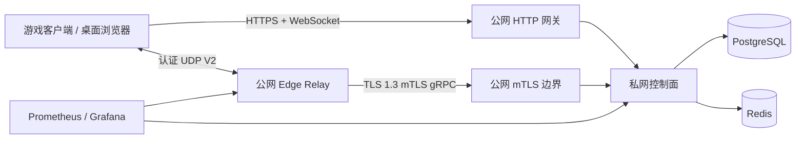

# 系统总览

ProjectRebound 是由游戏侧组件、桌面工具、Go 控制面和独立 Edge Relay 组成的联机元服务。控制面负责身份、房间、连接协调、Relay 调度和更新元数据；游戏 UDP 数据不经过控制面。

## 组件职责

| 组件 | 主要职责 | 不应承担 |
| --- | --- | --- |
| 游戏客户端 / Payload | 登录、房间交互、候选交换、Relay BIND 和数据收发 | 保存服务端密钥、直接访问数据库 |
| 控制面 | Auth、P2P 房间、连接状态机、Relay 调度、签名和管理 API | 转发游戏 UDP 流量 |
| PostgreSQL | 权威持久状态、审计、迁移和幂等约束 | 临时广播 |
| Redis | 限流、缓存和易失协作状态 | 权威身份或房间记录 |
| 公网 HTTP 网关 | 转发客户端 HTTPS/WebSocket | 终止 Relay 客户端 mTLS 身份 |
| 公网 mTLS 边界 | 透明转发 Relay TLS 连接到私网控制面 | 持有节点私钥、解析游戏 UDP |
| Edge Relay | 验证 Relay Token、完成 UDP BIND、转发认证数据包 | 访问 PostgreSQL/Redis、承载业务 API |

## 关键流程

1. 客户端通过外部 API 绑定身份并取得短期 Access Token 与轮换 Refresh Token。
2. 房主创建房间，参与者加入；双方通过 WebSocket 上报候选和直连检查结果。
3. 直连失败时，控制面选择一个 `READY` Relay，签发参与者隔离的 Relay Token。
4. 两端在 UDP V2 Challenge/Proof 后绑定同一 allocation，之后数据只在客户端与 Relay 之间流动。
5. 房间心跳在同一事务中续期非终态连接，避免活跃对局被固定 TTL 清理。
6. Relay 控制链路用于心跳、流量报告、配置、Keyset、分配和迁移；短时断链不立即删除已有 UDP allocation。

## 可用性原则

- 控制面和 Edge Relay 独立部署、独立升级；中继节点之间不共享本地运行状态。
- 健康 Relay 必须持续在线，不做小时级或日常周期重启。
- 发布 Relay 前先 Drain 并迁移到零 allocation；节点已经离线时才执行恢复性重启。
- 证书在剩余 25% 有效期时在线续签并重建 mTLS，不依赖进程重启续证。
- 连续在线长稳不混入故障注入；SIGKILL、迁移和弱网使用独立门禁。

## 下一步阅读

- 接口：[API 索引](../api/README.md)
- 部署：[部署入口](../operations/deployment.md)
- Relay 连续在线：[运行策略](../operations/relay-continuity.md)
- 测试：[测试索引](../testing/README.md)
