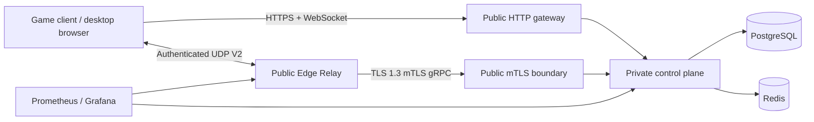

# System overview

English | [简体中文](overview.zh-CN.md)

ProjectRebound is an online-services platform composed of game-side components, desktop tools, a Go control plane, and independent Edge Relay nodes. The control plane owns identity, rooms, connection coordination, Relay scheduling, and update metadata. Game UDP traffic never traverses the control plane.

## Component responsibilities

| Component | Owns | Must not own |
| --- | --- | --- |
| Game client / payload | Login, room interaction, candidate exchange, Relay BIND, and data transfer | Server private keys or direct database access |
| Control plane | Authentication, P2P rooms, connection state machine, Relay scheduling, signing, and administration API | Game UDP forwarding |
| PostgreSQL | Authoritative persistent state, audit, migrations, and idempotency constraints | Ephemeral broadcast |
| Redis | Rate limits, cache, and ephemeral coordination | Authoritative identity or room records |
| Public HTTP gateway | Client HTTPS and WebSocket forwarding | Relay client-mTLS identity termination |
| Public mTLS boundary | Transparent Relay TLS forwarding to the private control plane | Node private keys or game UDP parsing |
| Edge Relay | Relay-token validation, UDP BIND, and authenticated packet forwarding | PostgreSQL/Redis access or business APIs |

## Critical flows

1. A client binds an identity through the external API and receives a short-lived access token plus a rotating refresh token.
2. The host creates a room and participants join. Both sides publish candidates and direct-connect results over WebSocket.
3. When direct connectivity fails, the control plane selects a `READY` Relay and signs participant-isolated Relay tokens.
4. Both peers bind the same allocation after the UDP V2 challenge/proof exchange; subsequent data flows only between clients and the Relay.
5. A room heartbeat renews every non-terminal connection in the same transaction, preventing an active match from being removed by a fixed TTL.
6. The Relay control stream carries heartbeats, traffic reports, configuration, keysets, allocations, and migrations. A brief control disconnect does not immediately remove existing UDP allocations.

## Availability principles

- The control plane and Edge Relay deploy and upgrade independently. Relay nodes do not share local runtime state.
- A healthy Relay stays continuously online and is not restarted hourly or daily.
- Drain and migrate a Relay to zero allocations before a planned release. Recovery restarts apply only to an already-offline process.
- A node certificate renews online at 25% remaining lifetime and rebuilds mTLS without a process restart.
- Continuous soak does not include fault injection. SIGKILL, migration, and weak-network behavior use separate gates.

## Next documents

- [API index](../api/README.md)
- [Deployment entry point](../operations/deployment.md)
- [Relay continuity policy](../operations/relay-continuity.md)
- [Testing index](../testing/README.md)
