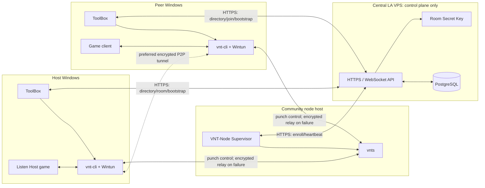
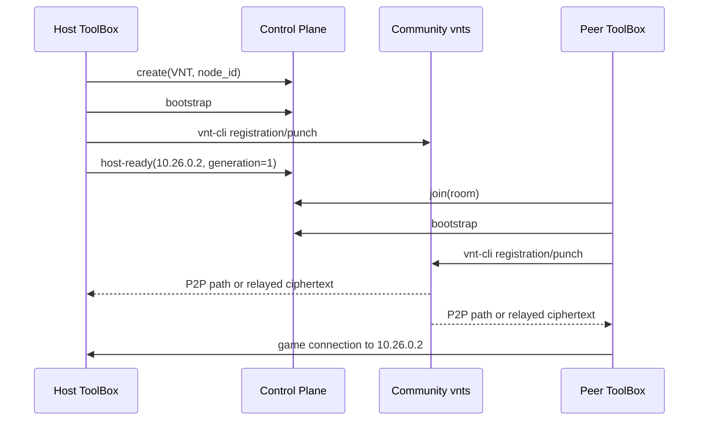
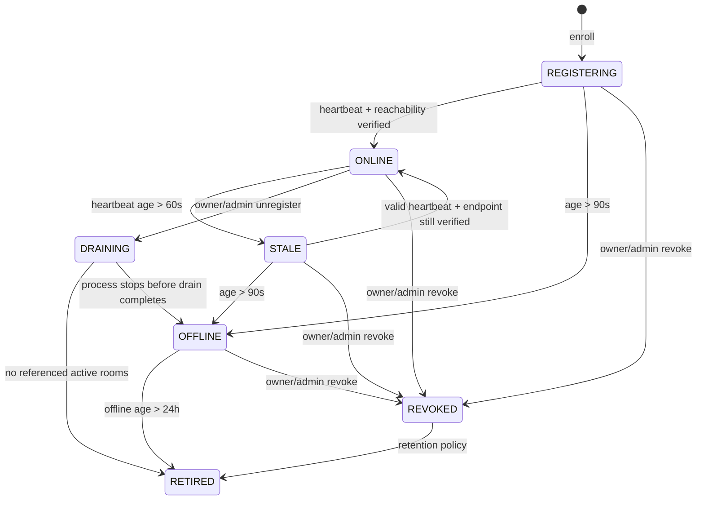

# Community VNT Node Online Target Architecture

English | [简体中文](vnt-community-online-architecture.zh-CN.md)

Status: target design, not implemented
Baseline date: 2026-08-02

This document turns the "VNT node + P2P room" proposal into an implementable, migratable, and testable target architecture for ProjectRebound. It preserves two primary constraints: community volunteers operate VNT registration/hole-punch/relay nodes, and gameplay traffic must never traverse the central LA VPS. The currently implemented custom Candidate/Connection/Edge Relay path remains the implementation truth until this design ships; see the [current complete P2P online architecture](online-architecture.md).

## 1. Goals, non-goals, and key decisions

### 1.1 Goals

- Let ToolBox discover, probe, and select a low-latency community VNT node by default.
- Put the host and members on a room-specific virtual LAN through the same `vnts` node.
- Prefer VNT peer-to-peer hole punching and relay only through the selected community node when necessary.
- Keep the central API limited to identity, directory, room, secret delivery, and health control traffic; it never carries gameplay packets.
- Prevent an untrusted community node from reading or producing valid plaintext gameplay traffic.
- Reuse the existing Auth, P2P Room, administration, audit, and optional P2P BattleLog capabilities.
- Give nodes, rooms, and local processes explicit state machines, timeouts, cleanup, and recovery boundaries.

### 1.2 Non-goals

- VNT does not turn a player host into an authoritative Dedicated Server; the game still uses a Listen Host.
- The first release does not support seamless VNT node migration during a running match.
- The first release permits only one active VNT room session per client machine.
- The central API does not inspect every gameplay packet or treat client network reports as authoritative match results.
- Community nodes never receive a Player Access Token, Room Host Token, or BattleLog Report Token.

### 1.3 Decided architecture

| Topic | Decision |
| --- | --- |
| Room isolation | Generate a unique high-entropy VNT `token` for each room/generation and pass it to `vnt-cli -k`; never reuse a public room ID |
| Content protection | Generate a separate strong password per room/generation, enable client-to-client AEAD with `-w`, and enable client-server encryption with `-W` |
| Node selection | The host ToolBox selects and pins a node; joining members must use it and cannot choose another |
| Virtual addressing | The host requests `10.26.0.2`; members receive stable slot addresses from `.3`; the MVP allows one room session per client |
| Node credentials | A Player Access Token only mints a one-time enrollment; the node then uses a separate revocable Node Credential whose database representation is only a hash |
| Secret delivery | The public directory never returns the VNT network token, E2E password, or host virtual IP; only verified active members receive them in a `no-store` bootstrap response |
| Runtime | The official server binary is `vnts`; distributions pin a version and SHA-256 and never download an executable at runtime |
| Room lifetime | `expires_at = created_at + 8h` is a hard limit; request-time checks enforce it and a five-minute sweeper converges missed state |
| Failure migration | Before match start, rebind is allowed and rotates all VNT room secrets; after `RUNNING`, node loss ends connectivity rather than attempting hot migration |
| Rollout | `transport_kind=VNT` runs alongside the existing `LEGACY_RELAY`; one room can never mix the two data planes |

## 2. External VNT constraints

This design relies on official VNT semantics rather than treating VNT as a custom protocol:

- `-k <token>` identifies a virtual LAN. Devices using the same token on one server join the same LAN, so a public, fixed, or cross-room token can join unrelated rooms.
- `-w <password>` encrypts client-to-client traffic end to end so the server cannot decrypt it; `-W` protects client-server communication.
- `--ip <IP>` requests a virtual address, which must be in the server subnet and unique within the VNT network.
- `-f <conf>` accepts YAML configuration, allowing the network token and password to stay out of the process command line.
- The official server repository and binary are named `vnts`; its configured service port must be reachable over TCP and UDP.

See the official [VNT client options](https://github.com/vnt-dev/vnt/blob/main/vnt-cli/README.md), [VNT server repository](https://github.com/vnt-dev/vnts), and [VNT server deployment guide](https://rustvnt.com/guide/server.html). Before release, the project must pin an interoperably tested release/tag and must not automatically follow `main`.

`vnts --white-token` is a static startup whitelist and does not fit dynamically created rooms. The community-node MVP runs without that static whitelist: an unguessable room token provides separation, while the room E2E password provides confidentiality and integrity. Per-room server authorization can be added only if the project later maintains a controlled `vnts` fork or dynamic management interface.

## 3. Target topology and traffic boundary



Only login, node and room metadata, membership, encrypted room secrets, state events, BattleLog uploads, and operational telemetry may traverse the central VPS. Gameplay UDP/TCP, VNT virtual-interface packets, VNT hole-punch packets, and VNT relay packets must not.

For a `transport_kind=VNT` room, the Control Plane creates no `connections`, `relay_allocations`, or Relay Token. Network policy must not expose a gameplay UDP forwarding entry on the central API container. Release acceptance must verify this with packet capture and central egress byte metrics.

## 4. Component responsibilities

| Component | Responsible for | Not responsible for |
| --- | --- | --- |
| ToolBox | Login, node probe/selection, room operations, bootstrap, controlled `vnt-cli` and game launch, process cleanup | Long-lived node credentials, selecting a node for other members, giving VNT secrets to the game |
| VNT privileged helper | Elevated virtual-adapter operations, starting/supervising `vnt-cli`, structured readiness | UI, player authentication, arbitrary command execution |
| Game/Payload | Connecting through the virtual IP and producing optional BattleLog observer evidence | VNT token/password access, `vnt-cli` control, node selection |
| Control Plane | Auth, node registry, rooms, members, secret wrapping, status/expiry, audit, and BattleLog | Forwarding VNT or gameplay traffic |
| PostgreSQL | Authoritative node, credential hash, room selection, VNT generation, and member virtual-address state | Plaintext secrets |
| VNT-Node Supervisor | Starting a pinned `vnts`, enrolling, heartbeats, unregistering, logging, and local health checks | Player Access Tokens or room E2E passwords |
| Community `vnts` | VNT registration, NAT traversal coordination, and encrypted relay where required | Player identity, room business state, gameplay decryption |
| Existing Edge Relay | Migration fallback for `LEGACY_RELAY` rooms only | Any VNT room |

## 5. Trust boundaries and credentials

### 5.1 Credential classes

| Credential | Holder | Purpose | Storage rule |
| --- | --- | --- | --- |
| Player Access/Refresh Token | ToolBox | Player APIs | Existing Auth contract; never copied to VNT-Node |
| Room Host Token | Host ToolBox | heartbeat, start, rebind, close | Memory or Windows user-protected storage; hash in database |
| Node Enrollment Code | ToolBox -> VNT-Node once | First enrollment of one node | Ten minutes, one use, hash in database; delete immediately after success |
| Node Credential | VNT-Node | Heartbeat, update, and unregister its node | Random 256-bit secret, hash in database, DPAPI/system credential store locally, revocable and rotatable |
| VNT Network Token | Active room members' ToolBox/vnt-cli | `-k` room separation | Random per room/generation, envelope-encrypted in database, absent from public APIs, command lines, and logs |
| VNT E2E Password | Active room members' ToolBox/vnt-cli | `-w` gameplay confidentiality and integrity | Random 256-bit secret per room/generation; same handling as the network token |
| P2P Report Token | ToolBox | BattleLog upload | Fully separate from VNT and never injected into game or VNT processes |

Only an Active, Steam-verified player that satisfies the integrity policy can request a Node Enrollment Code. A player may own at most three non-RETIRED nodes by default; larger quotas require administrative review. Ownership supports quotas, unregister, and audit, but does not establish node trustworthiness.

### 5.2 Community-node threat model

A community node is an untrusted Internet host. It can observe public source/destination addresses, connection times, packet sizes, traffic volume, and network metadata, and it can drop, throttle, replay invalid packets, or disappear. With a high-entropy `-w` secret and AEAD, it should not be able to read or construct valid plaintext gameplay traffic. Encryption cannot prevent denial of service or traffic analysis, and the UI must disclose that on first use.

Every ToolBox probes registered node endpoints. To keep the directory from becoming an SSRF or LAN-scanning mechanism, both Control Plane and ToolBox must reject loopback, link-local, multicast, unspecified, cloud metadata, and, by default, RFC1918/ULA addresses. Before connecting, ToolBox resolves a hostname again and validates every A/AAAA result. Only an explicit development setting can permit private nodes.

## 6. Authoritative data model

The following is the logical migration target. Concrete migrations and OpenAPI must use matching lengths and constraints.

### 6.1 VNT nodes

```sql
CREATE TABLE vnt_nodes (
    id                     VARCHAR(64) PRIMARY KEY,
    owner_player_id        VARCHAR(64) NOT NULL REFERENCES players(id),
    advertised_host        VARCHAR(253) NOT NULL,
    port                   INTEGER NOT NULL CHECK (port BETWEEN 1024 AND 65535),
    region                 VARCHAR(64) NOT NULL,
    location               VARCHAR(128) NOT NULL,
    state                  VARCHAR(16) NOT NULL,
    vnts_version           VARCHAR(32) NOT NULL,
    wrapper_version        VARCHAR(32) NOT NULL,
    server_key_fingerprint VARCHAR(128) NOT NULL,
    supported_transports   TEXT[] NOT NULL DEFAULT ARRAY['udp', 'tcp'],
    max_rooms              INTEGER NOT NULL CHECK (max_rooms BETWEEN 1 AND 10000),
    reported_sessions      INTEGER NOT NULL DEFAULT 0 CHECK (reported_sessions >= 0),
    last_heartbeat_at      TIMESTAMPTZ,
    last_reachable_at      TIMESTAMPTZ,
    created_at             TIMESTAMPTZ NOT NULL,
    updated_at             TIMESTAMPTZ NOT NULL,
    retired_at             TIMESTAMPTZ,
    CONSTRAINT vnt_nodes_state CHECK (
        state IN ('REGISTERING','ONLINE','STALE','OFFLINE','DRAINING','REVOKED','RETIRED')
    ),
    UNIQUE (advertised_host, port)
);
```

`reported_sessions` is telemetry only. Scheduling capacity comes from the database count of non-closed, non-expired rooms referencing the node, rather than trusting a self-report. Only a successful central active check updates `last_reachable_at`; a heartbeat cannot assert reachability.

Credentials and enrollments are separate tables:

```sql
CREATE TABLE vnt_node_enrollments (
    id              VARCHAR(64) PRIMARY KEY,
    owner_player_id VARCHAR(64) NOT NULL REFERENCES players(id),
    secret_hash     BYTEA UNIQUE NOT NULL,
    expires_at      TIMESTAMPTZ NOT NULL,
    consumed_at     TIMESTAMPTZ,
    created_at      TIMESTAMPTZ NOT NULL
);

CREATE TABLE vnt_node_credentials (
    id           VARCHAR(64) PRIMARY KEY,
    node_id      VARCHAR(64) NOT NULL REFERENCES vnt_nodes(id) ON DELETE RESTRICT,
    secret_hash  BYTEA UNIQUE NOT NULL,
    expires_at   TIMESTAMPTZ NOT NULL,
    last_used_at TIMESTAMPTZ,
    revoked_at   TIMESTAMPTZ,
    created_at   TIMESTAMPTZ NOT NULL
);
```

### 6.2 Room VNT sessions

Existing `p2p_rooms` gains a transport discriminator and hard expiry. VNT-only fields live in a one-to-one table so the Legacy path does not accumulate nullable columns:

```sql
ALTER TABLE p2p_rooms
    ADD COLUMN transport_kind VARCHAR(16) NOT NULL DEFAULT 'LEGACY_RELAY',
    ADD COLUMN expires_at TIMESTAMPTZ;

UPDATE p2p_rooms
SET expires_at = created_at + INTERVAL '8 hours'
WHERE expires_at IS NULL;

ALTER TABLE p2p_rooms
    ALTER COLUMN expires_at SET NOT NULL,
    ADD CONSTRAINT p2p_rooms_transport_kind
        CHECK (transport_kind IN ('LEGACY_RELAY', 'VNT'));

CREATE TABLE p2p_vnt_sessions (
    room_id                       VARCHAR(64) PRIMARY KEY
                                  REFERENCES p2p_rooms(id) ON DELETE CASCADE,
    node_id                       VARCHAR(64) NOT NULL
                                  REFERENCES vnt_nodes(id) ON DELETE RESTRICT,
    generation                    INTEGER NOT NULL DEFAULT 1,
    state                         VARCHAR(24) NOT NULL,
    node_host_snapshot            VARCHAR(253) NOT NULL,
    node_port_snapshot            INTEGER NOT NULL,
    node_region_snapshot          VARCHAR(64) NOT NULL,
    node_location_snapshot        VARCHAR(128) NOT NULL,
    network_token_ciphertext      BYTEA NOT NULL,
    e2e_password_ciphertext       BYTEA NOT NULL,
    secret_key_id                 VARCHAR(64) NOT NULL,
    network_token_nonce           BYTEA NOT NULL,
    e2e_password_nonce            BYTEA NOT NULL,
    host_virtual_ip               INET,
    failure_reason                VARCHAR(64),
    created_at                    TIMESTAMPTZ NOT NULL,
    updated_at                    TIMESTAMPTZ NOT NULL,
    CONSTRAINT p2p_vnt_state CHECK (
        state IN ('SELECTED','HOST_CONNECTING','HOST_READY','READY','ACTIVE',
                  'REBINDING','FAILED','CLOSED')
    )
);

CREATE TABLE p2p_vnt_member_sessions (
    room_id        VARCHAR(64) NOT NULL REFERENCES p2p_rooms(id) ON DELETE CASCADE,
    generation     INTEGER NOT NULL,
    player_id      VARCHAR(64) NOT NULL REFERENCES players(id),
    device_id      VARCHAR(64) NOT NULL,
    virtual_ip     INET NOT NULL,
    state          VARCHAR(16) NOT NULL DEFAULT 'ISSUED',
    last_report_at TIMESTAMPTZ,
    created_at     TIMESTAMPTZ NOT NULL,
    PRIMARY KEY (room_id, generation, player_id),
    UNIQUE (room_id, generation, virtual_ip),
    UNIQUE (room_id, generation, device_id),
    CONSTRAINT p2p_vnt_member_state CHECK (
        state IN ('ISSUED','CONNECTING','CONNECTED','FAILED','STOPPED')
    )
);
```

The network token and E2E password use versioned AEAD envelope encryption with a distinct, non-reused nonce for each value. Associated Data binds at least `room_id`, `generation`, `node_id`, and `secret_kind`. The key comes from deployment secret management and is not stored with PostgreSQL. These values cannot be hash-only because the service must redeliver them when a member reconnects.

Endpoint snapshots preserve historical room and audit meaning after a node changes address or retires. A node is not physically deleted merely because it has been offline for 24 hours. It becomes `RETIRED`, its credentials are revoked, and the row can be purged only after retention and once no references remain.

## 7. API contract

All errors retain the existing `{error:{code,message,details}, request_id}` envelope. Requests or responses containing a Node Credential or room secret set `Cache-Control: no-store`; gateways and application logs filter Authorization, bootstrap bodies, and secret fields.

### 7.1 Node APIs

| Method and path | Authentication | Behavior |
| --- | --- | --- |
| `POST /v1/vnt/node-enrollments` | Player Access | Issue a ten-minute, one-use enrollment code |
| `POST /v1/vnt/nodes` | Enrollment Code | Register a node, atomically consume the code, and return the Node Credential once |
| `GET /v1/vnt/nodes?status=online&region=...` | Public | Return probeable endpoint, location, version, capacity, and status without owner or secrets |
| `POST /v1/vnt/nodes/{node_id}/heartbeat` | Node Credential | Renew lease and report version/resources; cannot change owner or endpoint |
| `POST /v1/vnt/nodes/{node_id}/credential/rotate` | Node Credential | Self-rotate in the final 25% of validity; return the new credential once and revoke the old after a short overlap |
| `DELETE /v1/vnt/nodes/{node_id}` | Node Credential or Owner Player Access | Stop new assignments; retire when unused or enter DRAINING while active rooms remain |

An authenticated ToolBox requests enrollment:

```http
POST /v1/vnt/node-enrollments
Authorization: Bearer <player-access-token>

{
  "label": "home-node"
}
```

```json
{
  "enrollment_code": "vne_...",
  "expires_at": "2026-08-02T12:10:00Z"
}
```

VNT-Node performs first enrollment:

```http
POST /v1/vnt/nodes
Authorization: VNTEnrollment vne_...
```

```json
{
  "advertised_host": "1.2.3.4",
  "port": 29878,
  "region": "cn-east",
  "location": "Shanghai",
  "vnts_version": "<pinned-version>",
  "wrapper_version": "0.1.0",
  "server_key_fingerprint": "sha256:...",
  "supported_transports": ["udp", "tcp"],
  "max_rooms": 64
}
```

```json
{
  "node_id": "vnt_abc",
  "node_token": "vnn_...",
  "state": "REGISTERING",
  "heartbeat_interval_seconds": 30,
  "credential_expires_at": "2026-11-01T00:00:00Z"
}
```

`advertised_host` may be omitted. In that case, the API may only use a source public IP established by trusted reverse-proxy rules. A client-supplied or untrusted `X-Forwarded-For` can never become the endpoint. Endpoint changes require renewed owner confirmation and reachability verification.

Heartbeat example:

```json
{
  "wrapper_version": "0.1.0",
  "vnts_version": "<pinned-version>",
  "uptime_seconds": 3600,
  "reported_sessions": 4,
  "server_process_healthy": true
}
```

The public node response retains the proposal's `node_id`, `host`, `port`, `region`, `location`, and `status`, and adds `last_reachable_at`, `capacity_available`, `supported_transports`, and version compatibility. It never exposes the owner ID, Node Credential, server private key, or log path.

### 7.2 Room APIs

| Method and path | Authentication | VNT behavior |
| --- | --- | --- |
| `POST /v1/p2p-rooms` | verified/trusted Player Access | Accept `transport_kind=VNT` and `vnt_node_id`; atomically create the room, VNT session, and host slot |
| `GET /v1/p2p-rooms*` | Existing public rule | Return non-secret VNT node summary, VNT state, and `expires_at` |
| `POST /v1/p2p-rooms/{id}/join` | verified/trusted Player Access | Validate node/room, activate member, assign stable virtual IP; no room secrets |
| `POST /v1/p2p-rooms/{id}/vnt/bootstrap` | Active member Player Access | Return current-generation local runtime configuration; `no-store` |
| `PUT /v1/p2p-rooms/{id}/vnt/presence/me` | Active member Player Access | Idempotently report local VNT state for readiness and diagnostics only |
| `PUT /v1/p2p-rooms/{id}/vnt/host-ready` | Host Player Access + Host Token | Publish checked host virtual IP and generation; emit a non-secret readiness event |
| `POST /v1/p2p-rooms/{id}/vnt/rebind` | Host Player Access + Host Token | Switch nodes only before start, increment generation, and rotate every VNT secret |
| Existing heartbeat/start/leave/delete | Existing authentication | Also update or close VNT session/member state |

Create request:

```json
{
  "display_name": "Test Room",
  "region": "cn-east",
  "mode": "pvp",
  "version": "0.8.5",
  "max_players": 4,
  "transport_kind": "VNT",
  "vnt_node_id": "vnt_abc"
}
```

The public room adds displayable and probeable fields only:

```json
{
  "room_id": "room_xyz",
  "display_name": "Test Room",
  "transport_kind": "VNT",
  "vnt_node_id": "vnt_abc",
  "vnt_host": "1.2.3.4",
  "vnt_port": 29878,
  "vnt_region": "cn-east",
  "vnt_location": "Shanghai",
  "vnt_state": "HOST_READY",
  "expires_at": "2026-08-02T20:00:00Z"
}
```

Public responses explicitly exclude `network_token`, `e2e_password`, `host_virtual_ip`, `device_id`, every player IP, and every credential.

Member bootstrap response:

```json
{
  "room_id": "room_xyz",
  "generation": 1,
  "expires_at": "2026-08-02T20:00:00Z",
  "server": {
    "address": "1.2.3.4:29878",
    "server_key_fingerprint": "sha256:...",
    "supported_transports": ["udp", "tcp"]
  },
  "network_token": "<room-secret>",
  "e2e_password": "<room-secret>",
  "cipher_model": "chacha20_poly1305",
  "server_encrypt": true,
  "device_id": "vnd_...",
  "device_name": "room-host",
  "virtual_ip": "10.26.0.2",
  "host_virtual_ip": null,
  "mtu": 1410
}
```

After checking that local `vnt-cli` is connected, its virtual IP is the reserved value, and the server fingerprint matches, the host sends:

```json
{
  "generation": 1,
  "virtual_ip": "10.26.0.2"
}
```

A peer bootstrap contains the published `host_virtual_ip` of `10.26.0.2`. If the host is not ready, the API returns retryable `VNT_HOST_NOT_READY`; ToolBox waits for `room.vnt_host_ready` or retries with backoff. Secrets never appear in WebSocket events.

### 7.3 Idempotency and concurrency

- Room creation accepts the existing Idempotency Key; one key cannot create different VNT tokens.
- Duplicate join returns the same membership, slot, device ID, and virtual IP.
- Bootstrap is retryable but only returns the current generation; an old generation receives `VNT_GENERATION_STALE`.
- `host-ready` is idempotent for the same generation/IP and rejects a different IP.
- Rebind checks host, room state, and node capacity under `SELECT ... FOR UPDATE`; one attempt increments generation only once.
- Heartbeat renews room and VNT session leases in one transaction.
- Every write checks `now < expires_at`; correctness never depends on the sweeper.

## 8. Node discovery, probing, and selection

### 8.1 Online gate

Successful enrollment only reaches `REGISTERING`. A node becomes `ONLINE` when all conditions hold:

1. The Node Credential is valid and a heartbeat arrived within 90 seconds.
2. The wrapper reports the pinned `vnts` child process alive.
3. The endpoint is an allowed public address and its TCP/UDP firewall and port forwarding are configured.
4. A central verifier has recently completed at least one external reachability check.
5. Version, server fingerprint, and capacity remain supported.

If the first central verifier can only perform a TCP connect, the field and UI must say `tcp_reachable`; it cannot claim that VNT/UDP is healthy. Before production, use the pinned VNT client library for a bounded registration-handshake probe, with response-size and rate limits to avoid reflection amplification.

### 8.2 ToolBox latency measurement

ToolBox probes up to 16 eligible nodes concurrently, takes three bounded samples per node, and applies an overall deadline. A VNT control-handshake RTT is preferred; TCP connect is a labeled fallback. ICMP is not required.

Default ranking:

```text
score = median_rtt_ms
      + packet_loss_penalty
      + region_mismatch_penalty
      + capacity_penalty
      + stale_measurement_penalty
```

Automatic selection chooses the lowest score, while the UI lets a host manually select another compatible node. The room pins that selection. A peer probes the selected node only to display estimated latency and cannot replace it. Client measurements are recommendations, not server-authoritative latency.

## 9. End-to-end flows

### 9.1 First enrollment of a standalone community node

```mermaid
sequenceDiagram
    participant O as Owner ToolBox
    participant C as Control Plane
    participant N as VNT-Node
    participant S as vnts

    O->>C: POST /v1/vnt/node-enrollments (Player Access)
    C-->>O: one-time enrollment code
    O->>N: locally paste/securely transfer enrollment code
    N->>S: start pinned vnts and persist server key
    N->>C: POST /v1/vnt/nodes (Enrollment)
    C-->>N: node_id + Node Credential (once)
    N->>N: save Node Credential with DPAPI; delete enrollment code
    loop Every 30 seconds
        N->>C: heartbeat (Node Credential)
    end
    C->>S: external TCP/UDP/VNT reachability probe
    C->>C: REGISTERING -> ONLINE
```

### 9.2 Host creates a room and launches a Listen Host

1. ToolBox checks the VNT privileged helper. If unavailable, it disables P2P UI and offers an "Run/repair as administrator" action.
2. It retrieves ONLINE nodes, filters version/capacity/region, probes concurrently, and selects the lowest-latency node by default.
3. It creates a `transport_kind=VNT` room. The service atomically creates generation 1, network token, E2E password, and the host `10.26.0.2` slot.
4. The host calls bootstrap. ToolBox writes a temporary YAML readable only by the current user and SYSTEM and launches a supervised foreground `vnt-cli -f <path>`.
5. Once `vnt-cli` is ready, ToolBox verifies virtual IP, target server, generation, and fingerprint, then securely removes the temporary YAML.
6. The host calls `host-ready`; the business room remains in `LOBBY` so peers can still join.
7. ToolBox uses `GameLaunchAdapter` to start the Listen Host for the host virtual IP. The adapter emits `-match=10.26.0.2` only after the game-launch contract verifies that exact semantic; the value is not scattered as a hard-coded convention.
8. The existing `/start` is called only when the actual match starts and freezes the BattleLog roster. Starting the game process is not the same as starting the match.

### 9.3 Peer joins a room

1. The peer browses the public directory and sees node location and locally measured latency.
2. `join` atomically activates membership and assigns a stable address from `10.26.0.3` onward.
3. The peer calls bootstrap; if the host is not ready, it waits for the event and retries.
4. ToolBox starts `vnt-cli` with the same server, network token, E2E password, and the member's device ID/IP.
5. After checking ready/fingerprint, it briefly probes the host virtual IP and uses `GameLaunchAdapter` to connect the game to the host.
6. ToolBox may report `presence/me=CONNECTED` and observed `P2P`/`RELAY` path for diagnosis. The report has no match-authority effect.



### 9.4 Leave and close

- A normal leave stops the game, then its `vnt-cli`, then reports leave. The service marks the member session `STOPPED`.
- Host close sets the business room and VNT session to `CLOSED` and rejects later bootstrap. Secrets already delivered cannot be remotely withdrawn before local processes exit.
- ToolBox exit, crash, or cancellation uses a Windows Job Object/supervised helper to terminate `vnt-cli`, preventing orphan adapters and processes.
- Closing a room does not require per-room cleanup on community `vnts`; without clients, that token has no active session.

## 10. State machines and timeouts

### 10.1 Node



Heartbeat interval is 30 seconds. At 60 seconds a node becomes `STALE` and receives no new rooms; at 90 seconds it becomes `OFFLINE`. Twenty-four hours offline means logical retirement and credential revocation, not immediate deletion of a referenced row.

### 10.2 Room VNT substate

```mermaid
stateDiagram-v2
    [*] --> SELECTED: room create
    SELECTED --> HOST_CONNECTING: host bootstrap
    HOST_CONNECTING --> HOST_READY: verified host-ready
    HOST_READY --> READY: room directory may accept peers
    READY --> ACTIVE: room start
    SELECTED --> REBINDING: selected node unusable
    HOST_CONNECTING --> REBINDING: selected node unusable
    HOST_READY --> REBINDING: host chooses new node before start
    REBINDING --> HOST_CONNECTING: rotate secrets + generation
    ACTIVE --> FAILED: data path lost; no hot migration in MVP
    SELECTED --> CLOSED: room close/expiry
    HOST_CONNECTING --> CLOSED: room close/expiry
    HOST_READY --> CLOSED: room close/expiry
    READY --> CLOSED: room close/expiry
    ACTIVE --> CLOSED: room close/expiry
    FAILED --> CLOSED: cleanup
```



The VNT substate does not replace the existing `LOBBY/CONNECTING/RUNNING/STALE/CLOSED` business state. `host-ready` must not move the business room to `RUNNING`, or peers could not join before match start.

### 10.3 Eight-hour hard expiry

- Creation writes immutable `expires_at = created_at + 8h`.
- Every GET/LIST filters or immediately closes an expired room, and every write rejects it before mutation.
- The existing five-second heartbeat sweeper retains its 45/90-second host-loss behavior; a new five-minute hard-expiry sweeper closes missed rooms in batches.
- The close transaction marks members, VNT session, and non-terminal member sessions together and triggers Legacy connection cleanup or a VNT local-stop event.
- BattleLog may retain/collect evidence under its own hard expiry but cannot revive the room.

## 11. Failure behavior

| Failure | Control Plane behavior | ToolBox behavior |
| --- | --- | --- |
| Node offline before create | Remove it from candidates | Select the next node |
| Node offline in `LOBBY` before start | Stop new bootstrap; permit host rebind | Stop old `vnt-cli`, obtain new generation, restart |
| Concurrent rebind | Commit one generation only; invalidate old bootstrap | On `VNT_GENERATION_STALE`, GET/bootstrap again |
| Node heartbeat lost while data path works | Stop new assignments; do not immediately kill active rooms | Keep the path and show abnormal node control status |
| Actual path loss during `RUNNING` | Mark VNT session FAILED; close connectivity; no automatic migration | Bounded reconnect to same node, then exit and preserve diagnostics/BattleLog |
| `vnt-cli` startup failure | Do not publish host-ready | Delete temp config, reclaim helper, show actionable error |
| Fingerprint mismatch | Refuse ready and record security event | Stop immediately; no "ignore and continue" option |
| Temporary Control Plane outage | Established VNT data path continues | Keep game; recover heartbeat/presence without creating another room |
| VNT-Node wrapper exits | Best-effort DELETE; lease eventually becomes OFFLINE | Not applicable |

Node OFFLINE only means its control-plane lease expired; it does not prove an existing data path is down. Conversely, a valid heartbeat does not prove a player's route works. UI and alerts must show these separately.

## 12. Windows process and distribution security

### 12.1 ToolBox / `vnt-cli`

- At startup, ToolBox checks VNT privilege capability. The MVP may use `IsUserAnAdmin` to disable entry points; the production preference is a signed, least-privilege helper with a fixed command set rather than a permanently elevated UI process.
- Each session uses a unique virtual-adapter name and restricted temporary directory. A cross-process lock rejects a second active VNT room in the MVP.
- Secrets pass through a YAML configuration whose DACL allows only the current user, SYSTEM, and helper. Secrets never appear in the command line.
- ToolBox runs `vnt-cli` as a supervised foreground child, captures stdout/stderr, parses readiness, and puts it in a Job Object.
- Logs filter the network token, password, Access/Host/Report Tokens, full Authorization, and temporary configuration content.
- The game starts only after checking server, fingerprint, generation, and virtual IP.
- The game receives the host virtual IP and existing non-secret BattleLog context only; it never receives VNT secrets.

The official CLI currently exposes primarily human-readable `--info`/stdout. Before GA, select a testable integration: a parser pinned to one output version, or a minimal VNT wrapper/fork providing structured ready, virtual IP, route, and fingerprint. Process liveness cannot silently stand in for tunnel readiness when the output has no stable contract.

### 12.2 VNT-Node one-click package

Distribution layout:

```text
VNT-Node.exe
vnts.exe
vnt_node_config.json       # non-secret configuration only
THIRD-PARTY-NOTICES.txt
licenses/
data/key/                  # vnts server key, restricted ACL
logs/
```

Non-secret configuration example:

```json
{
  "api_base_url": "https://api.example.invalid",
  "advertised_host": "",
  "listen_port": 29878,
  "region": "cn-east",
  "location": "Shanghai",
  "max_rooms": 64
}
```

The Node Credential is not JSON. Store it under DPAPI `LocalMachine`, Windows Credential Manager, or an equivalent system secret store. The enrollment code is entered only on first run and deleted after registration. The Supervisor rotates a credential automatically once it enters the final 25% of validity. If the machine moves or loses the credential, the owner reclaims it with a new enrollment and step-up rather than copying credential files.

The Supervisor should be implemented in Go to reuse the repository's HTTP, configuration, logging, and Windows release experience; `vnts` remains the pinned upstream Rust binary. Startup validates configuration and `vnts.exe` SHA-256, ensures TCP/UDP port bind, starts supervised `vnts -p 29878`, loads/computes the persisted server-key fingerprint, enrolls or recovers node identity, and heartbeats every 30 seconds. Ctrl+C/service stop first requests DRAINING. It exits immediately when no rooms are active; otherwise it displays the active count and stops after a bounded grace, at which point the node becomes OFFLINE and rooms follow the failure path. Every step produces structured redacted logs.

When bundling official VNT binaries, include the exact version, source/license links, and third-party notices, complying with its [Apache-2.0 license](https://github.com/vnt-dev/vnt/blob/main/LICENSE). If the product keeps a `vnt-server.exe` alias, the manifest must identify it as the pinned `vnts.exe` to avoid implying a nonexistent upstream binary name.

Operators must allow and forward the configured port over TCP and UDP. `29878` is the ProjectRebound package default, not the upstream default. A local "port bound" check cannot replace public reachability verification.

## 13. Security controls

### 13.1 Required controls

- Independent random network token and E2E password for every room/generation; at least 128 bits of token entropy and 256 bits of password entropy.
- Allow only reviewed AEAD `cipher_model` values (prefer `chacha20_poly1305` or `aes_gcm`); reject `xor`, ECB, and unauthenticated modes.
- Force `server_encrypt=true` and compare the server fingerprint with the node registry value.
- Permit bootstrap only for an Active member of the current generation; return `Cache-Control: no-store` and disallow CDN/browser caching.
- Envelope-encrypt room secrets in PostgreSQL. Key rotation can decrypt multiple `secret_key_id` versions while writing only with the new key.
- Audit node enrollment, endpoint change, revoke, rebind, fingerprint change, and secret decryption failure.
- Give the public node API, enrollment, heartbeat, bootstrap, and probe separate IP/player/node rate limits.
- Apply two-layer SSRF address validation and DNS-rebind protection to node endpoints.
- Never treat node-reported latency, capacity, version, or health as trusted fact.

### 13.2 Residual risks

- A community node can selectively drop or slow traffic, record connection metadata, or aid traffic analysis.
- A malicious room member legitimately has that room's token/password and can participate in its virtual LAN; the game protocol must still handle malicious peers.
- Compromise of ToolBox or the local administrator exposes in-memory and temporary-file room secrets.
- An upstream VNT vulnerability affects clients and community nodes; the project needs a version denylist and emergency feature flag.
- If fingerprint verification relies only on unstable human-readable output, the VNT path cannot pass the GA security gate.

## 14. Observability and operations

### 14.1 Metrics

Control Plane emits at least:

- `vnt_nodes{state,region,version}`, heartbeat age, and reachability age;
- enrollment success/failure/replay and Node Credential rotation/rejection;
- VNT room count by state/generation/node, rebind, and hard expiry;
- bootstrap requests/rejections and host-ready latency;
- client-reported P2P/RELAY ratio, setup time, and failure reason without raw IPs;
- referenced-room count and capacity saturation per node;
- a release-gate metric showing zero gameplay data-plane ports/bytes on the central VPS.

VNT-Node reports wrapper/vnts uptime, heartbeat outcome, listen state, child restart count, and aggregate sessions. Logs never contain a network token, E2E password, Node Credential, or player identifier.

### 14.2 Administration

Admin Web gains node list/detail, owner, endpoint, version, fingerprint, lease, reachability, referenced rooms, Drain, and Revoke. Sensitive writes require existing RBAC, step-up, reason, and audit controls. Administrators cannot view plaintext room tokens/passwords; diagnosis shows key ID, generation, and safe digests only.

### 14.3 Service targets

Suggested initial targets, not protocol constants: 99.9% monthly node-directory API availability; ONLINE transition within 90 seconds; room-create p95 below 500 ms excluding client probe; host-ready p95 below 10 seconds; VNT setup success and relay ratio measured by region/version. Clients consume interval/expiry values from service responses and do not hard-code this table.

## 15. Migration from the current architecture

### 15.1 Coexistence boundary

| Capability | `LEGACY_RELAY` | `VNT` |
| --- | --- | --- |
| Room/Auth/member/heartbeat | Reused | Reused |
| `/v1/connections` and Candidate WebSocket | Used | Not created or used |
| Custom Edge Relay allocation/token | Used | Not created or used |
| VNT node/session/bootstrap | Not used | Used |
| P2P BattleLog v3 | Optionally reused | Optionally reused |
| Admin room/audit | Reused | Reused with VNT views |

### 15.2 Rollout phases

1. **PoC gate:** pin VNT versions and verify actual game ports, `-match` semantics, Wintun elevation, NAT matrix, E2E encryption, fingerprint, and structured readiness.
2. **Node control plane:** add migrations, `internal/vntnode`, OpenAPI, Admin read-only view, and VNT-Node wrapper; VNT room creation stays disabled.
3. **Room shadow:** add `transport_kind`, VNT session/secret store, and ToolBox node probes for internal test accounts only.
4. **Small beta:** enable VNT rooms through feature flag/allowlist while Legacy stays default; monitor setup, crashes, rebind, and node abuse.
5. **Default switch:** after meeting acceptance thresholds, make VNT the default for new rooms and retain an explicit Legacy rollback switch for at least one stable release.
6. **Legacy retirement review:** remove Candidate/Connection/Edge Relay only after no old ToolBox, running room, or operations dependency remains. This is a separate change, not part of the first VNT release.

Rollback disables creation of new VNT rooms. It does not mutate a running room's transport kind or hot-switch it to Legacy Relay. Existing rooms continue on their original path until close or expiry.

## 16. Implementation locations

| Work item | Repository location |
| --- | --- |
| Node, credential, and VNT session tables | New ordered migration under `Backend/migrations/` |
| Node domain | New `Backend/internal/vntnode/`; follow `relayregistry` patterns without reusing Relay Node Tokens |
| Room extension | `Backend/internal/p2proom/` transport policy, eight-hour expiry, VNT transactions, and late bootstrap |
| HTTP routes | `Backend/internal/controlplane/server.go` |
| Machine contract | `Backend/api/openapi/openapi.yaml`, plus permission matrix and API docs |
| Configuration | VNT feature flag, versions, timings, secret key, and rate limits under `Backend/internal/config/`; disabled by default |
| Background jobs | Node lease/reachability sweeper, five-minute hard-expiry sweeper, credential-rotation alerts |
| ToolBox | This repository does not yet contain a complete player ToolBox P2P client; API, probe, privileged helper, VNT supervision, and GameLaunchAdapter require a separate implementation |
| VNT-Node | New independently released program with pinned `vnts.exe`, licenses, and checksum manifest |
| Administration | Add VNT node/room diagnostics to `AdminWeb`, never secrets |

Do not put VNT nodes into the existing `relay_nodes` table. Their trust, protocol, credentials, capacity, and control flow differ. They may share ID generation, audit, rate limiting, error envelope, database access, and observability infrastructure.

## 17. Acceptance criteria

### 17.1 Functional

- Two Windows clients in one room receive unique virtual IPs and complete real gameplay through host `10.26.0.2`.
- Tests cover public direct, common NAT hole punching, and community-node relay paths.
- Two rooms on the same community node cannot discover, ping, or connect to each other.
- Host-not-ready, duplicate join, Launcher restart, and a short API outage recover as specified.
- A pre-start node failure can rebind, and an old-generation client cannot bootstrap afterward.
- After eight hours the room fails immediately on read/write and batch state converges within five minutes.

### 17.2 Security

- A Player Access Token never appears in VNT-Node configuration, logs, command lines, or process environment.
- Network token and E2E password never appear in public rooms, WebSocket events, logs, crash reports, or process command lines.
- A database leak alone cannot recover plaintext room secrets.
- A community-node packet capture sees ciphertext only; packet modification cannot produce valid gameplay traffic.
- Registrations/probes for loopback, private, link-local, metadata, DNS-rebinding, or forbidden-port endpoints are rejected.
- ToolBox fails closed on fingerprint mismatch.
- Enrollment replay, revoked Node Credential, and cross-node credential use are rejected and audited.

### 17.3 Operations and rollback

- Time-controlled tests cover 30/60/90-second node transitions, 24-hour logical retirement, and DRAINING.
- Disabling the VNT feature flag blocks new VNT rooms without regressing existing Legacy rooms.
- Packet capture on the central API host proves zero VNT-room gameplay traffic.
- VNT-Node/ToolBox abnormal exit leaves no orphan `vnt-cli`, uncontrolled `vnts`, or temporary config readable by another user.
- OpenAPI, database constraints, bilingual docs, integration tests, and installer third-party notices ship together.

## 18. Gates that must close before GA

These are not details to guess at runtime; they are development or GA gates:

1. Pin the `vnt-cli`/`vnts` release, build features, Windows architecture, Wintun version, and SHA-256.
2. Verify the Listen Host and peer launch arguments, ports, bind addresses, and exact `-match` semantics against the real game.
3. Confirm that the pinned version reliably exposes, or a wrapper provides, structured virtual IP, ready, route, and server-fingerprint state.
4. Complete an interoperability matrix for at least Full Cone, Restricted, Port-Restricted, Symmetric NAT, and IPv6.
5. Confirm programmatic verification of the `-W` fingerprint. Do not claim MITM protection if the client cannot fail closed.
6. Pass same-node multi-room isolation, malicious-node, secret-exposure, DoS/rate-limit, and client-crash tests.
7. Decide the public node-directory privacy/abuse terms, report process, region-label policy, and operator responsibilities.
8. Complete Apache-2.0 notices, source attribution, signed auto-update, and emergency version-revocation procedures.

Only after these gates close and machine-readable contracts ship does this document advance from "target design" to "implementation baseline."
