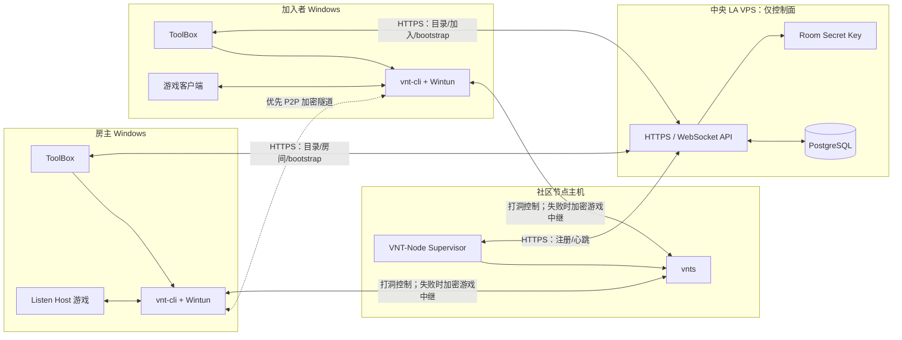
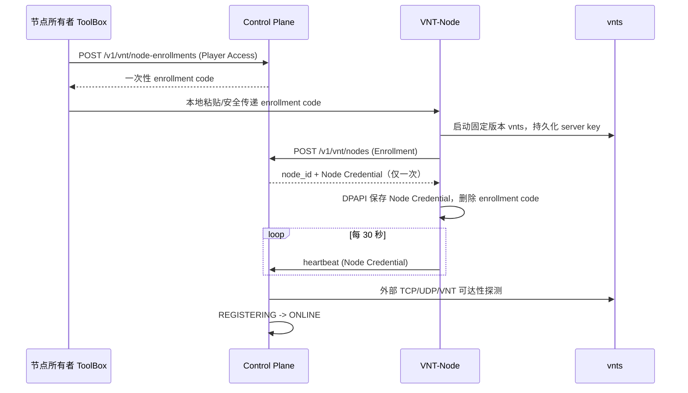
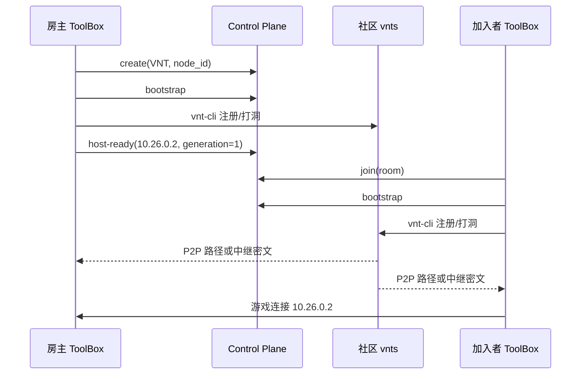
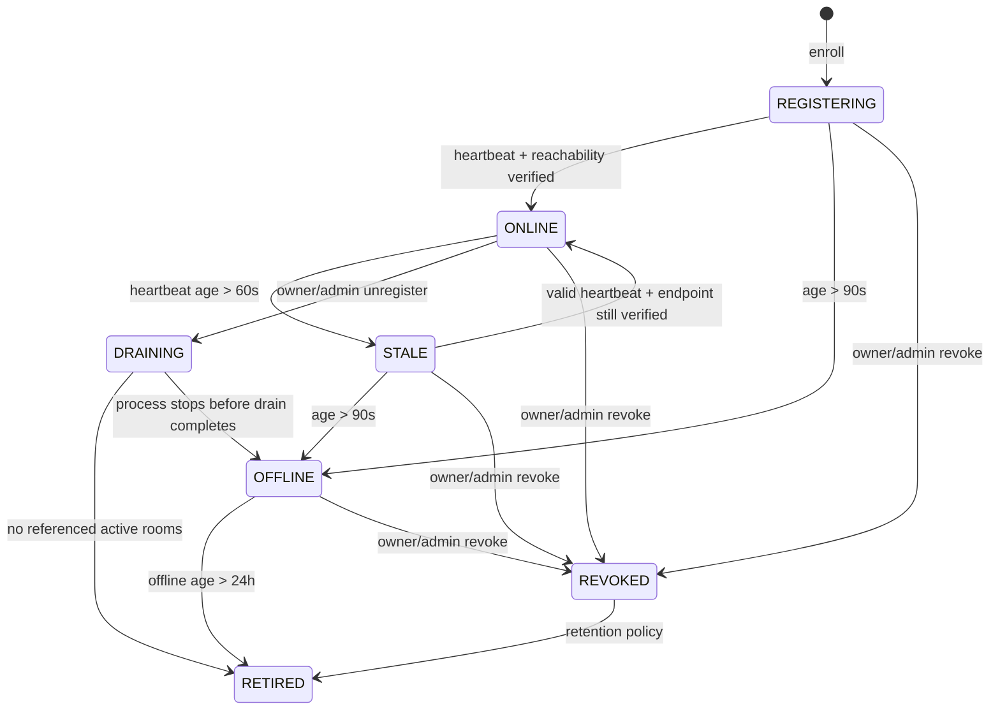

# 社区 VNT 节点联机目标架构

[English](vnt-community-online-architecture.md) | 简体中文

状态：后端 MVP 已实现；客户端/节点打包与 GA 门禁仍待完成
基线日期：2026-08-04

本文定义 ProjectRebound“VNT 节点 + P2P 房间”路径的完整目标架构。它保留两项核心约束：社区志愿者提供 VNT 注册/打洞/中继节点；游戏流量不得经过中央 LA VPS。后端 MVP 已随 `000036_player_entitlements_and_vnt.sql` 上线：Control Plane 现已实现相互独立的玩家权限、VNT 节点 Enrollment/生命周期 API、VNT P2P 房间 Session、加密房间秘密 Bootstrap、Rebind、Presence、到期清理和 OpenAPI 契约。现有 Candidate/Connection/Edge Relay 路径继续服务 `LEGACY_RELAY`；参见[当前 P2P 联机完整架构](online-architecture.zh-CN.md)。

完整目标尚未达到 GA。固定生产版本的 VNT-Node 安装包、ToolBox 的特权 `vnt-cli` 集成与结构化就绪契约、大范围 NAT/互操作证据，以及完整的 VNT 管理和可观测性门禁仍是独立交付项。后端 API 可用不能被表述为端到端 VNT 数据面已经达到生产就绪。

## 1. 目标、非目标与关键决策

### 1.1 目标

- ToolBox 自动发现、探测并默认选择低延迟社区 VNT 节点；
- 房主和成员通过同一 `vnts` 节点加入一个房间专属虚拟局域网；
- VNT 优先点对点打洞，失败时只由所选社区节点中继；
- 中央 API 只承载身份、目录、房间、密钥下发和健康状态，不承载游戏包；
- 社区节点即使不可信，也不能读取或篡改有效游戏明文；
- 保留现有 Auth、P2P Room、管理、审计和 P2P BattleLog 能力；
- 节点、房间和本地进程均有明确状态机、超时、清理和恢复边界。

### 1.2 非目标

- VNT 不把玩家主机变成权威 Dedicated Server；Listen Host 仍是游戏主机；
- 第一版不支持运行中无感切换 VNT 节点；
- 第一版不允许同一台客户端同时加入多个 VNT 房间；
- 中央 API 不验证每一个游戏包，也不以客户端网络报告作为比赛权威结果；
- 社区节点不获得玩家 Access Token、房间 Host Token 或 BattleLog Report Token。

### 1.3 已确定的架构决策

| 主题 | 决策 |
| --- | --- |
| 房间隔离 | 每个房间/代次生成唯一高熵 VNT `token`，对应 `vnt-cli -k`；不得复用公开房间 ID |
| 内容保护 | 每个房间/代次生成独立强密码，启用客户端间 AEAD 加密 `-w`；同时启用客户端到服务器加密 `-W` |
| 节点选择 | 房主 ToolBox 选择并固定节点；加入者必须使用该节点，不能自行改选 |
| 虚拟地址 | 房主固定申请 `10.26.0.2`，成员按稳定槽位申请 `.3` 起的地址；MVP 每台客户端只运行一个房间会话 |
| 节点凭据 | Player Access Token 只用于签发一次性 enrollment；节点长期使用独立、可撤销、数据库仅存哈希的 Node Credential |
| 秘密下发 | 公共目录不返回组网 token、端到端密码或房主虚拟 IP；只有已验证的活动成员可通过 `no-store` bootstrap 响应取得 |
| 运行时 | 官方服务端二进制名为 `vnts`；发行包固定版本和 SHA-256，不从网络临时下载可执行文件 |
| 房间寿命 | `expires_at = created_at + 8h` 是硬上限；请求时同步执行过期门禁，5 分钟扫描器负责收敛遗漏状态 |
| 故障切换 | 开局前允许 rebind 并轮换全部房间 VNT 秘密；进入 `RUNNING` 后节点故障不做热迁移，终止联机并保留战绩收集窗口 |
| 迁移方式 | `transport_kind=VNT` 与现有 `LEGACY_RELAY` 并行发布；同一房间不得混用两条数据面 |

## 2. VNT 的外部约束

本设计依赖官方 VNT 语义，不把它当作自研协议：

- `-k <token>` 是虚拟局域网标识；同一服务器上相同 token 的设备处于同一虚拟 LAN，因此公开、固定或跨房间复用 token 会造成串房风险；
- `-w <password>` 对客户端间数据执行端到端加密，服务器无法解密；`-W` 保护客户端与服务器间通信；
- `--ip <IP>` 可请求虚拟 IP，但地址必须属于服务器网段且不得在同一组网内重复；
- `-f <conf>` 接受 YAML 配置，可避免把组网 token 和密码放进进程命令行；
- 官方服务端仓库和二进制名是 `vnts`，默认同时需要其服务端端口的 TCP 与 UDP 可达。

参考：[VNT 客户端参数](https://github.com/vnt-dev/vnt/blob/main/vnt-cli/README.md)、[VNT 服务端](https://github.com/vnt-dev/vnts)、[VNT 服务端部署指南](https://rustvnt.com/guide/server.html)。发行前必须固定经过互操作测试的 release/tag，不能跟随 `main` 自动升级。

`vnts --white-token` 是启动时静态白名单，不适合动态创建大量房间。社区节点 MVP 不开启静态白名单，隔离依赖不可猜测的房间 token，保密和完整性依赖房间端到端密码。若后续维护受控的 `vnts` fork 或动态管理接口，才可增加服务端逐房间授权。

## 3. 目标拓扑与流量边界



允许经过中央 VPS 的内容只有：登录、节点和房间元数据、成员关系、加密后的房间秘密、状态事件、BattleLog 上传以及运维遥测。禁止经过中央 VPS 的内容包括：游戏 UDP/TCP、VNT 虚拟网卡包、VNT 打洞包和 VNT 中继包。

对 `transport_kind=VNT` 的房间，Control Plane 不创建 `connections`、`relay_allocations` 或 Relay Token。网络策略也不得给中央 API 容器开放游戏 UDP 转发入口。发布验收必须以抓包和中央出口字节指标证明这一点。

## 4. 组件职责

| 组件 | 负责 | 不负责 |
| --- | --- | --- |
| ToolBox | 登录、节点探测/选择、房间操作、bootstrap、受控启动 `vnt-cli` 和游戏、进程清理 | 保存节点长期凭据、决定其他成员的节点、把秘密传给游戏 |
| VNT 特权助手 | 创建虚拟网卡所需的提权操作、启动/监督 `vnt-cli`、收集结构化就绪状态 | UI、玩家认证、任意命令执行 |
| 游戏/Payload | 通过虚拟 IP 建立游戏连接、生成可选 BattleLog 观察证据 | 获取 VNT token/密码、控制 `vnt-cli`、节点选择 |
| Control Plane | Auth、节点注册表、房间、成员、秘密封装、状态/过期、审计和 BattleLog | 转发 VNT 或游戏数据 |
| PostgreSQL | 节点、凭据哈希、房间选择、VNT 代次和成员虚拟地址的权威状态 | 保存明文秘密 |
| VNT-Node Supervisor | 启动固定版本 `vnts`、注册、心跳、退出注销、日志和本机健康检查 | 持有 Player Access Token 或房间端到端密码 |
| 社区 `vnts` | VNT 注册、NAT 穿透协调和必要时中继密文 | 玩家身份、房间业务状态、游戏内容解密 |
| 现有 Edge Relay | 仅服务 `LEGACY_RELAY` 房间，迁移期兜底 | 参与 VNT 房间 |

## 5. 信任边界与凭据

### 5.1 凭据分类

| 凭据 | 持有者 | 用途 | 保存规则 |
| --- | --- | --- | --- |
| Player Access/Refresh Token | ToolBox | 玩家 API | 遵循现有 Auth 契约；不得复制给 VNT-Node |
| Room Host Token | 房主 ToolBox | heartbeat、start、rebind、close | 只存内存或 Windows 用户保护存储；数据库存哈希 |
| Node Enrollment Code | ToolBox -> VNT-Node 一次 | 首次注册一个节点 | 10 分钟、单次消费、数据库存哈希；成功后立即删除 |
| Node Credential | VNT-Node | heartbeat、更新和注销自己的节点 | 随机 256 bit、数据库存哈希、本地用 DPAPI/系统凭据库保护、可轮换和撤销 |
| VNT Network Token | 活动房间成员的 ToolBox/vnt-cli | `-k` 房间隔离 | 每房间每代次随机；数据库信封加密；不进公共 API、命令行或日志 |
| VNT E2E Password | 活动房间成员的 ToolBox/vnt-cli | `-w` 游戏包机密性和完整性 | 每房间每代次随机 256 bit；规则同上 |
| P2P Report Token | ToolBox | BattleLog 上传 | 与 VNT 完全隔离，绝不传入游戏或 VNT 进程 |

Node Enrollment Code 只能由 Active、Steam 已验证且通过完整性策略的玩家申请。默认每个玩家最多 3 个非 RETIRED 节点；更高额度由管理审核。节点所有权不是可信度证明，只用于配额、注销和审计。

### 5.2 社区节点威胁模型

社区节点视为不可信互联网主机。它能观察源/目的公网地址、连接时间、包长、流量和组网元数据，也能丢包、限速、重放无效包或下线。启用高熵 `-w` 和 AEAD 后，它不应能读取或构造有效游戏明文；但加密不能阻止拒绝服务和流量分析，UI 必须在首次启用社区节点联机时告知这一点。

节点登记地址会被所有 ToolBox 探测，因此 Control Plane 和 ToolBox 都必须拒绝 loopback、link-local、multicast、unspecified、云 metadata 和默认的 RFC1918/ULA 地址，避免把节点目录变成 SSRF/局域网扫描器。域名必须在连接前重新解析并再次校验全部 A/AAAA 结果。仅显式的开发配置可允许私网节点。

## 6. 权威数据模型

以下是逻辑迁移目标；字段长度和索引须在实际 migration 与 OpenAPI 中保持一致。

### 6.1 VNT 节点

```sql
CREATE TABLE vnt_nodes (
    id                     VARCHAR(64) PRIMARY KEY,
    owner_player_id        VARCHAR(64) NOT NULL REFERENCES players(id),
    advertised_host        VARCHAR(253) NOT NULL,
    port                   INTEGER NOT NULL CHECK (port BETWEEN 1024 AND 65535),
    region                 VARCHAR(64) NOT NULL,
    location               VARCHAR(128) NOT NULL,
    state                  VARCHAR(16) NOT NULL,
    vnts_version           VARCHAR(32) NOT NULL,
    wrapper_version        VARCHAR(32) NOT NULL,
    server_key_fingerprint VARCHAR(128) NOT NULL,
    supported_transports   TEXT[] NOT NULL DEFAULT ARRAY['udp', 'tcp'],
    max_rooms              INTEGER NOT NULL CHECK (max_rooms BETWEEN 1 AND 10000),
    reported_sessions      INTEGER NOT NULL DEFAULT 0 CHECK (reported_sessions >= 0),
    last_heartbeat_at      TIMESTAMPTZ,
    last_reachable_at      TIMESTAMPTZ,
    created_at             TIMESTAMPTZ NOT NULL,
    updated_at             TIMESTAMPTZ NOT NULL,
    retired_at             TIMESTAMPTZ,
    CONSTRAINT vnt_nodes_state CHECK (
        state IN ('REGISTERING','ONLINE','STALE','OFFLINE','DRAINING','REVOKED','RETIRED')
    ),
    UNIQUE (advertised_host, port)
);
```

`reported_sessions` 只用于遥测；调度容量以数据库中未关闭且未过期、引用该节点的房间数为准，避免相信节点自报。`last_reachable_at` 只有中央主动验证器成功时更新，heartbeat 不能伪造可达性。

凭据和 enrollment 分表保存：

```sql
CREATE TABLE vnt_node_enrollments (
    id              VARCHAR(64) PRIMARY KEY,
    owner_player_id VARCHAR(64) NOT NULL REFERENCES players(id),
    secret_hash     BYTEA UNIQUE NOT NULL,
    expires_at      TIMESTAMPTZ NOT NULL,
    consumed_at     TIMESTAMPTZ,
    created_at      TIMESTAMPTZ NOT NULL
);

CREATE TABLE vnt_node_credentials (
    id           VARCHAR(64) PRIMARY KEY,
    node_id      VARCHAR(64) NOT NULL REFERENCES vnt_nodes(id) ON DELETE RESTRICT,
    secret_hash  BYTEA UNIQUE NOT NULL,
    expires_at   TIMESTAMPTZ NOT NULL,
    last_used_at TIMESTAMPTZ,
    revoked_at   TIMESTAMPTZ,
    created_at   TIMESTAMPTZ NOT NULL
);
```

### 6.2 房间 VNT 会话

现有 `p2p_rooms` 增加 `transport_kind` 和硬过期时间；VNT 专属字段放在一对一表，避免让 Legacy 路径充满 nullable 字段：

```sql
ALTER TABLE p2p_rooms
    ADD COLUMN transport_kind VARCHAR(16) NOT NULL DEFAULT 'LEGACY_RELAY',
    ADD COLUMN expires_at TIMESTAMPTZ;

UPDATE p2p_rooms
SET expires_at = created_at + INTERVAL '8 hours'
WHERE expires_at IS NULL;

ALTER TABLE p2p_rooms
    ALTER COLUMN expires_at SET NOT NULL,
    ADD CONSTRAINT p2p_rooms_transport_kind
        CHECK (transport_kind IN ('LEGACY_RELAY', 'VNT'));

CREATE TABLE p2p_vnt_sessions (
    room_id                       VARCHAR(64) PRIMARY KEY
                                  REFERENCES p2p_rooms(id) ON DELETE CASCADE,
    node_id                       VARCHAR(64) NOT NULL
                                  REFERENCES vnt_nodes(id) ON DELETE RESTRICT,
    generation                    INTEGER NOT NULL DEFAULT 1,
    state                         VARCHAR(24) NOT NULL,
    node_host_snapshot            VARCHAR(253) NOT NULL,
    node_port_snapshot            INTEGER NOT NULL,
    node_region_snapshot          VARCHAR(64) NOT NULL,
    node_location_snapshot        VARCHAR(128) NOT NULL,
    network_token_ciphertext      BYTEA NOT NULL,
    e2e_password_ciphertext       BYTEA NOT NULL,
    secret_key_id                 VARCHAR(64) NOT NULL,
    network_token_nonce           BYTEA NOT NULL,
    e2e_password_nonce            BYTEA NOT NULL,
    host_virtual_ip               INET,
    failure_reason                VARCHAR(64),
    created_at                    TIMESTAMPTZ NOT NULL,
    updated_at                    TIMESTAMPTZ NOT NULL,
    CONSTRAINT p2p_vnt_state CHECK (
        state IN ('SELECTED','HOST_CONNECTING','HOST_READY','READY','ACTIVE',
                  'REBINDING','FAILED','CLOSED')
    )
);

CREATE TABLE p2p_vnt_member_sessions (
    room_id        VARCHAR(64) NOT NULL REFERENCES p2p_rooms(id) ON DELETE CASCADE,
    generation     INTEGER NOT NULL,
    player_id      VARCHAR(64) NOT NULL REFERENCES players(id),
    device_id      VARCHAR(64) NOT NULL,
    virtual_ip     INET NOT NULL,
    state          VARCHAR(16) NOT NULL DEFAULT 'ISSUED',
    last_report_at TIMESTAMPTZ,
    created_at     TIMESTAMPTZ NOT NULL,
    PRIMARY KEY (room_id, generation, player_id),
    UNIQUE (room_id, generation, virtual_ip),
    UNIQUE (room_id, generation, device_id),
    CONSTRAINT p2p_vnt_member_state CHECK (
        state IN ('ISSUED','CONNECTING','CONNECTED','FAILED','STOPPED')
    )
);
```

房间 token 和 E2E 密码必须使用带版本的 AEAD 信封加密，并分别生成不可复用的 nonce；Associated Data 至少绑定 `room_id`、`generation`、`node_id` 和 `secret_kind`。密钥来自部署秘密管理，不与数据库共同保存。因为服务端需要在成员重连时再次下发，不能只存哈希。

节点 endpoint 快照保证节点后来改地址或退役时，历史房间和审计仍可解释。节点不得因 24 小时离线而物理删除；只转为 `RETIRED` 并撤销凭据，超过数据保留期且不存在引用时才可清理。

## 7. API 契约

所有错误继续使用现有 `{error:{code,message,details}, request_id}` 契约。包含 Node Credential 或房间秘密的请求/响应必须设置 `Cache-Control: no-store`，网关和应用日志必须过滤 Authorization、bootstrap body 和 secret 字段。

### 7.1 节点 API

| 方法与路径 | 认证 | 行为 |
| --- | --- | --- |
| `POST /v1/vnt/node-enrollments` | Player Access | 签发 10 分钟、单次使用的 enrollment code |
| `POST /v1/vnt/nodes` | Enrollment Code | 注册节点；原子消费 code；Node Credential 仅返回一次 |
| `GET /v1/vnt/nodes?status=online&region=...` | 公开 | 返回可公开探测的 endpoint、位置、版本、容量和状态，不返回 owner/秘密 |
| `POST /v1/vnt/nodes/{node_id}/heartbeat` | Node Credential | 更新租约、版本和自报资源；不能自行改变 owner/endpoint |
| `POST /v1/vnt/nodes/{node_id}/credential/rotate` | Node Credential | 在剩余 25% 有效期内自助轮换；新凭据只返回一次，旧凭据短暂重叠后撤销 |
| `DELETE /v1/vnt/nodes/{node_id}` | Node Credential 或 Owner Player Access | 停止新分配；无活动房间时退役，否则进入 DRAINING |

Enrollment 请求由已登录 ToolBox 发起：

```http
POST /v1/vnt/node-enrollments
Authorization: Bearer <player-access-token>

{
  "label": "home-node"
}
```

```json
{
  "enrollment_code": "vne_...",
  "expires_at": "2026-08-02T12:10:00Z"
}
```

VNT-Node 首次注册：

```http
POST /v1/vnt/nodes
Authorization: VNTEnrollment vne_...
```

```json
{
  "advertised_host": "1.2.3.4",
  "port": 29878,
  "region": "cn-east",
  "location": "上海",
  "vnts_version": "<pinned-version>",
  "wrapper_version": "0.1.0",
  "server_key_fingerprint": "sha256:...",
  "supported_transports": ["udp", "tcp"],
  "max_rooms": 64
}
```

```json
{
  "node_id": "vnt_abc",
  "node_token": "vnn_...",
  "state": "REGISTERING",
  "heartbeat_interval_seconds": 30,
  "credential_expires_at": "2026-11-01T00:00:00Z"
}
```

`advertised_host` 可省略，此时 API 只可使用经过可信反向代理规则确认的来源公网 IP。客户端提交或未经信任的 `X-Forwarded-For` 不得成为节点 endpoint。endpoint 改动需要 owner 重新确认并重新执行可达性验证。

Heartbeat 示例：

```json
{
  "wrapper_version": "0.1.0",
  "vnts_version": "<pinned-version>",
  "uptime_seconds": 3600,
  "reported_sessions": 4,
  "server_process_healthy": true
}
```

公共节点响应保留原方案需要的 `node_id`、`host`、`port`、`region`、`location` 和 `status`，并增加 `last_reachable_at`、`capacity_available`、`supported_transports` 和版本兼容信息。owner ID、Node Credential、服务端私钥和日志路径永不公开。

### 7.2 房间 API

| 方法与路径 | 认证 | VNT 行为 |
| --- | --- | --- |
| `POST /v1/p2p-rooms` | verified/trusted Player Access | 接受 `transport_kind=VNT` 与 `vnt_node_id`，原子创建房间、VNT session 和 host member slot |
| `GET /v1/p2p-rooms*` | 现有公开规则 | 返回非秘密 VNT 节点摘要、VNT 状态和 `expires_at` |
| `POST /v1/p2p-rooms/{id}/join` | verified/trusted Player Access | 校验节点/房间可用，激活成员并分配稳定虚拟 IP；不返回房间秘密 |
| `POST /v1/p2p-rooms/{id}/vnt/bootstrap` | 活动成员 Player Access | 返回当前代次的临时本地运行配置；`no-store` |
| `PUT /v1/p2p-rooms/{id}/vnt/presence/me` | 活动成员 Player Access | 幂等报告本地 VNT 状态，仅作就绪和诊断依据 |
| `PUT /v1/p2p-rooms/{id}/vnt/host-ready` | Host Player Access + Host Token | 发布已核对的房主虚拟 IP和 generation，产生非秘密就绪事件 |
| `POST /v1/p2p-rooms/{id}/vnt/rebind` | Host Player Access + Host Token | 仅开局前切换节点，增加 generation 并轮换全部 VNT 秘密 |
| 现有 heartbeat/start/leave/delete | 现有认证 | 同时更新或关闭 VNT session/member state |

创建请求：

```json
{
  "display_name": "Test Room",
  "region": "cn-east",
  "mode": "pvp",
  "version": "0.8.5",
  "max_players": 4,
  "transport_kind": "VNT",
  "vnt_node_id": "vnt_abc"
}
```

公共房间只增加可展示和可探测字段：

```json
{
  "room_id": "room_xyz",
  "display_name": "Test Room",
  "transport_kind": "VNT",
  "vnt_node_id": "vnt_abc",
  "vnt_host": "1.2.3.4",
  "vnt_port": 29878,
  "vnt_region": "cn-east",
  "vnt_location": "上海",
  "vnt_state": "HOST_READY",
  "expires_at": "2026-08-02T20:00:00Z"
}
```

公共响应明确禁止 `network_token`、`e2e_password`、`host_virtual_ip`、`device_id`、任何玩家 IP 和任何 credential。

成员 bootstrap 响应：

```json
{
  "room_id": "room_xyz",
  "generation": 1,
  "expires_at": "2026-08-02T20:00:00Z",
  "server": {
    "address": "1.2.3.4:29878",
    "server_key_fingerprint": "sha256:...",
    "supported_transports": ["udp", "tcp"]
  },
  "network_token": "<room-secret>",
  "e2e_password": "<room-secret>",
  "cipher_model": "chacha20_poly1305",
  "server_encrypt": true,
  "device_id": "vnd_...",
  "device_name": "room-host",
  "virtual_ip": "10.26.0.2",
  "host_virtual_ip": null,
  "mtu": 1410
}
```

房主核对本地 `vnt-cli` 已连接、虚拟 IP 等于预留值且服务端 fingerprint 匹配后调用：

```json
{
  "generation": 1,
  "virtual_ip": "10.26.0.2"
}
```

加入者 bootstrap 的 `host_virtual_ip` 必须为已发布的 `10.26.0.2`。若房主尚未就绪，服务端返回可重试的 `VNT_HOST_NOT_READY`；ToolBox 等待 `room.vnt_host_ready` 事件或退避重试，秘密绝不放进 WebSocket 事件。

### 7.3 幂等与并发

- 创建房间接受现有 Idempotency Key；同 key 不得创建不同 VNT token；
- 重复 join 返回同一 membership、slot、device ID 和虚拟 IP；
- bootstrap 可重试，但只能返回当前 generation；旧 generation 返回 `VNT_GENERATION_STALE`；
- `host-ready` 对相同 generation/IP 幂等，对不同 IP 拒绝；
- rebind 在 `SELECT ... FOR UPDATE` 事务中检查房主、房间状态和节点容量，generation 只增加一次；
- heartbeat 与房间/VNT session 续租在同一事务；
- 所有写入先检查 `now < expires_at`，不能依赖扫描器提供正确性。

## 8. 节点发现、探测与选择

### 8.1 上线条件

注册成功只进入 `REGISTERING`。节点成为 `ONLINE` 必须同时满足：

1. Node Credential 有效，最近 90 秒内有 heartbeat；
2. wrapper 报告固定版本 `vnts` 子进程存活；
3. endpoint 是允许的公网地址，TCP 和 UDP 防火墙/端口映射已配置；
4. 中央验证器最近完成至少一次外部可达性检查；
5. 版本、服务端 fingerprint 和容量处于支持范围。

若首版中央验证器只能完成 TCP connect，字段和 UI 必须显示为 `tcp_reachable`，不能声称 VNT/UDP 已健康。正式发布前应使用固定版本 VNT 客户端库完成有界注册握手探测，同时限制频率和响应大小，避免反射放大。

### 8.2 ToolBox 延迟测量

ToolBox 对最多 16 个合格节点并发探测，每节点执行 3 个有界样本并设置总 deadline。优先使用 VNT 控制握手 RTT；TCP connect 只作回退并标注 `TCP`。ICMP 不作为必要条件。

默认排序分数：

```text
score = median_rtt_ms
      + packet_loss_penalty
      + region_mismatch_penalty
      + capacity_penalty
      + stale_measurement_penalty
```

自动选择最低 score，UI 仍允许房主在兼容节点间手动选择。选择结果写入房间并固定；加入者只测量该房间节点以显示预估延迟，不得替换节点。测量结果是客户端建议，不写成服务端权威延迟。

## 9. 端到端流程

### 9.1 独立社区节点首次上线



### 9.2 房主建房并启动 Listen Host

1. ToolBox 检查可用的 VNT 特权助手；不可用时 P2P UI 灰显并提供“以管理员身份修复/运行”。
2. 拉取 ONLINE 节点，过滤版本/容量/region，执行并发探测，默认选最低延迟节点。
3. 创建 `transport_kind=VNT` 房间；服务端原子生成 generation 1、网络 token、E2E 密码和房主 `10.26.0.2` 槽位。
4. 房主调用 bootstrap，ToolBox 写入仅当前用户和 SYSTEM 可读的临时 YAML，以 `vnt-cli -f <path>` 启动受监督前台子进程。
5. `vnt-cli` 就绪后 ToolBox 核对虚拟 IP、目标 server、generation 和 fingerprint，随即安全删除临时 YAML。
6. 房主调用 `host-ready`；房间保持业务 `LOBBY`，允许其他玩家加入。
7. ToolBox 通过 `GameLaunchAdapter` 启动 Listen Host，目标地址为房主虚拟 IP。`-match=10.26.0.2` 仅在游戏启动契约确认后由适配器产生，不能散落硬编码。
8. 实际比赛开始时才调用现有 `/start`，冻结 BattleLog roster；启动游戏进程本身不等于开始比赛。

### 9.3 加入房间

1. 加入者浏览公共房间，看到节点位置与本地测得延迟。
2. `join` 原子激活 membership，并按稳定槽位分配 `10.26.0.3` 起的虚拟 IP。
3. 调用 bootstrap；若房主未就绪则等待事件后重试。
4. 用同一 server、同一网络 token、同一 E2E 密码和自己的 device ID/IP 启动 `vnt-cli`。
5. 核对 ready/fingerprint 后，先对房主虚拟 IP 做短时可达性检查，再由 `GameLaunchAdapter` 启动游戏连接房主。
6. ToolBox 可上报 `presence/me=CONNECTED` 和观察到的 `P2P`/`RELAY` 路径用于诊断；该报告不影响比赛权威性。



### 9.4 离开和关闭

- 普通 leave 先停止游戏，再停止对应 `vnt-cli`，最后上报 leave；服务端把 member session 标为 `STOPPED`；
- 房主关闭会使业务房间和 VNT session 同时 `CLOSED`，撤销后续 bootstrap，但已经下发的秘密直到本地进程退出前无法远程收回；
- ToolBox 退出、崩溃或取消时用 Windows Job Object/受监督 helper 终止 `vnt-cli`，避免遗留网卡和进程；
- 房间关闭不要求社区 `vnts` 做逐房间清理；无客户端后该 token 自然没有活动会话。

## 10. 状态机和超时

### 10.1 节点



心跳间隔 30 秒；60 秒进入 `STALE` 并停止新房间分配；90 秒进入 `OFFLINE`。24 小时离线表示逻辑退役和凭据撤销，不表示立即删除有外键引用的行。

### 10.2 房间 VNT 子状态

```mermaid
stateDiagram-v2
    [*] --> SELECTED: room create
    SELECTED --> HOST_CONNECTING: host bootstrap
    HOST_CONNECTING --> HOST_READY: verified host-ready
    HOST_READY --> READY: room directory may accept peers
    READY --> ACTIVE: room start
    SELECTED --> REBINDING: selected node unusable
    HOST_CONNECTING --> REBINDING: selected node unusable
    HOST_READY --> REBINDING: host chooses new node before start
    REBINDING --> HOST_CONNECTING: rotate secrets + generation
    ACTIVE --> FAILED: data path lost; no hot migration in MVP
    SELECTED --> CLOSED: room close/expiry
    HOST_CONNECTING --> CLOSED: room close/expiry
    HOST_READY --> CLOSED: room close/expiry
    READY --> CLOSED: room close/expiry
    ACTIVE --> CLOSED: room close/expiry
    FAILED --> CLOSED: cleanup
```



VNT 子状态不替换现有 `LOBBY/CONNECTING/RUNNING/STALE/CLOSED` 业务状态。`host-ready` 不得把业务房间提前改成 `RUNNING`，否则成员将无法在比赛开始前加入。

### 10.3 8 小时硬过期

- 创建时写入不可延长的 `expires_at = created_at + 8h`；
- 所有 GET/LIST 过滤或即时关闭已过期房间，所有写操作先拒绝过期资源；
- 现有 5 秒 heartbeat sweeper 继续处理 45/90 秒房主失联语义；新增 5 分钟 hard-expiry sweeper 批量关闭遗漏房间；
- 关闭事务同步标记 members、VNT session 和非终态 member sessions，并触发 Legacy 连接清理或 VNT 本地停止事件；
- BattleLog 可按自己的 hard expiry 继续保存/收集证据，但不能复活房间。

## 11. 故障处理

| 故障 | 控制面行为 | ToolBox 行为 |
| --- | --- | --- |
| 节点在建房前离线 | 从候选中移除 | 选择下一节点 |
| 节点在 `LOBBY` 且开局前离线 | 停止新 bootstrap；允许房主 rebind | 停止旧 `vnt-cli`，取得新 generation 后重启 |
| rebind 并发 | 只提交一个 generation；旧 bootstrap 失效 | 收到 `VNT_GENERATION_STALE` 后重新 GET/bootstrap |
| 节点 heartbeat 断但数据面仍通 | 停止新分配，不立即杀死活动房间 | 保持现有通道并显示“节点控制状态异常” |
| `RUNNING` 中实际路径断开 | VNT session 标为 FAILED；关闭联机，不自动迁移 | 有界重连同一节点；失败后退出并保存诊断/BattleLog |
| `vnt-cli` 启动失败 | 不发布 host-ready | 删除临时配置、回收 helper、显示可操作错误 |
| fingerprint 不匹配 | 拒绝 ready，记录安全事件 | 立即停止进程，不提供“忽略并继续” |
| Control Plane 暂时不可用 | 不影响已建立的 VNT 数据路径 | 保持游戏；API 恢复后补 heartbeat/presence，不重复建房 |
| VNT-Node wrapper 退出 | 最佳努力 DELETE；租约最终 OFFLINE | 不适用 |

节点 OFFLINE 只说明控制面租约失效，不足以证明既有数据面已经断开；反过来 heartbeat 正常也不能证明玩家路径可用。两种状态必须在 UI 和告警中分开展示。

## 12. Windows 进程与发行安全

### 12.1 ToolBox / `vnt-cli`

- ToolBox 启动时检查 VNT 特权能力。产品 MVP 可使用 `IsUserAnAdmin` 灰显入口；正式版优先使用最小权限、固定命令集的签名 helper，不让整个 UI 长期高权限运行；
- 每次会话生成唯一虚拟网卡名和受限临时目录；MVP 用跨进程锁拒绝第二个活动 VNT 房间；
- 使用 YAML 配置文件传递 token/password，DACL 只允许当前用户、SYSTEM 和 helper；不得把秘密拼到命令行；
- ToolBox 必须以前台受监督子进程方式运行 `vnt-cli`，捕获 stdout/stderr、解析就绪状态，并放入 Job Object；
- 日志过滤 network token、password、Access/Host/Report Token、完整 Authorization 和临时配置内容；
- 只有核对 server、fingerprint、generation 和 virtual IP 后才能启动游戏；
- 游戏进程只获得房主虚拟 IP和既有非秘密 BattleLog 环境，不获得任何 VNT 秘密。

官方 CLI 目前以人类可读的 `--info`/stdout 为主。GA 前必须选定一种可测试集成：固定版本输出解析器，或维护最小 VNT wrapper/fork 提供结构化 ready、virtual IP、route 和 fingerprint。输出格式没有契约时不得静默把“进程存活”当作“隧道就绪”。

### 12.2 VNT-Node 一键包

发行结构：

```text
VNT-Node.exe
vnts.exe
vnt_node_config.json       # 仅非秘密配置
THIRD-PARTY-NOTICES.txt
licenses/
data/key/                  # vnts 服务端密钥，受限 ACL
logs/
```

非秘密配置示例：

```json
{
  "api_base_url": "https://api.example.invalid",
  "advertised_host": "",
  "listen_port": 29878,
  "region": "cn-east",
  "location": "上海",
  "max_rooms": 64
}
```

Node Credential 不在 JSON；它由 DPAPI `LocalMachine`、Windows Credential Manager 或等价系统 secret store 保存。enrollment code 只在首次运行输入，注册成功立即清除。Supervisor 在凭据进入最后 25% 有效期后自动轮换；若机器迁移或凭据丢失，owner 通过新的 enrollment 和 step-up 重新认领，不能复制凭据文件。

Supervisor 建议用 Go 实现，以复用仓库的 HTTP、配置、日志和 Windows 发布经验；`vnts` 仍使用固定的上游 Rust 二进制。启动顺序：校验自身配置和 `vnts.exe` SHA-256；确保 TCP/UDP 端口可绑定；以受监督子进程启动 `vnts -p 29878`；读取/计算持久化 server key fingerprint；注册或恢复 node identity；每 30 秒 heartbeat。Ctrl+C/服务停止先请求 DRAINING；若无活动房间则立即退出，有活动房间则显示数量并在有界宽限后停止，届时节点转为 OFFLINE 且房间按故障流程处理。所有步骤写结构化、脱敏日志。

打包官方 VNT 二进制时须带对应版本、源码/许可证链接和第三方声明，并遵循其 [Apache-2.0 许可证](https://github.com/vnt-dev/vnt/blob/main/LICENSE)。`vnt-server.exe` 若作为产品别名存在，必须在清单中明确它是固定版本 `vnts.exe`，避免与不存在的上游二进制名混淆。

节点运营者必须放行并转发配置端口的 TCP 和 UDP；`29878` 是 ProjectRebound 包默认值，不是上游默认值。wrapper 的本机“端口已绑定”检查不能替代公网可达性验证。

## 13. 安全控制

### 13.1 必须项

- 每房间每 generation 独立的随机 network token 和 E2E password；至少 128 bit token 熵和 256 bit password 熵；
- `cipher_model` 只允许项目审核过的 AEAD（首选 `chacha20_poly1305` 或 `aes_gcm`），禁止 `xor`、ECB 和无认证模式；
- 强制 `server_encrypt=true`，并把服务端 fingerprint 与节点注册表值比对；
- bootstrap 只允许当前 generation 的 Active member，响应 `Cache-Control: no-store`，禁止 CDN/浏览器缓存；
- 房间秘密在 PostgreSQL 信封加密，密钥轮换支持多 `secret_key_id` 解密和新 key 写入；
- 节点注册、endpoint 改动、revoke、rebind、fingerprint 变化和秘密解密失败全部进入安全审计；
- 公共节点 API、enrollment、heartbeat、bootstrap 和探测都有独立 IP/player/node 限流；
- 节点 endpoint 执行双层 SSRF 地址校验和 DNS rebind 防护；
- 不把社区节点自报的延迟、容量、版本或健康直接当作可信事实。

### 13.2 仍然存在的风险

- 社区节点可以选择性丢包、降速、记录连接元数据或协助流量分析；
- 已加入房间的恶意玩家本来就拥有当前房间 token/password，能参与该虚拟 LAN；游戏协议仍需处理恶意同局玩家；
- ToolBox 或本机管理员被攻陷时，进程内和临时文件中的房间秘密可被读取；
- VNT 上游漏洞会影响所有客户端和社区节点，必须有版本撤销列表和紧急 feature flag；
- fingerprint 校验能力若只能依赖未稳定的人类可读输出，则 VNT 路径不能达到 GA 安全门槛。

## 14. 可观测性与运维

### 14.1 指标

Control Plane 至少输出：

- `vnt_nodes{state,region,version}`、heartbeat age、reachability age；
- enrollment 成功/失败/重放、Node Credential 轮换/拒绝；
- VNT 房间数、按 state/generation/node 分布、rebind 和 hard expiry；
- bootstrap 请求、拒绝原因、host-ready 延迟；
- 客户端自报 P2P/RELAY 比例、建立耗时和失败原因，但不得带原始 IP；
- 每节点引用房间数和 capacity saturation；
- 中央 VPS 游戏数据面端口/字节应为零的发布门禁指标。

VNT-Node 至少输出 wrapper/vnts uptime、heartbeat 结果、监听状态、子进程重启次数和聚合会话数。日志不得包含 network token、E2E password、Node Credential 或玩家标识。

### 14.2 管理能力

Admin Web 增加节点列表、详情、owner、endpoint、版本、fingerprint、租约、可达性、引用房间、Drain 和 Revoke。敏感写入要求既有 RBAC、step-up、原因和审计。管理端不能查看房间明文 token/password；排障只显示 key ID、generation 和安全摘要。

### 14.3 运行目标

建议初始目标而非协议常量：节点目录 API 月可用性 99.9%；ONLINE 判定延迟不超过 90 秒；房间创建 p95 小于 500 ms（不含客户端探测）；host-ready p95 小于 10 秒；VNT 建链成功率和 relay 比例按 region/版本观测。客户端读取服务端 interval/expiry，不硬编码本表数值。

## 15. 与现有架构的迁移

### 15.1 共存边界

| 能力 | `LEGACY_RELAY` | `VNT` |
| --- | --- | --- |
| 房间/Auth/成员/Heartbeat | 复用 | 复用 |
| `/v1/connections` 和 Candidate WebSocket | 使用 | 不创建、不使用 |
| 自研 Edge Relay allocation/token | 使用 | 不创建、不使用 |
| VNT node/session/bootstrap | 不使用 | 使用 |
| P2P BattleLog v3 | 可选复用 | 可选复用 |
| Admin 房间/审计 | 复用 | 复用并增加 VNT 视图 |

### 15.2 发布阶段

1. **PoC 门禁（待完成）**：固定 VNT 版本，验证游戏实际端口、`-match` 语义、Wintun 提权、NAT 类型矩阵、E2E 加密、fingerprint 和结构化就绪方案。
2. **节点控制面（后端已完成）**：已实现 migration `000036`、`internal/vnt`、玩家权限强制检查和 OpenAPI；Admin 只读诊断与生产 VNT-Node wrapper 仍待完成。
3. **房间 Shadow（后端已完成）**：已实现 `transport_kind`、VNT session/secret store、Bootstrap、Presence、Rebind 和硬过期；ToolBox 节点探测、特权客户端监督与内部端到端放量仍待完成。
4. **小流量 Beta**：按 feature flag/allowlist 开放 VNT 房间；Legacy 路径保持默认，监控建链、崩溃、rebind 和节点滥用。
5. **默认切换**：达成验收阈值后新房间默认 VNT，保留显式 Legacy 回滚开关至少一个稳定发布周期。
6. **Legacy 退役评审**：确认没有旧 ToolBox、运行房间或运维依赖后，才移除 Candidate/Connection/Edge Relay；这是独立变更，不包含在 VNT 首发中。

回滚只关闭“创建新的 VNT 房间”功能开关，不修改已经运行的 VNT 房间 transport_kind，也不把其热切到 Legacy Relay。已创建房间按原路径运行到关闭或过期。

## 16. 实现落点

| 工作项 | 仓库落点 |
| --- | --- |
| 节点、凭据、玩家权限和 VNT session 表 | `Backend/migrations/000036_player_entitlements_and_vnt.sql` |
| 节点领域 | `Backend/internal/vnt/` 实现 Enrollment、Credential、发现、Heartbeat、轮换、退役和 Sweeper |
| 房间扩展 | `Backend/internal/p2proom/` 实现 transport 策略、8h expiry、VNT session 事务、加密 Bootstrap、Presence 和 Rebind |
| HTTP 路由 | `Backend/internal/controlplane/server.go` |
| 机器契约 | 已实现在 `Backend/api/openapi/openapi.yaml`，并同步权限矩阵与 API 文档 |
| 配置 | 生产环境强制要求 `VNT_SECRET_ENCRYPTION_KEY_BASE64`；版本固定、放量控制和其余运维参数仍属于 GA 工作 |
| 后台任务 | node lease/reachability sweeper、5 分钟 hard-expiry sweeper、credential rotation alert |
| ToolBox | 当前仓库尚无完整玩家 ToolBox P2P 客户端；需单独实现 API、探测、特权 helper、VNT 监督和 GameLaunchAdapter |
| VNT-Node | 新建独立可发布程序及固定版本 `vnts.exe` 资产、许可证和校验清单 |
| 管理面 | 邀请码创建已提供三项独立注册权限；`AdminWeb` 的 VNT 节点/房间诊断仍待完成，且不得显示秘密 |

不得把 VNT 节点塞进现有 `relay_nodes`：两者的信任、协议、凭据、容量和控制流不同。可以共享 ID 生成、审计、限流、错误 envelope、数据库连接和可观测性基础设施。

## 17. 验收标准

### 17.1 功能

- 两台 Windows 客户端在同一房间获得唯一虚拟 IP，并能通过房主 `10.26.0.2` 完成实际游戏联机；
- 至少覆盖公网直连、常见 NAT 打洞和社区节点中继三条路径；
- 同一社区节点上的两个房间不能互相发现、ping 或连接；
- 房主未 ready、重复 join、Launcher 重启和 API 短断均能按本文恢复；
- 开局前节点故障能 rebind，旧 generation 客户端不能继续 bootstrap；
- 8 小时后房间在读取/写入时立即失效，最迟 5 分钟完成批量状态收敛。

### 17.2 安全

- Player Access Token 不出现在 VNT-Node 配置、日志、命令行或进程环境；
- network token 和 E2E password 不出现在公共房间、WebSocket 事件、日志、崩溃报告和进程命令行；
- 数据库泄漏本身不能恢复房间明文秘密；
- 社区节点抓包只能得到密文；篡改包不能成为有效游戏数据；
- loopback、私网、link-local、metadata IP、DNS rebind 和不允许端口的节点注册/探测全部被拒绝；
- fingerprint 不匹配时 ToolBox fail closed；
- enrollment 重放、Node Credential 撤销和跨节点使用均被拒绝并审计。

### 17.3 运维和回滚

- 节点 30/60/90 秒状态转换、24 小时逻辑退役和 DRAINING 行为通过时间控制测试；
- 关闭 VNT feature flag 后不能新建 VNT 房间，但现有 Legacy 房间无回归；
- 中央 API 主机抓包证明 VNT 房间的游戏流量为零；
- VNT-Node/ToolBox 异常退出后没有遗留 `vnt-cli`、失控 `vnts` 或可被其他用户读取的临时配置；
- OpenAPI、数据库约束、双语文档、集成测试和安装包第三方声明在同一发布中完成。

## 18. GA 前必须关闭的问题

以下不是可在运行时猜测的细节，而是进入正式开发或 GA 前的门禁：

1. 固定 `vnt-cli`/`vnts` release、构建 feature、Windows 架构、Wintun 版本和 SHA-256；
2. 用真实游戏确认 Listen Host 和加入者的启动参数、端口、绑定地址及 `-match` 精确语义；
3. 确认固定版本能稳定输出或由 wrapper 提供 virtual IP、ready、route 和 server fingerprint 的结构化状态；
4. 完成至少 Full Cone、Restricted、Port-Restricted、Symmetric NAT 与 IPv6 的互操作矩阵；
5. 确认 `-W` fingerprint 的程序化核对方式；无法 fail closed 时不得宣称防 MITM；
6. 通过同节点多房间隔离、恶意节点、秘密泄漏、DoS/限流和客户端崩溃测试；
7. 决定节点公开目录的隐私/滥用条款、举报流程、地区标签规范和运营者责任；
8. 完成 Apache-2.0 notice、源码归属、自动更新签名和紧急版本撤销流程。

以上门禁完成且机器可读契约落地后，本文才从“目标设计”升级为“实现基线”。
